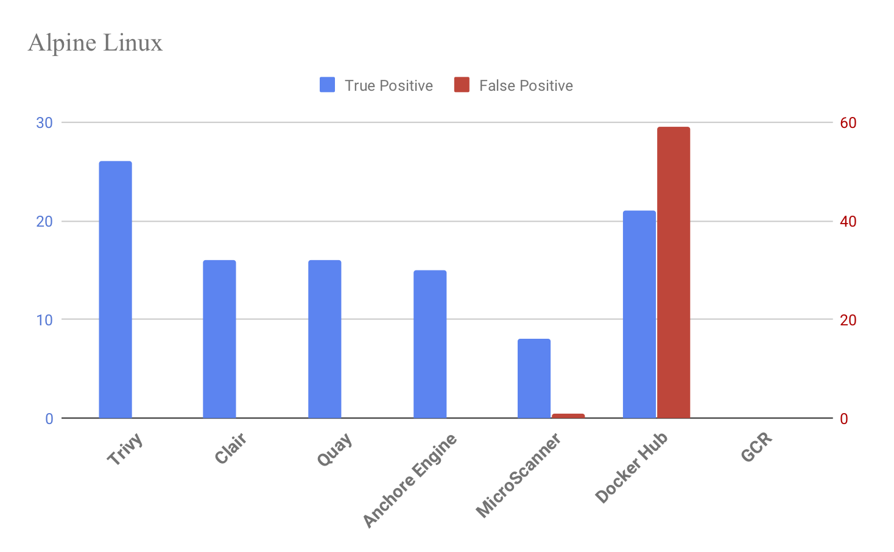
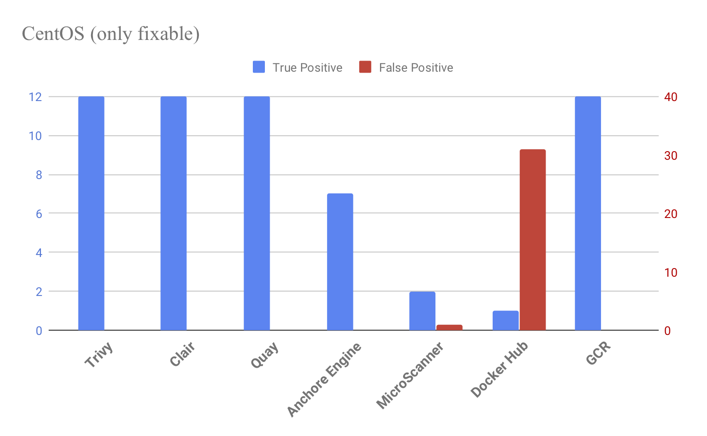
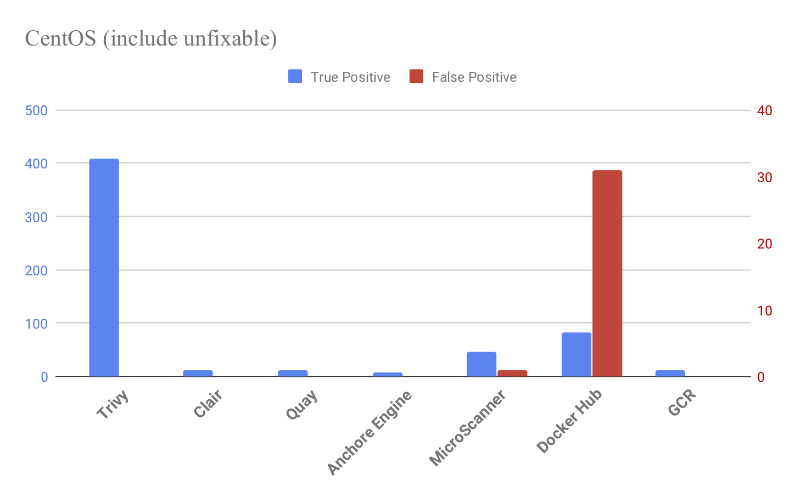

[](https://github.com/knqyf263/trivy/releases/latest)
[](https://circleci.com/gh/knqyf263/trivy)
[](https://goreportcard.com/report/github.com/knqyf263/trivy)
[](https://www.gnu.org/licenses/agpl-3.0)


A Simple and Comprehensive Vulnerability Scanner for Containers, Suitable for CI


# Accuracy Comparison

The number of vulnerabilities detected on Alpine Linux (as of 2019/05/12)



See [Comparison with other scanners](#comparison-with-other-scanners) for details.

# TOC

- [Abstract](#abstract)
- [Features](#features)
- [Installation](#installation)
  - [RHEL/CentOS](#rhelcentos)
  - [Debian/Ubuntu](#debianubuntu)
  - [Mac OS X / Homebrew](#mac-os-x--homebrew)
  - [Binary (Including Windows)](#binary-including-windows)
  - [From source](#from-source)
- [Quick Start](#quick-start)
- [Examples](#examples)
  - [Scan an image](#scan-an-image)
  - [Scan an image file](#scan-an-image-file)
  - [Save the results as JSON](#save-the-results-as-json)
  - [Filter the vulnerabilities by severities](#filter-the-vulnerabilities-by-severities)
  - [Skip an update of vulnerability DB](#skip-an-update-of-vulnerability-db)
  - [Ignore unfixed vulnerabilities](#ignore-unfixed-vulnerabilities)
  - [Specify exit code](#specify-exit-code)
  - [Ignore the specified vulnerabilities](#ignore-the-specified-vulnerabilities)
  - [Clear image caches](#clear-image-caches)
  - [Reset](#reset)
- [Continuous Integration (CI)](#continuous-integration-ci)
  - [Travis CI](#travis-ci)
  - [Circle CI](#circle-ci)
- [Vulnerability Detection](#vulnerability-detection)
  - [OS Packages](#os-packages)
  - [Application Dependencies](#application-dependencies)
- [Usage](#usage)
- [Comparison with other scanners](#comparison-with-other-scanners)
  - [Overview](#overview)
  - [Accuracy](#accuracy)
  - [vs Clair, Quay](#vs-clair)
  - [vs Anchore Engine](#vs-anchore-engine)
  - [vs Docker Hub, GCR](#vs-quay-docker-hub-gcr)
- [Q&A](#qa)
  - [Homebrew](#homebrew)
  - [Others](#others)

# Abstract

`Trivy` (`tri` pronounced like **tri**gger, `vy` pronounced like en**vy**) is a simple and comprehensive vulnerability scanner for containers.
`Trivy` detects vulnerabilities of OS packages (Alpine, RHEL, CentOS, etc.) and application dependencies (Bundler, Composer, npm, yarn etc.).
`Trivy` is easy to use. Just install the binary and you're ready to scan. All you need to do for scanning is to specify an image name of container.

It is considered to be used in CI. Before pushing to a container registry, you can scan your local container image easily.
See [here](#continuous-integration-ci) for details.

# Features

- Detect comprehensive vulnerabilities
  - OS packages (Alpine, **Red Hat Universal Base Image**, Red Hat Enterprise Linux, CentOS, Debian and Ubuntu)
  - **Application dependencies** (Bundler, Composer, Pipenv, npm, yarn and Cargo)
- Simple
  - Specify only an image name
  - See [Quick Start](#quick-start) and [Examples](#examples)
- Easy installation
  - **No need for prerequirements** such as installation of DB, libraries, etc.
  - `apt-get install`, `yum install` and `brew install` is possible (See [Installation](#installation))
- High accuracy
  - **Especially Alpine Linux and RHEL/CentOS** (See [Comparison with other scanners](#comparison-with-other-scanners))
  - Other OSes are also high
- DevSecOps
  - **Suitable for CI** such as Travis CI, CircleCI, Jenkins, etc.
  - See [CI Example](#continuous-integration-ci)

# Installation

## RHEL/CentOS

Add repository setting to `/etc/yum.repos.d`.

```
$ sudo vim /etc/yum.repos.d/trivy.repo
[trivy]
name=Trivy repository
baseurl=https://knqyf263.github.io/trivy-repo/rpm/releases/$releasever/$basearch/
gpgcheck=0
enabled=1
$ sudo yum -y update
$ sudo yum -y install trivy
```

or

```
$ rpm -ivh https://github.com/knqyf263/trivy/releases/download/v0.0.13/trivy_0.0.13_Linux-64bit.rpm
```

## Debian/Ubuntu

Replace `[CODE_NAME]` with your code name

CODE_NAME: wheezy, jessie, stretch, buster, trusty, xenial, bionic

```
$ sudo apt-get install apt-transport-https gnupg
$ wget -qO - https://knqyf263.github.io/trivy-repo/deb/public.key | sudo apt-key add -
$ echo deb https://knqyf263.github.io/trivy-repo/deb [CODE_NAME] main | sudo tee -a /etc/apt/sources.list
$ sudo apt-get update
$ sudo apt-get install trivy
```

or

```
$ sudo apt-get install rpm
$ wget https://github.com/knqyf263/trivy/releases/download/v0.0.13/trivy_0.0.13_Linux-64bit.deb
$ sudo dpkg -i trivy_0.0.13_Linux-64bit.deb
```

## Mac OS X / Homebrew

You can use homebrew on OS X.

```
$ brew tap knqyf263/trivy
$ brew install knqyf263/trivy/trivy
```

## Binary (Including Windows)

Go to [the releases page](https://github.com/knqyf263/trivy/releases), find the version you want, and download the zip file. Unpack the zip file, and put the binary to somewhere you want (on UNIX-y systems, /usr/local/bin or the like). Make sure it has execution bits turned on.

You need to install `rpm` command for scanning RHEL/CentOS.

## From source

```sh
$ go get -u github.com/knqyf263/trivy
```

# Quick Start

Simply specify an image name (and a tag). **The `latest` tag should be avoided as problems occur with cache.**. See [Clear image caches](#clear-image-caches)

```
$ trivy [YOUR_IMAGE_NAME]
```

For example:

```
$ trivy python:3.4-alpine
```

<details>
<summary>Result</summary>

```
2019-05-16T01:20:43.180+0900    INFO    Updating vulnerability database...
2019-05-16T01:20:53.029+0900    INFO    Detecting Alpine vulnerabilities...

python:3.4-alpine3.9 (alpine 3.9.2)
===================================
Total: 1 (UNKNOWN: 0, LOW: 0, MEDIUM: 1, HIGH: 0, CRITICAL: 0)

+---------+------------------+----------+-------------------+---------------+--------------------------------+
| LIBRARY | VULNERABILITY ID | SEVERITY | INSTALLED VERSION | FIXED VERSION |             TITLE              |
+---------+------------------+----------+-------------------+---------------+--------------------------------+
| openssl | CVE-2019-1543    | MEDIUM   | 1.1.1a-r1         | 1.1.1b-r1     | openssl: ChaCha20-Poly1305     |
|         |                  |          |                   |               | with long nonces               |
+---------+------------------+----------+-------------------+---------------+--------------------------------+
```

</details>

# Examples

### Scan an image

Simply specify an image name (and a tag).

```
$ trivy knqyf263/test-image:1.2.3
```

<details>
<summary>Result</summary>

```
2019-05-16T12:58:55.967+0900    INFO    Updating vulnerability database...
2019-05-16T12:59:03.150+0900    INFO    Detecting Alpine vulnerabilities...
2019-05-16T12:59:03.156+0900    INFO    Updating bundler Security DB...
2019-05-16T12:59:04.941+0900    INFO    Detecting bundler vulnerabilities...
2019-05-16T12:59:04.942+0900    INFO    Updating cargo Security DB...
2019-05-16T12:59:05.967+0900    INFO    Detecting cargo vulnerabilities...
2019-05-16T12:59:05.967+0900    INFO    Updating composer Security DB...
2019-05-16T12:59:07.834+0900    INFO    Detecting composer vulnerabilities...
2019-05-16T12:59:07.834+0900    INFO    Updating npm Security DB...
2019-05-16T12:59:10.285+0900    INFO    Detecting npm vulnerabilities...
2019-05-16T12:59:10.285+0900    INFO    Updating pipenv Security DB...
2019-05-16T12:59:11.487+0900    INFO    Detecting pipenv vulnerabilities...

knqyf263/test-image:1.2.3 (alpine 3.7.1)
========================================
Total: 26 (UNKNOWN: 0, LOW: 3, MEDIUM: 16, HIGH: 5, CRITICAL: 2)

+---------+------------------+----------+-------------------+---------------+----------------------------------+
| LIBRARY | VULNERABILITY ID | SEVERITY | INSTALLED VERSION | FIXED VERSION |              TITLE               |
+---------+------------------+----------+-------------------+---------------+----------------------------------+
| curl    | CVE-2018-14618   | CRITICAL | 7.61.0-r0         | 7.61.1-r0     | curl: NTLM password overflow     |
|         |                  |          |                   |               | via integer overflow             |
+         +------------------+----------+                   +---------------+----------------------------------+
|         | CVE-2018-16839   | HIGH     |                   | 7.61.1-r1     | curl: Integer overflow leading   |
|         |                  |          |                   |               | to heap-based buffer overflow in |
|         |                  |          |                   |               | Curl_sasl_create_plain_message() |
+         +------------------+          +                   +---------------+----------------------------------+
|         | CVE-2019-3822    |          |                   | 7.61.1-r2     | curl: NTLMv2 type-3 header       |
|         |                  |          |                   |               | stack buffer overflow            |
+         +------------------+          +                   +---------------+----------------------------------+
|         | CVE-2018-16840   |          |                   | 7.61.1-r1     | curl: Use-after-free when        |
|         |                  |          |                   |               | closing "easy" handle in         |
|         |                  |          |                   |               | Curl_close()                     |
+         +------------------+----------+                   +               +----------------------------------+
|         | CVE-2018-16842   | MEDIUM   |                   |               | curl: Heap-based buffer          |
|         |                  |          |                   |               | over-read in the curl tool       |
|         |                  |          |                   |               | warning formatting               |
+         +------------------+          +                   +---------------+----------------------------------+
|         | CVE-2018-16890   |          |                   | 7.61.1-r2     | curl: NTLM type-2 heap           |
|         |                  |          |                   |               | out-of-bounds buffer read        |
+         +------------------+          +                   +               +----------------------------------+
|         | CVE-2019-3823    |          |                   |               | curl: SMTP end-of-response       |
|         |                  |          |                   |               | out-of-bounds read               |
+---------+------------------+----------+-------------------+---------------+----------------------------------+
| git     | CVE-2018-17456   | HIGH     | 2.15.2-r0         | 2.15.3-r0     | git: arbitrary code execution    |
|         |                  |          |                   |               | via .gitmodules                  |
+         +------------------+          +                   +               +----------------------------------+
|         | CVE-2018-19486   |          |                   |               | git: Improper handling of        |
|         |                  |          |                   |               | PATH allows for commands to be   |
|         |                  |          |                   |               | executed from...                 |
+---------+------------------+----------+-------------------+---------------+----------------------------------+
| libssh2 | CVE-2019-3855    | CRITICAL | 1.8.0-r2          | 1.8.1-r0      | libssh2: Integer overflow in     |
|         |                  |          |                   |               | transport read resulting in      |
|         |                  |          |                   |               | out of bounds write...           |
+         +------------------+----------+                   +               +----------------------------------+
|         | CVE-2019-3859    | MEDIUM   |                   |               | libssh2: Unchecked use of        |
|         |                  |          |                   |               | _libssh2_packet_require and      |
|         |                  |          |                   |               | _libssh2_packet_requirev         |
|         |                  |          |                   |               | resulting in out-of-bounds       |
|         |                  |          |                   |               | read                             |
+         +------------------+          +                   +               +----------------------------------+
|         | CVE-2019-3858    |          |                   |               | libssh2: Zero-byte allocation    |
|         |                  |          |                   |               | with a specially crafted SFTP    |
|         |                  |          |                   |               | packed leading to an...          |
+         +------------------+          +                   +               +----------------------------------+
|         | CVE-2019-3863    |          |                   |               | libssh2: Integer overflow        |
|         |                  |          |                   |               | in user authenticate             |
|         |                  |          |                   |               | keyboard interactive allows      |
|         |                  |          |                   |               | out-of-bounds writes             |
+         +------------------+          +                   +               +----------------------------------+
|         | CVE-2019-3862    |          |                   |               | libssh2: Out-of-bounds memory    |
|         |                  |          |                   |               | comparison with specially        |
|         |                  |          |                   |               | crafted message channel          |
|         |                  |          |                   |               | request                          |
+         +------------------+          +                   +               +----------------------------------+
|         | CVE-2019-3860    |          |                   |               | libssh2: Out-of-bounds reads     |
|         |                  |          |                   |               | with specially crafted SFTP      |
|         |                  |          |                   |               | packets                          |
+         +------------------+          +                   +               +----------------------------------+
|         | CVE-2019-3857    |          |                   |               | libssh2: Integer overflow in     |
|         |                  |          |                   |               | SSH packet processing channel    |
|         |                  |          |                   |               | resulting in out of...           |
+         +------------------+          +                   +               +----------------------------------+
|         | CVE-2019-3861    |          |                   |               | libssh2: Out-of-bounds reads     |
|         |                  |          |                   |               | with specially crafted SSH       |
|         |                  |          |                   |               | packets                          |
+         +------------------+          +                   +               +----------------------------------+
|         | CVE-2019-3856    |          |                   |               | libssh2: Integer overflow in     |
|         |                  |          |                   |               | keyboard interactive handling    |
|         |                  |          |                   |               | resulting in out of bounds...    |
+---------+------------------+          +-------------------+---------------+----------------------------------+
| libxml2 | CVE-2018-14567   |          | 2.9.7-r0          | 2.9.8-r1      | libxml2: Infinite loop when      |
|         |                  |          |                   |               | --with-lzma is used allows for   |
|         |                  |          |                   |               | denial of service...             |
+         +------------------+          +                   +               +----------------------------------+
|         | CVE-2018-14404   |          |                   |               | libxml2: NULL pointer            |
|         |                  |          |                   |               | dereference in                   |
|         |                  |          |                   |               | xpath.c:xmlXPathCompOpEval()     |
|         |                  |          |                   |               | can allow attackers to cause     |
|         |                  |          |                   |               | a...                             |
+         +------------------+----------+                   +               +----------------------------------+
|         | CVE-2018-9251    | LOW      |                   |               | libxml2: infinite loop in        |
|         |                  |          |                   |               | xz_decomp function in xzlib.c    |
+---------+------------------+----------+-------------------+---------------+----------------------------------+
| openssh | CVE-2019-6109    | MEDIUM   | 7.5_p1-r9         | 7.5_p1-r10    | openssh: Missing character       |
|         |                  |          |                   |               | encoding in progress display     |
|         |                  |          |                   |               | allows for spoofing of scp...    |
+         +------------------+          +                   +               +----------------------------------+
|         | CVE-2019-6111    |          |                   |               | openssh: Improper validation     |
|         |                  |          |                   |               | of object names allows           |
|         |                  |          |                   |               | malicious server to overwrite    |
|         |                  |          |                   |               | files...                         |
+         +------------------+----------+                   +               +----------------------------------+
|         | CVE-2018-20685   | LOW      |                   |               | openssh: scp client improper     |
|         |                  |          |                   |               | directory name validation        |
+---------+------------------+----------+-------------------+---------------+----------------------------------+
| sqlite  | CVE-2018-20346   | MEDIUM   | 3.21.0-r1         | 3.25.3-r0     | sqlite: Multiple flaws in        |
|         |                  |          |                   |               | sqlite which can be triggered    |
|         |                  |          |                   |               | via corrupted internal...        |
+---------+------------------+----------+-------------------+---------------+----------------------------------+
| tar     | CVE-2018-20482   | LOW      | 1.29-r1           | 1.31-r0       | tar: Infinite read loop in       |
|         |                  |          |                   |               | sparse_dump_region function in   |
|         |                  |          |                   |               | sparse.c                         |
+---------+------------------+----------+-------------------+---------------+----------------------------------+

ruby-app/Gemfile.lock
=====================
Total: 1 (UNKNOWN: 0, LOW: 0, MEDIUM: 1, HIGH: 0, CRITICAL: 0)

+----------------------+------------------+----------+-------------------+---------------+--------------------------------+
|       LIBRARY        | VULNERABILITY ID | SEVERITY | INSTALLED VERSION | FIXED VERSION |             TITLE              |
+----------------------+------------------+----------+-------------------+---------------+--------------------------------+
| rails-html-sanitizer | CVE-2018-3741    | MEDIUM   | 1.0.3             | >= 1.0.4      | rubygem-rails-html-sanitizer:  |
|                      |                  |          |                   |               | non-whitelisted attributes     |
|                      |                  |          |                   |               | are present in sanitized       |
|                      |                  |          |                   |               | output when input with         |
|                      |                  |          |                   |               | specially-crafted...           |
+----------------------+------------------+----------+-------------------+---------------+--------------------------------+

rust-app/Cargo.lock
===================
Total: 3 (UNKNOWN: 3, LOW: 0, MEDIUM: 0, HIGH: 0, CRITICAL: 0)

+---------+-------------------+----------+-------------------+---------------+--------------------------------+
| LIBRARY | VULNERABILITY ID  | SEVERITY | INSTALLED VERSION | FIXED VERSION |             TITLE              |
+---------+-------------------+----------+-------------------+---------------+--------------------------------+
| ammonia | RUSTSEC-2019-0001 | UNKNOWN  | 1.9.0             | >= 2.1.0      | Uncontrolled recursion leads   |
|         |                   |          |                   |               | to abort in HTML serialization |
+---------+-------------------+          +-------------------+---------------+--------------------------------+
| openssl | RUSTSEC-2016-0001 |          | 0.8.3             | >= 0.9.0      | SSL/TLS MitM vulnerability due |
|         |                   |          |                   |               | to insecure defaults           |
+         +-------------------+          +                   +---------------+--------------------------------+
|         | RUSTSEC-2018-0010 |          |                   | >= 0.10.9     | Use after free in CMS Signing  |
+---------+-------------------+----------+-------------------+---------------+--------------------------------+

php-app/composer.lock
=====================
Total: 1 (UNKNOWN: 0, LOW: 0, MEDIUM: 1, HIGH: 0, CRITICAL: 0)

+-------------------+------------------+----------+-------------------+---------------------+--------------------------------+
|      LIBRARY      | VULNERABILITY ID | SEVERITY | INSTALLED VERSION |    FIXED VERSION    |             TITLE              |
+-------------------+------------------+----------+-------------------+---------------------+--------------------------------+
| guzzlehttp/guzzle | CVE-2016-5385    | MEDIUM   | 6.2.0             | 6.2.1, 4.2.4, 5.3.1 | PHP: sets environmental        |
|                   |                  |          |                   |                     | variable based on user         |
|                   |                  |          |                   |                     | supplied Proxy request header  |
+-------------------+------------------+----------+-------------------+---------------------+--------------------------------+

node-app/package-lock.json
==========================
Total: 4 (UNKNOWN: 0, LOW: 0, MEDIUM: 3, HIGH: 1, CRITICAL: 0)

+---------+------------------+----------+-------------------+---------------+--------------------------------+
| LIBRARY | VULNERABILITY ID | SEVERITY | INSTALLED VERSION | FIXED VERSION |             TITLE              |
+---------+------------------+----------+-------------------+---------------+--------------------------------+
| jquery  | CVE-2019-5428    | MEDIUM   | 3.3.9             | >=3.4.0       | Modification of                |
|         |                  |          |                   |               | Assumed-Immutable Data (MAID)  |
+         +------------------+          +                   +               +--------------------------------+
|         | CVE-2019-11358   |          |                   |               | js-jquery: prototype pollution |
|         |                  |          |                   |               | in object's prototype leading  |
|         |                  |          |                   |               | to denial of service or...     |
+---------+------------------+----------+-------------------+---------------+--------------------------------+
| lodash  | CVE-2018-16487   | HIGH     | 4.17.4            | >=4.17.11     | lodash: Prototype pollution in |
|         |                  |          |                   |               | utilities function             |
+         +------------------+----------+                   +---------------+                                +
|         | CVE-2018-3721    | MEDIUM   |                   | >=4.17.5      |                                |
|         |                  |          |                   |               |                                |
+---------+------------------+----------+-------------------+---------------+--------------------------------+

python-app/Pipfile.lock
=======================
Total: 1 (UNKNOWN: 0, LOW: 0, MEDIUM: 1, HIGH: 0, CRITICAL: 0)

+---------+------------------+----------+-------------------+---------------+------------------------------------+
| LIBRARY | VULNERABILITY ID | SEVERITY | INSTALLED VERSION | FIXED VERSION |               TITLE                |
+---------+------------------+----------+-------------------+---------------+------------------------------------+
| django  | CVE-2019-6975    | MEDIUM   | 2.0.9             | 2.0.11        | python-django:                     |
|         |                  |          |                   |               | memory exhaustion in               |
|         |                  |          |                   |               | django.utils.numberformat.format() |
+---------+------------------+----------+-------------------+---------------+------------------------------------+
```

</details>

### Scan an image file

```
$ docker save ruby:2.3.0-alpine3.9 -o ruby-2.3.0.tar
$ trivy --input ruby-2.3.0.tar
```

<details>
<summary>Result</summary>

```
2019-05-16T12:45:57.332+0900    INFO    Updating vulnerability database...
2019-05-16T12:45:59.119+0900    INFO    Detecting Debian vulnerabilities...

ruby-2.3.0.tar (debian 8.4)
===========================
Total: 7447 (UNKNOWN: 5, LOW: 326, MEDIUM: 5695, HIGH: 1316, CRITICAL: 105)

+------------------------------+---------------------+----------+----------------------------+----------------------------------+-----------------------------------------------------+
|           LIBRARY            |  VULNERABILITY ID   | SEVERITY |     INSTALLED VERSION      |          FIXED VERSION           |                        TITLE                        |
+------------------------------+---------------------+----------+----------------------------+----------------------------------+-----------------------------------------------------+
| apt                          | CVE-2019-3462       | CRITICAL | 1.0.9.8.3                  | 1.0.9.8.5                        | Incorrect sanitation of the                         |
|                              |                     |          |                            |                                  | 302 redirect field in HTTP                          |
|                              |                     |          |                            |                                  | transport method of...                              |
+                              +---------------------+----------+                            +----------------------------------+-----------------------------------------------------+
|                              | CVE-2016-1252       | MEDIUM   |                            | 1.0.9.8.4                        | The apt package in Debian                           |
|                              |                     |          |                            |                                  | jessie before 1.0.9.8.4, in                         |
|                              |                     |          |                            |                                  | Debian unstable before...                           |
+                              +---------------------+----------+                            +----------------------------------+-----------------------------------------------------+
|                              | CVE-2011-3374       | LOW      |                            |                                  |                                                     |
+------------------------------+---------------------+----------+----------------------------+----------------------------------+-----------------------------------------------------+
| bash                         | CVE-2016-7543       | HIGH     | 4.3-11                     | 4.3-11+deb8u1                    | bash: Specially crafted                             |
|                              |                     |          |                            |                                  | SHELLOPTS+PS4 variables allows                      |
|                              |                     |          |                            |                                  | command substitution                                |
+                              +---------------------+          +                            +----------------------------------+-----------------------------------------------------+
|                              | CVE-2019-9924       |          |                            | 4.3-11+deb8u2                    | bash: BASH_CMD is writable in                       |
|                              |                     |          |                            |                                  | restricted bash shells                              |
+                              +---------------------+----------+                            +----------------------------------+-----------------------------------------------------+
|                              | CVE-2016-0634       | MEDIUM   |                            | 4.3-11+deb8u1                    | bash: Arbitrary code execution                      |
|                              |                     |          |                            |                                  | via malicious hostname                              |
+                              +---------------------+----------+                            +----------------------------------+-----------------------------------------------------+
|                              | CVE-2016-9401       | LOW      |                            | 4.3-11+deb8u2                    | bash: popd controlled free                          |
+                              +---------------------+          +                            +----------------------------------+-----------------------------------------------------+
|                              | TEMP-0841856-B18BAF |          |                            |                                  |                                                     |
+------------------------------+---------------------+----------+----------------------------+----------------------------------+-----------------------------------------------------
...
```

</details>

### Save the results as JSON

```
$ trivy -f json -o results.json golang:1.12-alpine
```

<details>
<summary>Result</summary>

```
2019-05-16T01:46:31.777+0900    INFO    Updating vulnerability database...
2019-05-16T01:47:03.007+0900    INFO    Detecting Alpine vulnerabilities...
```

</details>

### Filter the vulnerabilities by severities

```
$ trivy --severity HIGH,CRITICAL ruby:2.3.0
```

<details>
<summary>Result</summary>

```
2019-05-16T01:51:46.255+0900    INFO    Updating vulnerability database...
2019-05-16T01:51:49.213+0900    INFO    Detecting Debian vulnerabilities...

ruby:2.3.0 (debian 8.4)
=======================
Total: 1785 (UNKNOWN: 0, LOW: 0, MEDIUM: 0, HIGH: 1680, CRITICAL: 105)

+-----------------------------+------------------+----------+---------------------------+----------------------------------+-------------------------------------------------+
|           LIBRARY           | VULNERABILITY ID | SEVERITY |     INSTALLED VERSION     |          FIXED VERSION           |                      TITLE                      |
+-----------------------------+------------------+----------+---------------------------+----------------------------------+-------------------------------------------------+
| apt                         | CVE-2019-3462    | CRITICAL | 1.0.9.8.3                 | 1.0.9.8.5                        | Incorrect sanitation of the                     |
|                             |                  |          |                           |                                  | 302 redirect field in HTTP                      |
|                             |                  |          |                           |                                  | transport method of...                          |
+-----------------------------+------------------+----------+---------------------------+----------------------------------+-------------------------------------------------+
| bash                        | CVE-2019-9924    | HIGH     | 4.3-11                    | 4.3-11+deb8u2                    | bash: BASH_CMD is writable in                   |
|                             |                  |          |                           |                                  | restricted bash shells                          |
+                             +------------------+          +                           +----------------------------------+-------------------------------------------------+
|                             | CVE-2016-7543    |          |                           | 4.3-11+deb8u1                    | bash: Specially crafted                         |
|                             |                  |          |                           |                                  | SHELLOPTS+PS4 variables allows                  |
|                             |                  |          |                           |                                  | command substitution                            |
+-----------------------------+------------------+          +---------------------------+----------------------------------+-------------------------------------------------+
| binutils                    | CVE-2017-8421    |          | 2.25-5                    |                                  | binutils: Memory exhaustion in                  |
|                             |                  |          |                           |                                  | objdump via a crafted PE file                   |
+                             +------------------+          +                           +----------------------------------+-------------------------------------------------+
|                             | CVE-2017-14930   |          |                           |                                  | binutils: Memory leak in                        |
|                             |                  |          |                           |                                  | decode_line_info                                |
+                             +------------------+          +                           +----------------------------------+-------------------------------------------------+
|                             | CVE-2017-7614    |          |                           |                                  | binutils: NULL                                  |
|                             |                  |          |                           |                                  | pointer dereference in                          |
|                             |                  |          |                           |                                  | bfd_elf_final_link function                     |
+                             +------------------+          +                           +----------------------------------+-------------------------------------------------+
|                             | CVE-2014-9939    |          |                           |                                  | binutils: buffer overflow in                    |
|                             |                  |          |                           |                                  | ihex.c                                          |
+                             +------------------+          +                           +----------------------------------+-------------------------------------------------+
|                             | CVE-2017-13716   |          |                           |                                  | binutils: Memory leak with the                  |
|                             |                  |          |                           |                                  | C++ symbol demangler routine                    |
|                             |                  |          |                           |                                  | in libiberty                                    |
+                             +------------------+          +                           +----------------------------------+-------------------------------------------------+
|                             | CVE-2018-12699   |          |                           |                                  | binutils: heap-based buffer                     |
|                             |                  |          |                           |                                  | overflow in finish_stab in                      |
|                             |                  |          |                           |                                  | stabs.c                                         |
+-----------------------------+------------------+          +---------------------------+----------------------------------+-------------------------------------------------+
| bsdutils                    | CVE-2015-5224    |          | 2.25.2-6                  |                                  | util-linux: File name                           |
|                             |                  |          |                           |                                  | collision due to incorrect                      |
|                             |                  |          |                           |                                  | mkstemp use                                     |
+                             +------------------+          +                           +----------------------------------+-------------------------------------------------+
|                             | CVE-2016-2779    |          |                           |                                  | util-linux: runuser tty hijack                  |
|                             |                  |          |                           |                                  | via TIOCSTI ioctl                               |
+-----------------------------+------------------+----------+---------------------------+----------------------------------+-------------------------------------------------+
```

</details>

### Skip an update of vulnerability DB

`Trivy` always updates vulnerability database when it starts operating. This is usually fast as it is a difference update. But if you want to skip even that, use the `--skip-update` option.

```
$ trivy --skip-update python:3.4-alpine3.9
```

<details>
<summary>Result</summary>

```
2019-05-16T12:48:08.703+0900    INFO    Detecting Alpine vulnerabilities...

python:3.4-alpine3.9 (alpine 3.9.2)
===================================
Total: 1 (UNKNOWN: 0, LOW: 0, MEDIUM: 1, HIGH: 0, CRITICAL: 0)

+---------+------------------+----------+-------------------+---------------+--------------------------------+
| LIBRARY | VULNERABILITY ID | SEVERITY | INSTALLED VERSION | FIXED VERSION |             TITLE              |
+---------+------------------+----------+-------------------+---------------+--------------------------------+
| openssl | CVE-2019-1543    | MEDIUM   | 1.1.1a-r1         | 1.1.1b-r1     | openssl: ChaCha20-Poly1305     |
|         |                  |          |                   |               | with long nonces               |
+---------+------------------+----------+-------------------+---------------+--------------------------------+
```

</details>

### Ignore unfixed vulnerabilities

By default, `Trivy` also detects unpatched/unfixed vulnerabilities. This means you can't fix these vulnerabilities even if you update all packages.
If you would like to ignore them, use the `--ignore-unfixed` option.

```
$ trivy --ignore-unfixed ruby:2.3.0
```

<details>
<summary>Result</summary>

```
2019-05-16T12:49:52.656+0900    INFO    Updating vulnerability database...
2019-05-16T12:50:14.786+0900    INFO    Detecting Debian vulnerabilities...

ruby:2.3.0 (debian 8.4)
=======================
Total: 4730 (UNKNOWN: 1, LOW: 145, MEDIUM: 3487, HIGH: 1014, CRITICAL: 83)

+------------------------------+------------------+----------+----------------------------+----------------------------------+-----------------------------------------------------+
|           LIBRARY            | VULNERABILITY ID | SEVERITY |     INSTALLED VERSION      |          FIXED VERSION           |                        TITLE                        |
+------------------------------+------------------+----------+----------------------------+----------------------------------+-----------------------------------------------------+
| apt                          | CVE-2019-3462    | CRITICAL | 1.0.9.8.3                  | 1.0.9.8.5                        | Incorrect sanitation of the                         |
|                              |                  |          |                            |                                  | 302 redirect field in HTTP                          |
|                              |                  |          |                            |                                  | transport method of...                              |
+                              +------------------+----------+                            +----------------------------------+-----------------------------------------------------+
|                              | CVE-2016-1252    | MEDIUM   |                            | 1.0.9.8.4                        | The apt package in Debian                           |
|                              |                  |          |                            |                                  | jessie before 1.0.9.8.4, in                         |
|                              |                  |          |                            |                                  | Debian unstable before...                           |
+------------------------------+------------------+----------+----------------------------+----------------------------------+-----------------------------------------------------+
| bash                         | CVE-2019-9924    | HIGH     | 4.3-11                     | 4.3-11+deb8u2                    | bash: BASH_CMD is writable in                       |
|                              |                  |          |                            |                                  | restricted bash shells                              |
+                              +------------------+          +                            +----------------------------------+-----------------------------------------------------+
|                              | CVE-2016-7543    |          |                            | 4.3-11+deb8u1                    | bash: Specially crafted                             |
|                              |                  |          |                            |                                  | SHELLOPTS+PS4 variables allows                      |
|                              |                  |          |                            |                                  | command substitution                                |
+                              +------------------+----------+                            +                                  +-----------------------------------------------------+
|                              | CVE-2016-0634    | MEDIUM   |                            |                                  | bash: Arbitrary code execution                      |
|                              |                  |          |                            |                                  | via malicious hostname                              |
+                              +------------------+----------+                            +----------------------------------+-----------------------------------------------------+
|                              | CVE-2016-9401    | LOW      |                            | 4.3-11+deb8u2                    | bash: popd controlled free                          |
+------------------------------+------------------+----------+----------------------------+----------------------------------+-----------------------------------------------------+
...
```

</details>

### Specify exit code

By default, `Trivy` exits with code 0 even when vulnerabilities are detected.
Use the `--exit-code` option if you want to exit with a non-zero exit code.

```
$ trivy --exit-code 1 python:3.4-alpine3.9
```

<details>
<summary>Result</summary>

```
2019-05-16T12:51:43.500+0900    INFO    Updating vulnerability database...
2019-05-16T12:52:00.387+0900    INFO    Detecting Alpine vulnerabilities...

python:3.4-alpine3.9 (alpine 3.9.2)
===================================
Total: 1 (UNKNOWN: 0, LOW: 0, MEDIUM: 1, HIGH: 0, CRITICAL: 0)

+---------+------------------+----------+-------------------+---------------+--------------------------------+
| LIBRARY | VULNERABILITY ID | SEVERITY | INSTALLED VERSION | FIXED VERSION |             TITLE              |
+---------+------------------+----------+-------------------+---------------+--------------------------------+
| openssl | CVE-2019-1543    | MEDIUM   | 1.1.1a-r1         | 1.1.1b-r1     | openssl: ChaCha20-Poly1305     |
|         |                  |          |                   |               | with long nonces               |
+---------+------------------+----------+-------------------+---------------+--------------------------------+
```

</details>

This option is useful for CI/CD. In the following example, the test will fail only when a critical vulnerability is found.

```
$ trivy --exit-code 0 --severity MEDIUM,HIGH ruby:2.3.0
$ trivy --exit-code 1 --severity CRITICAL ruby:2.3.0
```

### Ignore the specified vulnerabilities

Use `.trivyignore`.

```
$ cat .trivyignore
# Accept the risk
CVE-2018-14618

# No impact in our settings
CVE-2019-1543

$ trivy python:3.4-alpine3.9
```

<details>
<summary>Result</summary>

```
2019-05-16T12:53:10.076+0900    INFO    Updating vulnerability database...
2019-05-16T12:53:28.134+0900    INFO    Detecting Alpine vulnerabilities...

python:3.4-alpine3.9 (alpine 3.9.2)
===================================
Total: 0 (UNKNOWN: 0, LOW: 0, MEDIUM: 0, HIGH: 0, CRITICAL: 0)

```

</details>

### Clear image caches

The `--clear-cache` option removes image caches. This option is useful if the image which has the same tag is updated (such as when using `latest` tag).

```
$ trivy --clear-cache python:3.7
```

<details>
<summary>Result</summary>

```
2019-05-16T12:55:24.749+0900    INFO    Removing image caches...
2019-05-16T12:55:24.769+0900    INFO    Updating vulnerability database...
2019-05-16T12:56:14.055+0900    INFO    Detecting Debian vulnerabilities...

python:3.7 (debian 9.9)
=======================
Total: 3076 (UNKNOWN: 0, LOW: 127, MEDIUM: 2358, HIGH: 578, CRITICAL: 13)

+------------------------------+---------------------+----------+--------------------------+------------------+-------------------------------------------------------+
|           LIBRARY            |  VULNERABILITY ID   | SEVERITY |    INSTALLED VERSION     |  FIXED VERSION   |                         TITLE                         |
+------------------------------+---------------------+----------+--------------------------+------------------+-------------------------------------------------------+
| apt                          | CVE-2011-3374       | LOW      | 1.4.9                    |                  |                                                       |
+------------------------------+---------------------+          +--------------------------+------------------+-------------------------------------------------------+
| bash                         | TEMP-0841856-B18BAF |          | 4.4-5                    |                  |                                                       |
+------------------------------+---------------------+----------+--------------------------+------------------+-------------------------------------------------------+
...
```

</details>

### Reset

The `--reset` option removes all caches and database. After this, it takes a long time as the vulnerability database needs to be rebuilt locally.

```
$ trivy --reset
```

<details>
<summary>Result</summary>

```
2019-05-16T13:05:31.935+0900    INFO    Resetting...
```

</details>

# Continuous Integration (CI)

Scan your image built in Travis CI/CircleCI. The test will fail if a vulnerability is found. When you don't want to fail the test, specify `--exit-code 0` .

**Note**: It will take a while for the first time (faster by cache after the second time)

## Travis CI

```
$ cat .travis.yml
services:
  - docker

env:
  global:
    - COMMIT=${TRAVIS_COMMIT::8}

before_install:
  - docker build -t trivy-ci-test:${COMMIT} .
  - wget https://github.com/knqyf263/trivy/releases/download/v0.0.13/trivy_0.0.13_Linux-64bit.tar.gz
  - tar zxvf trivy_0.0.13_Linux-64bit.tar.gz
script:
  - ./trivy --exit-code 0 --severity HIGH --quiet trivy-ci-test:${COMMIT}
  - ./trivy --exit-code 1 --severity CRITICAL --quiet trivy-ci-test:${COMMIT}
cache:
  directories:
    - $HOME/.cache/trivy
```

Example: https://travis-ci.org/knqyf263/trivy-ci-test  
Repository: https://github.com/knqyf263/trivy-ci-test

## CircleCI

```
jobs:
  build:
    docker:
      - image: docker:18.09-git
    steps:
      - checkout
      - setup_remote_docker
      - restore_cache:
          key: vulnerability-db
      - run:
          name: Build image
          command: docker build -t trivy-ci-test:${CIRCLE_SHA1} .
      - run:
          name: Install trivy
          command: |
            wget https://github.com/knqyf263/trivy/releases/download/v0.0.13/trivy_0.0.13_Linux-64bit.tar.gz
            tar zxvf trivy_0.0.13_Linux-64bit.tar.gz
            mv trivy /usr/local/bin
      - run:
          name: Scan the local image with trivy
          command: trivy --exit-code 0 --quiet trivy-ci-test:${CIRCLE_SHA1}
      - save_cache:
          key: vulnerability-db
          paths:
            - $HOME/.cache/trivy
workflows:
  version: 2
  release:
    jobs:
      - build
```

Example: https://circleci.com/gh/knqyf263/trivy-ci-test  
Repository: https://github.com/knqyf263/trivy-ci-test

# Vulnerability Detection

## OS Packages

The unfixed/unfixable vulnerabilities mean that the patch has not yet been provieded on their distribution.

| OS                           | Supported Versions                       | Target Packages               | Detection of unfixed vulnerabilities |
| ---------------------------- | ---------------------------------------- | ----------------------------- | :----------------------------------: |
| Alpine Linux                 | 2.2 - 2.7, 3.0 - 3.10                    | Installed by apk              |                  NO                  |
| Red Hat Universal Base Image | 7, 8                                     | Installed by yum/rpm          |                 YES                  |
| Red Hat Enterprise Linux     | 6, 7, 8                                  | Installed by yum/rpm          |                 YES                  |
| CentOS                       | 6, 7                                     | Installed by yum/rpm          |                 YES                  |
| Debian GNU/Linux             | wheezy, jessie, stretch, buster          | Installed by apt/apt-get/dpkg |                 YES                  |
| Ubuntu                       | 12.04, 14.04, 16.04, 18.04, 18.10, 19.04 | Installed by apt/apt-get/dpkg |                 YES                  |

## Application Dependencies

`Trivy` automatically detects the following files in the container and scans vulnerabilities in the application dependencies.

- Gemfile.lock
- Pipfile.lock
- composer.lock
- package-lock.json
- yarn.lock
- Cargo.lock

The path of these files does not matter.

Example: https://npm.pkg.github.com/knqyf263/trivy-ci-test/blob/master/Dockerfile

# Usage

```
NAME:
  trivy - A simple and comprehensive vulnerability scanner for containers
USAGE:
  main [options] image_name
VERSION:
  0.0.13
OPTIONS:
  --format value, -f value    format (table, json) (default: "table")
  --input value, -i value     input file path instead of image name
  --severity value, -s value  severities of vulnerabilities to be displayed (comma separated) (default: "UNKNOWN,LOW,MEDIUM,HIGH,CRITICAL")
  --output value, -o value    output file name
  --exit-code value           Exit code when vulnerabilities were found (default: 0)
  --skip-update               skip db update
  --reset                     remove all caches and database
  --clear-cache, -c           clear image caches
  --quiet, -q                 suppress progress bar
  --ignore-unfixed            display only fixed vulnerabilities
  --refresh                   refresh DB (usually used after version update of trivy)
  --debug, -d                 debug mode
  --help, -h                  show help
  --version, -v               print the version
```

# Comparison with other scanners

## Overview

| Scanner        | OS<br>Packages | Application<br>Dependencies | Easy to use | Accuracy | Suitable<br>for CI |
| -------------- | :------------: | :-------------------------: | :---------: | :------: | :-------------------: |
| Trivy          |       ◯        |              ◯              |      ◯      |    ◎     |           ◯           |
| Clair          |       ◯        |              ×              |      △      |    ◯     |           △           |
| Anchore Engine |       ◯        |              △              |      △      |    ◯     |           △           |
| Quay           |       ◯        |              ×              |      ◯      |    ◯     |           ×           |
| MicroScanner   |       ◯        |              ×              |      ◯      |    △     |           ◯           |
| Docker Hub     |       ◯        |              ×              |      ◯      |    ×     |           ×           |
| GCR            |       ◯        |              ×              |      ◯      |    ◯     |           ×           |

## Accuracy

The following bar charts show the results of scanning [composer:1.7.2](https://hub.docker.com/_/composer?tab=tags) and [crate:3.2.2](https://hub.docker.com/_/crate?tab=tags) by container scanners. These images were selected randomly.

Scanners: [Clair](https://github.com/coreos/clair), [Quay](https://quay.io/), [MicroScanner(Free)](https://github.com/aquasecurity/microscanner), [Docker Hub](https://hub.docker.com/), [Anchore Engine](https://anchore.com/engine/)

See [spreadsheet](https://docs.google.com/spreadsheets/d/16uj9vGh2PHMcVwb_D4h0nYUSvzCAxcnUz9UgQaDCYs4/edit#gid=0) for details.

In this case, the union of vulnerabilities detected by all vulnerability scanners is used as a data set.

**NOTE**

- There may be vulnerabilities that all scanners could not detect.
- There may be a mistake because I have confirmed the correctness manually.

### Alpine Linux

The results of [composer:1.7.2](https://hub.docker.com/_/composer?tab=tags) using Alpine Linux 3.7.1 (as of 2019/05/12).


`Trivy` has high accuracy and high precision, while GCR did not detect any vulnerability. Althogh Docker Hub has many True Positive, it also has many False Positive.

### RHEL/CentOS

The results of [crate:3.2.2](https://hub.docker.com/_/crate?tab=tags) using CentOS 7.6.1810. (as of 2019/05/14).

The following chart includes only fixable vulnerabilities.



Most scanners only detect patched/fixable vulnerabilities on RHEL/CentOS, but `Trivy` also detects unpatched/unfixable vulnerabilities.

This graph includes unfixable vulnerabilities as well.



### Other OS

In the case of other OS, the result is similar to other container scanners.

## vs Clair

[Clair](https://github.com/coreos/clair) uses [alpine-secdb](https://github.com/alpinelinux/alpine-secdb/).
However, the purpose of this database is to make it possible to know what packages has backported fixes.
As README says, it is not a complete database of all security issues in Alpine.

`Trivy` collects vulnerability information in Alpine Linux from [Alpine LInux Redmine](https://bugs.alpinelinux.org/projects/alpine/issues).
Then, those vulnerabilities will be saved on [vuln-list](https://github.com/knqyf263/vuln-list/tree/master/alpine)

`alpine-secdb` has 6959 vulnerabilities (as of 2019/05/12).
`vuln-list` has 11101 vulnerabilities related with Alpine Linux (as of 2019/05/12).
There is a difference in detection accuracy because the number of vulnerabilities is nearly doubled.

In addition, `Trivy` analyzes the middle layer as well and find out which version of the library was used for static linking.

`Clair` can not handle the following cases because it analyzes the image after applying the all layers.

```
RUN apk add --no-cache sqlite-dev \
 && wget https://xxx/yyy.tar.gz \
 && tar zxvf yyy.tar.gz && cd yyy \
 && make && make install \
 && apk del sqlite-dev
```

And as many people know, it is difficult to select a `Clair` client because many clients are deprecated.

Finally, `Trivy` can also detect vulnerabilities in application dependent libraries such as Bundler, Composer, Pipenv, etc.

## vs Anchore Engine

Similar to Clair, there is a difference in detection accuracy on Alpine Linux.
Then, as noted above, `Anchore Engine` does not detect unfixable vulnerabilities on RHEL/CentOS, whereas `Trivy` does.

Also, `Anchore Engine` needs some steps to start scanning.
`Trivy` is much easier to use.

## vs Quay, Docker Hub, GCR

As `Quay` seems to use `Clair` internally, it has the same accuracy with `Clair`. `Docker Hub` can scan only official images. `GCR` hardly detects vulnerability on Alpine Linux. Also, it is locked to a specific registry.

`Trivy` can be used regardless of the registry. In addition, it is easy to be integrated with CI/CD services.

# Q&A

## Homebrew

### Error: Your macOS keychain GitHub credentials do not have sufficient scope!

```
$ brew tap knqyf263/trivy
Error: Your macOS keychain GitHub credentials do not have sufficient scope!
Scopes they need: none
Scopes they have:
Create a personal access token:
https://github.com/settings/tokens/new?scopes=gist,public_repo&description=Homebrew
echo 'export HOMEBREW_GITHUB_API_TOKEN=your_token_here' >> ~/.zshrc
```

Try:

```
$ printf "protocol=https\nhost=github.com\n" | git credential-osxkeychain erase
```

### Error: knqyf263/trivy/trivy 64 already installed

```
$ brew upgrade
...
Error: knqyf263/trivy/trivy 64 already installed
```

Try:

```
$ brew unlink trivy && brew uninstall trivy
($ rm -rf /usr/local/Cellar/trivy/64)
$ brew install knqyf263/trivy/trivy
```

## Others

### Detected version update of trivy. Please try again with --refresh option

Try again with `--refresh` option

```
$ trivy --refresh alpine:3.9
```

### Unknown error

Try again with `--reset` option

```
$ trivy --reset
```

# Related Projects

- [Remic](https://github.com/knqyf263/remic)
  - Vulnerability Scanner for Detecting Publicly Disclosed Vulnerabilities in Application Dependencies

# Contribute

1. fork a repository: github.com/knqyf263/trivy to github.com/you/repo
2. get original code: `go get github.com/knqyf263/trivy`
3. work on original code
4. add remote to your repo: git remote add myfork https://github.com/you/repo.git
5. push your changes: git push myfork
6. create a new Pull Request

- see [GitHub and Go: forking, pull requests, and go-getting](http://blog.campoy.cat/2014/03/github-and-go-forking-pull-requests-and.html)

---

# Credits

- Special thanks to [Tomoya Amachi](https://github.com/tomoyamachi)
- Special thanks to [Masahiro Fujimura](https://github.com/masahiro331)

# License

AGPLv3

# Author

Teppei Fukuda (knqyf263)
