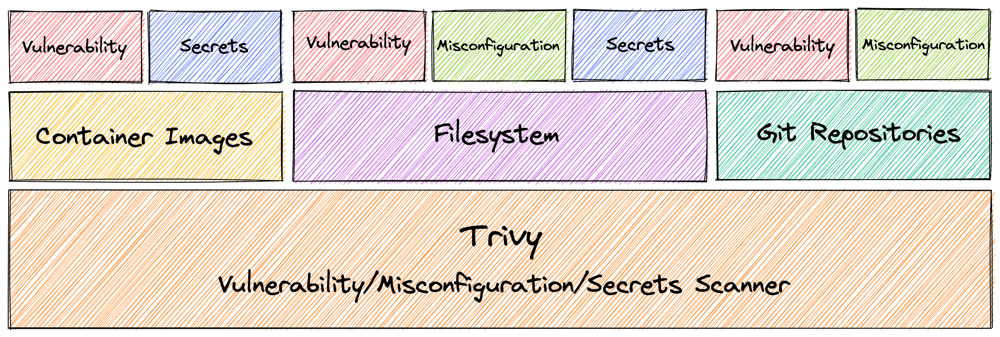

<p align="center">
  
</p>

<p align="center">
  <a href="https://aquasecurity.github.io/trivy/">Documentation</a> 
</p>

<p align="center">
Scanner for vulnerabilities in container images, file systems, and Git repositories, as well as for configuration issues
</p>

[![GitHub Release][release-img]][release]
[![Test][test-img]][test]
[![Go Report Card][go-report-img]][go-report]
[![License: Apache-2.0][license-img]][license]
[![GitHub All Releases][github-all-releases-img]][release]
![Docker Pulls][docker-pulls]


# Abstract
`Trivy` (`tri` pronounced like **tri**gger, `vy` pronounced like en**vy**) is a simple and comprehensive scanner for vulnerabilities in container images, file systems, and Git repositories, as well as for configuration issues.
`Trivy` detects vulnerabilities of OS packages (Alpine, RHEL, CentOS, etc.) and language-specific packages (Bundler, Composer, npm, yarn, etc.).
In addition, `Trivy` scans Infrastructure as Code (IaC) files such as Terraform, Dockerfile and Kubernetes, to detect potential configuration issues that expose your deployments to the risk of attack.
`Trivy` is easy to use. Just install the binary and you're ready to scan.

<p align="center">
  
</p>

### Demo: Vulnerability Detection (Container Image)
<p align="center">
  
</p>

### Demo: Misconfiguration Detection (IaC Files)
<p align="center">
  
</p>

# Quick Start
## Scan Image for Vulnerabilities
Simply specify an image name (and a tag).

```
$ trivy image [YOUR_IMAGE_NAME]
```

For example:

```
$ trivy image python:3.4-alpine
```

<details>
<summary>Result</summary>

```
2019-05-16T01:20:43.180+0900    INFO    Updating vulnerability database...
2019-05-16T01:20:53.029+0900    INFO    Detecting Alpine vulnerabilities...

python:3.4-alpine3.9 (alpine 3.9.2)
===================================
Total: 1 (UNKNOWN: 0, LOW: 0, MEDIUM: 1, HIGH: 0, CRITICAL: 0)

+---------+------------------+----------+-------------------+---------------+--------------------------------+
| LIBRARY | VULNERABILITY ID | SEVERITY | INSTALLED VERSION | FIXED VERSION |             TITLE              |
+---------+------------------+----------+-------------------+---------------+--------------------------------+
| openssl | CVE-2019-1543    | MEDIUM   | 1.1.1a-r1         | 1.1.1b-r1     | openssl: ChaCha20-Poly1305     |
|         |                  |          |                   |               | with long nonces               |
+---------+------------------+----------+-------------------+---------------+--------------------------------+
```
</details>

## Scan Filesystem for Vulnerabilities and Misconfigurations
Simply specify a directory to scan.

```bash
$ trivy fs --security-checks vuln,config [YOUR_PROJECT_DIR]
```

For example:

```bash
$ trivy fs --security-checks vuln,config myproject/
```

<details>
<summary>Result</summary>

```bash
2021-07-09T12:03:27.564+0300    INFO    Number of language-specific files: 1
2021-07-09T12:03:27.564+0300    INFO    Detecting pipenv vulnerabilities...
2021-07-09T12:03:27.566+0300    INFO    Detected config files: 1

Pipfile.lock (pipenv)
=====================
Total: 1 (HIGH: 1, CRITICAL: 0)

+----------+------------------+----------+-------------------+---------------+---------------------------------------+
| LIBRARY  | VULNERABILITY ID | SEVERITY | INSTALLED VERSION | FIXED VERSION |                 TITLE                 |
+----------+------------------+----------+-------------------+---------------+---------------------------------------+
| httplib2 | CVE-2021-21240   | HIGH     | 0.12.1            | 0.19.0        | python-httplib2: Regular              |
|          |                  |          |                   |               | expression denial of                  |
|          |                  |          |                   |               | service via malicious header          |
|          |                  |          |                   |               | -->avd.aquasec.com/nvd/cve-2021-21240 |
+----------+------------------+----------+-------------------+---------------+---------------------------------------+

Dockerfile (dockerfile)
=======================
Tests: 23 (SUCCESSES: 22, FAILURES: 1, EXCEPTIONS: 0)
Failures: 1 (HIGH: 1, CRITICAL: 0)

+---------------------------+------------+----------------------+----------+------------------------------------------+
|           TYPE            | MISCONF ID |        CHECK         | SEVERITY |                 MESSAGE                  |
+---------------------------+------------+----------------------+----------+------------------------------------------+
| Dockerfile Security Check |   DS002    | Image user is 'root' |   HIGH   | Last USER command in                     |
|                           |            |                      |          | Dockerfile should not be 'root'          |
|                           |            |                      |          | -->avd.aquasec.com/appshield/ds002       |
+---------------------------+------------+----------------------+----------+------------------------------------------+
```
</details>

## Scan Directory for Misconfigurations

Simply specify a directory containing IaC files such as Terraform and Dockerfile.

```
$ trivy config [YOUR_IAC_DIR]
```

For example:

```
$ ls build/
Dockerfile
$ trivy config ./build
```

<details>
<summary>Result</summary>

```
2021-07-09T10:06:29.188+0300    INFO    Need to update the built-in policies
2021-07-09T10:06:29.188+0300    INFO    Downloading the built-in policies...
2021-07-09T10:06:30.520+0300    INFO    Detected config files: 1

Dockerfile (dockerfile)
=======================
Tests: 23 (SUCCESSES: 22, FAILURES: 1, EXCEPTIONS: 0)
Failures: 1 (UNKNOWN: 0, LOW: 0, MEDIUM: 0, HIGH: 1, CRITICAL: 0)

+---------------------------+------------+----------------------+----------+------------------------------------------+
|           TYPE            | MISCONF ID |        CHECK         | SEVERITY |                 MESSAGE                  |
+---------------------------+------------+----------------------+----------+------------------------------------------+
| Dockerfile Security Check |   DS002    | Image user is 'root' |   HIGH   | Last USER command in                     |
|                           |            |                      |          | Dockerfile should not be 'root'          |
|                           |            |                      |          | -->avd.aquasec.com/appshield/ds002       |
+---------------------------+------------+----------------------+----------+------------------------------------------+
```

</details>


# Features

- Comprehensive vulnerability detection
  - OS packages (Alpine Linux, Red Hat Universal Base Image, Red Hat Enterprise Linux, CentOS, Oracle Linux, Debian, Ubuntu, Amazon Linux, openSUSE Leap, SUSE Enterprise Linux, Photon OS and Distroless)
  - **Language-specific packages** (Bundler, Composer, Pipenv, Poetry, npm, yarn, Cargo, NuGet, Maven, and Go)
- Misconfiguration detection (IaC scanning) 
  - A wide variety of built-in policies are provided **out of the box**
    - Kubernetes, Docker, Terraform, and more coming soon
  - Support custom policies
- Simple
  - Specify only an image name, a path to config files, or an artifact name
- Fast
  - The first scan will finish within 10 seconds (depending on your network). Consequent scans will finish in single seconds.
- Easy installation
  - `apt-get install`, `yum install` and `brew install` are possible.
  - **No pre-requisites** such as installation of DB, libraries, etc.
- High accuracy
  - **Especially [Alpine Linux][alpine] and RHEL/CentOS**
  - Other OSes are also high
- DevSecOps
  - **Suitable for CI** such as GitHub Actions, Jenkins, GitLab CI, etc.
- Support multiple targets
  - container image, local filesystem and remote git repository

# Integrations
- [GitHub Actions][action]
- [Visual Studio Code][vscode]

# Documentation
The official documentation, which provides detailed installation, configuration, and quick start guides, is available at https://aquasecurity.github.io/trivy/.

[test]: https://github.com/aquasecurity/trivy/actions/workflows/test.yaml
[test-img]: https://github.com/aquasecurity/trivy/actions/workflows/test.yaml/badge.svg
[go-report]: https://goreportcard.com/report/github.com/aquasecurity/trivy
[go-report-img]: https://goreportcard.com/badge/github.com/aquasecurity/trivy
[release]: https://github.com/aquasecurity/trivy/releases
[release-img]: https://img.shields.io/github/release/aquasecurity/trivy.svg?logo=github
[github-all-releases-img]: https://img.shields.io/github/downloads/aquasecurity/trivy/total?logo=github
[docker-pulls]: https://img.shields.io/docker/pulls/aquasec/trivy?logo=docker&label=docker%20pulls%20%2F%20trivy
[license]: https://github.com/aquasecurity/trivy/blob/main/LICENSE
[license-img]: https://img.shields.io/badge/License-Apache%202.0-blue.svg

[alpine]: https://ariadne.space/2021/06/08/the-vulnerability-remediation-lifecycle-of-alpine-containers/
[action]: https://github.com/aquasecurity/trivy-action
[vscode]: https://github.com/aquasecurity/trivy-vscode-extension
