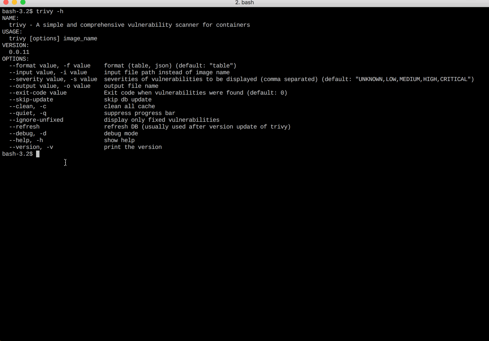
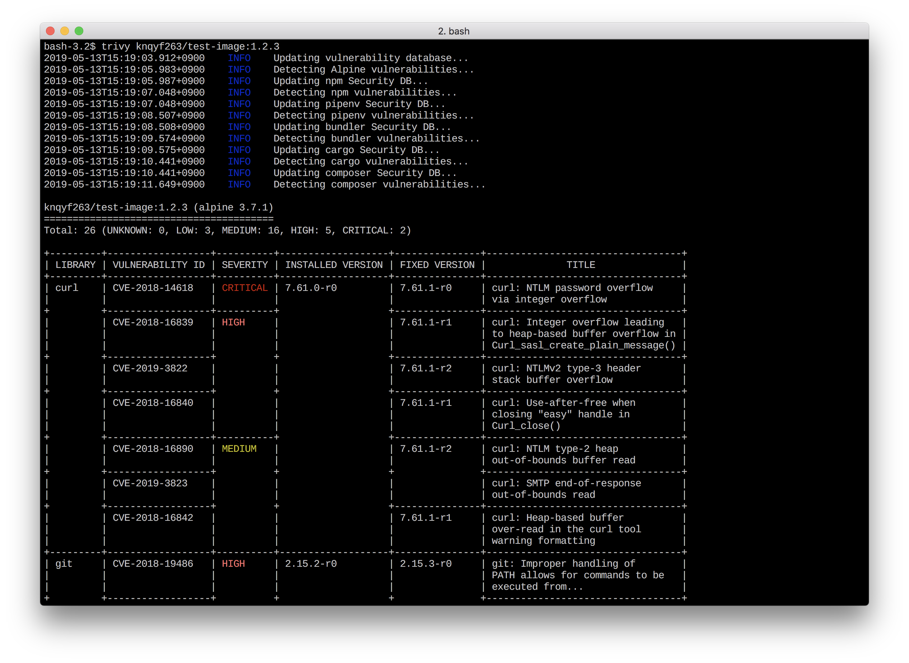
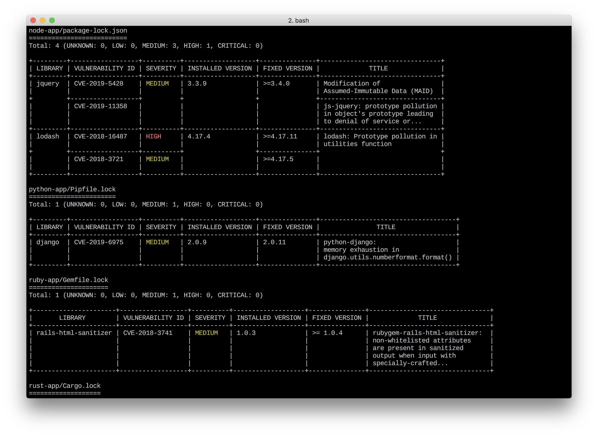

[](https://github.com/aquasecurity/trivy/releases/latest)
[](https://circleci.com/gh/aquasecurity/trivy)
[](https://goreportcard.com/report/github.com/aquasecurity/trivy)
[](https://github.com/aquasecurity/trivy/blob/master/LICENSE)
[](https://microbadger.com/images/aquasec/trivy "Get your own version badge on microbadger.com")
[](https://codecov.io/gh/aquasecurity/trivy)

A Simple and Comprehensive Vulnerability Scanner for Containers and other Artifacts, Suitable for CI.





# Table of Contents

- [Abstract](#abstract)
- [Features](#features)
- [Installation](#installation)
  * [RHEL/CentOS](#rhelcentos)
  * [Debian/Ubuntu](#debianubuntu)
  * [Arch Linux](#arch-linux)
  * [Homebrew](#homebrew)
  * [Nix/NixOS](#nixnixos)
  * [Install Script](#install-script)
  * [Binary](#binary)
  * [From source](#from-source)
- [Quick Start](#quick-start)
  * [Image](#image)
    + [Basic](#basic)
    + [Docker](#docker)
  * [Filesystem](#filesystem)
  * [Embed in Dockerfile](#embed-in-dockerfile)
  * [Git Repository](#git-repository)
- [Examples](#examples)
  * [Standalone](#standalone)
    + [Scan an image](#scan-an-image)
    + [Scan an image file](#scan-an-image-file)
    + [Scan an OCI image](#scan-an-oci-image)
    + [Scan a container from inside the container](#scan-a-container-from-inside-the-container)
    + [Scan a project including a lock file](#scan-a-project-including-a-lock-file)
    + [Embed in Dockerfile](#embed-in-dockerfile)
    + [Save the results as JSON](#save-the-results-as-json)
    + [Save the results using a template](#save-the-results-using-a-template)
    + [Filter the vulnerabilities by severities](#filter-the-vulnerabilities-by-severities)
    + [Filter the vulnerabilities by type](#filter-the-vulnerabilities-by-type)
    + [Filter the vulnerabilities by Open Policy Agent](#filter-the-vulnerabilities-by-open-policy-agent-policy)
    + [Skip traversal of the specific files](#skip-traversal-of-the-specific-files)
    + [Skip traversal in the specific directory](#skip-traversal-in-the-specific-directory)
    + [Skip update of vulnerability DB](#skip-update-of-vulnerability-db)
    + [Only download vulnerability database](#only-download-vulnerability-database)
    + [Ignore unfixed vulnerabilities](#ignore-unfixed-vulnerabilities)
    + [Specify exit code](#specify-exit-code)
    + [Ignore the specified vulnerabilities](#ignore-the-specified-vulnerabilities)
    + [Specify cache directory](#specify-cache-directory)
    + [Clear caches](#clear-caches)
    + [Reset](#reset)
    + [Use lightweight DB](#use-lightweight-db)
  * [Client / Server](#client--server)
    + [Server](#server)
    + [Client](#client)
    + [Authentication](#authentication)
    + [Deprecated options](#deprecated-options)
- [Continuous Integration (CI)](#continuous-integration-ci)
  * [GitHub Actions](#github-actions)
  * [Travis CI](#travis-ci)
  * [CircleCI](#circleci)
  * [GitLab CI](#gitlab-ci)
  * [AWS CodePipeline](#aws-codepipeline)
  * [AWS Security Hub](#aws-security-hub)
  * [Authorization for Private Docker Registry](#authorization-for-private-docker-registry)
- [Vulnerability Detection](#vulnerability-detection)
  * [OS Packages](#os-packages)
  * [Application Dependencies](#application-dependencies)
  * [Image Tar format](#image-tar-format)
  * [Data sources](#data-sources)
- [Air-gapped environment](#air-gapped-environment)
- [Comparison with other scanners](#comparison-with-other-scanners)
- [Usage](#usage)
  * [Image](#image-1)
  * [Client](#client-1)
  * [Server](#server-1)
- [Q&A](#qa)
  * [Homebrew](#homebrew-2)
  * [Others](#others)


# Abstract

`Trivy` (`tri` pronounced like **tri**gger, `vy` pronounced like en**vy**) is a simple and comprehensive vulnerability scanner for containers and other artifacts.
A software vulnerability is a glitch, flaw, or weakness present in the software or in an Operating System.
`Trivy` detects vulnerabilities of OS packages (Alpine, RHEL, CentOS, etc.) and application dependencies (Bundler, Composer, npm, yarn, etc.).
`Trivy` is easy to use. Just install the binary and you're ready to scan. All you need to do for scanning is to specify a target such as an image name of the container.

It is considered to be used in CI. Before pushing to a container registry or deploying your application, you can scan your local container image and other artifacts easily.
See [here](#continuous-integration-ci) for details.

# Features

- Detect comprehensive vulnerabilities
  - OS packages (Alpine, **Red Hat Universal Base Image**, Red Hat Enterprise Linux, CentOS, Oracle Linux, Debian, Ubuntu, Amazon Linux, openSUSE Leap, SUSE Enterprise Linux, Photon OS and Distroless)
  - **Application dependencies** (Bundler, Composer, Pipenv, Poetry, npm, yarn and Cargo)
- Simple
  - Specify only an image name or artifact name
  - See [Quick Start](#quick-start) and [Examples](#examples)
- Fast
  - The first scan will finish within 10 seconds (depending on your network). Consequent scans will finish in single seconds.
  - Unlike other scanners that take long to fetch vulnerability information (~10 minutes) on the first run, and encourage you to maintain a durable vulnerability database, Trivy is stateless and requires no maintenance or preparation.
- Easy installation
  - `apt-get install`, `yum install` and `brew install` is possible (See [Installation](#installation))
  - **No pre-requisites** such as installation of DB, libraries, etc.
- High accuracy
  - **Especially Alpine Linux and RHEL/CentOS**
  - Other OSes are also high
- DevSecOps
  - **Suitable for CI** such as Travis CI, CircleCI, Jenkins, GitLab CI, etc.
  - See [CI Example](#continuous-integration-ci)
- Support multiple formats
  - container image
    - A local image in Docker Engine which is running as a daemon
    - A remote image in Docker Registry such as Docker Hub, ECR, GCR and ACR
    - A tar archive stored in the `docker save` formatted file
    - An image directory compliant with [OCI Image Format](https://github.com/opencontainers/image-spec)
  - local filesystem
  - remote git repository

Please see [LICENSE](https://github.com/aquasecurity/trivy/blob/master/LICENSE) for Trivy licensing information. Note that Trivy uses vulnerability information from a variety of sources, some of which are licensed for non-commercial use only.

# Installation

Replace `{TRIVY_VERSION}` with the latest released version of Trivy. You can find the latest releases on this page: https://github.com/aquasecurity/trivy/releases

## RHEL/CentOS

Add repository setting to `/etc/yum.repos.d`.

```
$ sudo vim /etc/yum.repos.d/trivy.repo
[trivy]
name=Trivy repository
baseurl=https://aquasecurity.github.io/trivy-repo/rpm/releases/$releasever/$basearch/
gpgcheck=0
enabled=1
$ sudo yum -y update
$ sudo yum -y install trivy
```

or

```
$ rpm -ivh https://github.com/aquasecurity/trivy/releases/download/{TRIVY_VERSION}/trivy_{TRIVY_VERSION}_Linux-64bit.rpm
```

## Debian/Ubuntu

Add repository to `/etc/apt/sources.list.d`.

```
$ sudo apt-get install wget apt-transport-https gnupg lsb-release
$ wget -qO - https://aquasecurity.github.io/trivy-repo/deb/public.key | sudo apt-key add -
$ echo deb https://aquasecurity.github.io/trivy-repo/deb $(lsb_release -sc) main | sudo tee -a /etc/apt/sources.list.d/trivy.list
$ sudo apt-get update
$ sudo apt-get install trivy
```

or

```
$ wget https://github.com/aquasecurity/trivy/releases/download/{TRIVY_VERSION}/trivy_{TRIVY_VERSION}_Linux-64bit.deb
$ sudo dpkg -i trivy_{TRIVY_VERSION}_Linux-64bit.deb
```


## Arch Linux
Package trivy-bin can be installed from the Arch User Repository. Examples:
```
pikaur -Sy trivy-bin
```
or
```
yay -Sy trivy-bin
```

## Homebrew

You can use homebrew on macOS and Linux.

```
$ brew install aquasecurity/trivy/trivy
```

## Nix/NixOS

You can use nix on Linux or macOS and on others unofficially.

Note that trivy is currently only in the unstable channels.

```
$ nix-env --install trivy
```

Or through your configuration on NixOS or with home-manager as usual


## Install Script
This script downloads Trivy binary based on your OS and architecture.

```
$ curl -sfL https://raw.githubusercontent.com/aquasecurity/trivy/master/contrib/install.sh | sh -s -- -b /usr/local/bin
```

## Binary

Get the latest version from [this page](https://github.com/aquasecurity/trivy/releases/latest), and download the archive file for your operating system/architecture. Unpack the archive, and put the binary somewhere in your `$PATH` (on UNIX-y systems, /usr/local/bin or the like). Make sure it has execution bits turned on.

## From source

```sh
$ mkdir -p $GOPATH/src/github.com/aquasecurity
$ cd $GOPATH/src/github.com/aquasecurity
$ git clone https://github.com/aquasecurity/trivy
$ cd trivy/cmd/trivy/
$ export GO111MODULE=on
$ go install
```

# Quick Start

## Image

Simply specify an image name (and a tag). **The `latest` tag should be avoided as problems occur with the image cache.** See [Clear caches](#clear-caches).

### Basic

```
$ trivy image [YOUR_IMAGE_NAME]
```

For example:

```
$ trivy image python:3.4-alpine
```

<details>
<summary>Result</summary>

```
2019-05-16T01:20:43.180+0900    INFO    Updating vulnerability database...
2019-05-16T01:20:53.029+0900    INFO    Detecting Alpine vulnerabilities...

python:3.4-alpine3.9 (alpine 3.9.2)
===================================
Total: 1 (UNKNOWN: 0, LOW: 0, MEDIUM: 1, HIGH: 0, CRITICAL: 0)

+---------+------------------+----------+-------------------+---------------+--------------------------------+
| LIBRARY | VULNERABILITY ID | SEVERITY | INSTALLED VERSION | FIXED VERSION |             TITLE              |
+---------+------------------+----------+-------------------+---------------+--------------------------------+
| openssl | CVE-2019-1543    | MEDIUM   | 1.1.1a-r1         | 1.1.1b-r1     | openssl: ChaCha20-Poly1305     |
|         |                  |          |                   |               | with long nonces               |
+---------+------------------+----------+-------------------+---------------+--------------------------------+
```

</details>

### Docker
#### Docker Hub

Replace [YOUR_CACHE_DIR] with the cache directory on your machine.

```
$ docker run --rm -v [YOUR_CACHE_DIR]:/root/.cache/ aquasec/trivy [YOUR_IMAGE_NAME]
```

Example for macOS:

```
$ docker run --rm -v $HOME/Library/Caches:/root/.cache/ aquasec/trivy python:3.4-alpine
```

If you would like to scan the image on your host machine, you need to mount `docker.sock`.

```
$ docker run --rm -v /var/run/docker.sock:/var/run/docker.sock \
    -v $HOME/Library/Caches:/root/.cache/ aquasec/trivy python:3.4-alpine
```

Please re-pull latest `aquasec/trivy` if an error occurred.

<details>
<summary>Result</summary>

```
2019-05-16T01:20:43.180+0900    INFO    Updating vulnerability database...
2019-05-16T01:20:53.029+0900    INFO    Detecting Alpine vulnerabilities...

python:3.4-alpine3.9 (alpine 3.9.2)
===================================
Total: 1 (UNKNOWN: 0, LOW: 0, MEDIUM: 1, HIGH: 0, CRITICAL: 0)

+---------+------------------+----------+-------------------+---------------+--------------------------------+
| LIBRARY | VULNERABILITY ID | SEVERITY | INSTALLED VERSION | FIXED VERSION |             TITLE              |
+---------+------------------+----------+-------------------+---------------+--------------------------------+
| openssl | CVE-2019-1543    | MEDIUM   | 1.1.1a-r1         | 1.1.1b-r1     | openssl: ChaCha20-Poly1305     |
|         |                  |          |                   |               | with long nonces               |
+---------+------------------+----------+-------------------+---------------+--------------------------------+
```

</details>

#### GitHub Container Registry
The same image is hosted on GitHub Container Registry as well.  
https://github.com/orgs/aquasecurity/packages/container/package/trivy

```
$ docker pull ghcr.io/aquasecurity/trivy:latest
```

## Filesystem
Scan a filesystem (such as a host machine, a virtual machine image, or an unpacked container image filesystem).

Trivy will look for vulnerabilities based on lock files such as Gemfile.lock and package-lock.json.

```
$ trivy fs /path/to/project
```


Scan your container from inside the container.

```
$ docker run --rm -it alpine:3.11
/ # curl -sfL https://raw.githubusercontent.com/aquasecurity/trivy/master/contrib/install.sh | sh -s -- -b /usr/local/bin
/ # trivy fs /
```

## Embed in Dockerfile
Scan your image as part of the build process by embedding Trivy in the Dockerfile. This approach can be used to update Dockerfiles currently using Aqua’s [Microscanner](https://github.com/aquasecurity/microscanner).

```
$ cat Dockerfile
FROM alpine:3.7

RUN apk add curl \
    && curl -sfL https://raw.githubusercontent.com/aquasecurity/trivy/master/contrib/install.sh | sh -s -- -b /usr/local/bin \
    && trivy filesystem --exit-code 1 --no-progress /

$ docker build -t vulnerable-image .
```

## Git Repository
Scan your remote git repository

```
$ trivy repo https://github.com/knqyf263/trivy-ci-test
```

Only public repositories are supported.

# Examples

## Standalone

### Scan an image

Simply specify an image name (and a tag).

```
$ trivy image knqyf263/vuln-image:1.2.3
```

<details>
<summary>Result</summary>

```
2019-05-16T12:59:03.150+0900    INFO    Detecting Alpine vulnerabilities...
2019-05-16T12:59:04.941+0900    INFO    Detecting bundler vulnerabilities...
2019-05-16T12:59:05.967+0900    INFO    Detecting cargo vulnerabilities...
2019-05-16T12:59:07.834+0900    INFO    Detecting composer vulnerabilities...
2019-05-16T12:59:10.285+0900    INFO    Detecting npm vulnerabilities...
2019-05-16T12:59:11.487+0900    INFO    Detecting pipenv vulnerabilities...

knqyf263/vuln-image:1.2.3 (alpine 3.7.1)
========================================
Total: 26 (UNKNOWN: 0, LOW: 3, MEDIUM: 16, HIGH: 5, CRITICAL: 2)

+---------+------------------+----------+-------------------+---------------+----------------------------------+
| LIBRARY | VULNERABILITY ID | SEVERITY | INSTALLED VERSION | FIXED VERSION |              TITLE               |
+---------+------------------+----------+-------------------+---------------+----------------------------------+
| curl    | CVE-2018-14618   | CRITICAL | 7.61.0-r0         | 7.61.1-r0     | curl: NTLM password overflow     |
|         |                  |          |                   |               | via integer overflow             |
+         +------------------+----------+                   +---------------+----------------------------------+
|         | CVE-2018-16839   | HIGH     |                   | 7.61.1-r1     | curl: Integer overflow leading   |
|         |                  |          |                   |               | to heap-based buffer overflow in |
|         |                  |          |                   |               | Curl_sasl_create_plain_message() |
+         +------------------+          +                   +---------------+----------------------------------+
|         | CVE-2019-3822    |          |                   | 7.61.1-r2     | curl: NTLMv2 type-3 header       |
|         |                  |          |                   |               | stack buffer overflow            |
+         +------------------+          +                   +---------------+----------------------------------+
|         | CVE-2018-16840   |          |                   | 7.61.1-r1     | curl: Use-after-free when        |
|         |                  |          |                   |               | closing "easy" handle in         |
|         |                  |          |                   |               | Curl_close()                     |
+         +------------------+----------+                   +               +----------------------------------+
|         | CVE-2018-16842   | MEDIUM   |                   |               | curl: Heap-based buffer          |
|         |                  |          |                   |               | over-read in the curl tool       |
|         |                  |          |                   |               | warning formatting               |
+         +------------------+          +                   +---------------+----------------------------------+
|         | CVE-2018-16890   |          |                   | 7.61.1-r2     | curl: NTLM type-2 heap           |
|         |                  |          |                   |               | out-of-bounds buffer read        |
+         +------------------+          +                   +               +----------------------------------+
|         | CVE-2019-3823    |          |                   |               | curl: SMTP end-of-response       |
|         |                  |          |                   |               | out-of-bounds read               |
+---------+------------------+----------+-------------------+---------------+----------------------------------+
| git     | CVE-2018-17456   | HIGH     | 2.15.2-r0         | 2.15.3-r0     | git: arbitrary code execution    |
|         |                  |          |                   |               | via .gitmodules                  |
+         +------------------+          +                   +               +----------------------------------+
|         | CVE-2018-19486   |          |                   |               | git: Improper handling of        |
|         |                  |          |                   |               | PATH allows for commands to be   |
|         |                  |          |                   |               | executed from...                 |
+---------+------------------+----------+-------------------+---------------+----------------------------------+
| libssh2 | CVE-2019-3855    | CRITICAL | 1.8.0-r2          | 1.8.1-r0      | libssh2: Integer overflow in     |
|         |                  |          |                   |               | transport read resulting in      |
|         |                  |          |                   |               | out of bounds write...           |
+         +------------------+----------+                   +               +----------------------------------+
|         | CVE-2019-3859    | MEDIUM   |                   |               | libssh2: Unchecked use of        |
|         |                  |          |                   |               | _libssh2_packet_require and      |
|         |                  |          |                   |               | _libssh2_packet_requirev         |
|         |                  |          |                   |               | resulting in out-of-bounds       |
|         |                  |          |                   |               | read                             |
+         +------------------+          +                   +               +----------------------------------+
|         | CVE-2019-3858    |          |                   |               | libssh2: Zero-byte allocation    |
|         |                  |          |                   |               | with a specially crafted SFTP    |
|         |                  |          |                   |               | packed leading to an...          |
+         +------------------+          +                   +               +----------------------------------+
|         | CVE-2019-3863    |          |                   |               | libssh2: Integer overflow        |
|         |                  |          |                   |               | in user authenticate             |
|         |                  |          |                   |               | keyboard interactive allows      |
|         |                  |          |                   |               | out-of-bounds writes             |
+         +------------------+          +                   +               +----------------------------------+
|         | CVE-2019-3862    |          |                   |               | libssh2: Out-of-bounds memory    |
|         |                  |          |                   |               | comparison with specially        |
|         |                  |          |                   |               | crafted message channel          |
|         |                  |          |                   |               | request                          |
+         +------------------+          +                   +               +----------------------------------+
|         | CVE-2019-3860    |          |                   |               | libssh2: Out-of-bounds reads     |
|         |                  |          |                   |               | with specially crafted SFTP      |
|         |                  |          |                   |               | packets                          |
+         +------------------+          +                   +               +----------------------------------+
|         | CVE-2019-3857    |          |                   |               | libssh2: Integer overflow in     |
|         |                  |          |                   |               | SSH packet processing channel    |
|         |                  |          |                   |               | resulting in out of...           |
+         +------------------+          +                   +               +----------------------------------+
|         | CVE-2019-3861    |          |                   |               | libssh2: Out-of-bounds reads     |
|         |                  |          |                   |               | with specially crafted SSH       |
|         |                  |          |                   |               | packets                          |
+         +------------------+          +                   +               +----------------------------------+
|         | CVE-2019-3856    |          |                   |               | libssh2: Integer overflow in     |
|         |                  |          |                   |               | keyboard interactive handling    |
|         |                  |          |                   |               | resulting in out of bounds...    |
+---------+------------------+          +-------------------+---------------+----------------------------------+
| libxml2 | CVE-2018-14567   |          | 2.9.7-r0          | 2.9.8-r1      | libxml2: Infinite loop when      |
|         |                  |          |                   |               | --with-lzma is used allows for   |
|         |                  |          |                   |               | denial of service...             |
+         +------------------+          +                   +               +----------------------------------+
|         | CVE-2018-14404   |          |                   |               | libxml2: NULL pointer            |
|         |                  |          |                   |               | dereference in                   |
|         |                  |          |                   |               | xpath.c:xmlXPathCompOpEval()     |
|         |                  |          |                   |               | can allow attackers to cause     |
|         |                  |          |                   |               | a...                             |
+         +------------------+----------+                   +               +----------------------------------+
|         | CVE-2018-9251    | LOW      |                   |               | libxml2: infinite loop in        |
|         |                  |          |                   |               | xz_decomp function in xzlib.c    |
+---------+------------------+----------+-------------------+---------------+----------------------------------+
| openssh | CVE-2019-6109    | MEDIUM   | 7.5_p1-r9         | 7.5_p1-r10    | openssh: Missing character       |
|         |                  |          |                   |               | encoding in progress display     |
|         |                  |          |                   |               | allows for spoofing of scp...    |
+         +------------------+          +                   +               +----------------------------------+
|         | CVE-2019-6111    |          |                   |               | openssh: Improper validation     |
|         |                  |          |                   |               | of object names allows           |
|         |                  |          |                   |               | malicious server to overwrite    |
|         |                  |          |                   |               | files...                         |
+         +------------------+----------+                   +               +----------------------------------+
|         | CVE-2018-20685   | LOW      |                   |               | openssh: scp client improper     |
|         |                  |          |                   |               | directory name validation        |
+---------+------------------+----------+-------------------+---------------+----------------------------------+
| sqlite  | CVE-2018-20346   | MEDIUM   | 3.21.0-r1         | 3.25.3-r0     | sqlite: Multiple flaws in        |
|         |                  |          |                   |               | sqlite which can be triggered    |
|         |                  |          |                   |               | via corrupted internal...        |
+---------+------------------+----------+-------------------+---------------+----------------------------------+
| tar     | CVE-2018-20482   | LOW      | 1.29-r1           | 1.31-r0       | tar: Infinite read loop in       |
|         |                  |          |                   |               | sparse_dump_region function in   |
|         |                  |          |                   |               | sparse.c                         |
+---------+------------------+----------+-------------------+---------------+----------------------------------+

ruby-app/Gemfile.lock
=====================
Total: 1 (UNKNOWN: 0, LOW: 0, MEDIUM: 1, HIGH: 0, CRITICAL: 0)

+----------------------+------------------+----------+-------------------+---------------+--------------------------------+
|       LIBRARY        | VULNERABILITY ID | SEVERITY | INSTALLED VERSION | FIXED VERSION |             TITLE              |
+----------------------+------------------+----------+-------------------+---------------+--------------------------------+
| rails-html-sanitizer | CVE-2018-3741    | MEDIUM   | 1.0.3             | >= 1.0.4      | rubygem-rails-html-sanitizer:  |
|                      |                  |          |                   |               | non-whitelisted attributes     |
|                      |                  |          |                   |               | are present in sanitized       |
|                      |                  |          |                   |               | output when input with         |
|                      |                  |          |                   |               | specially-crafted...           |
+----------------------+------------------+----------+-------------------+---------------+--------------------------------+

rust-app/Cargo.lock
===================
Total: 3 (UNKNOWN: 3, LOW: 0, MEDIUM: 0, HIGH: 0, CRITICAL: 0)

+---------+-------------------+----------+-------------------+---------------+--------------------------------+
| LIBRARY | VULNERABILITY ID  | SEVERITY | INSTALLED VERSION | FIXED VERSION |             TITLE              |
+---------+-------------------+----------+-------------------+---------------+--------------------------------+
| ammonia | RUSTSEC-2019-0001 | UNKNOWN  | 1.9.0             | >= 2.1.0      | Uncontrolled recursion leads   |
|         |                   |          |                   |               | to abort in HTML serialization |
+---------+-------------------+          +-------------------+---------------+--------------------------------+
| openssl | RUSTSEC-2016-0001 |          | 0.8.3             | >= 0.9.0      | SSL/TLS MitM vulnerability due |
|         |                   |          |                   |               | to insecure defaults           |
+         +-------------------+          +                   +---------------+--------------------------------+
|         | RUSTSEC-2018-0010 |          |                   | >= 0.10.9     | Use after free in CMS Signing  |
+---------+-------------------+----------+-------------------+---------------+--------------------------------+

php-app/composer.lock
=====================
Total: 1 (UNKNOWN: 0, LOW: 0, MEDIUM: 1, HIGH: 0, CRITICAL: 0)

+-------------------+------------------+----------+-------------------+---------------------+--------------------------------+
|      LIBRARY      | VULNERABILITY ID | SEVERITY | INSTALLED VERSION |    FIXED VERSION    |             TITLE              |
+-------------------+------------------+----------+-------------------+---------------------+--------------------------------+
| guzzlehttp/guzzle | CVE-2016-5385    | MEDIUM   | 6.2.0             | 6.2.1, 4.2.4, 5.3.1 | PHP: sets environmental        |
|                   |                  |          |                   |                     | variable based on user         |
|                   |                  |          |                   |                     | supplied Proxy request header  |
+-------------------+------------------+----------+-------------------+---------------------+--------------------------------+

node-app/package-lock.json
==========================
Total: 4 (UNKNOWN: 0, LOW: 0, MEDIUM: 3, HIGH: 1, CRITICAL: 0)

+---------+------------------+----------+-------------------+---------------+--------------------------------+
| LIBRARY | VULNERABILITY ID | SEVERITY | INSTALLED VERSION | FIXED VERSION |             TITLE              |
+---------+------------------+----------+-------------------+---------------+--------------------------------+
| jquery  | CVE-2019-5428    | MEDIUM   | 3.3.9             | >=3.4.0       | Modification of                |
|         |                  |          |                   |               | Assumed-Immutable Data (MAID)  |
+         +------------------+          +                   +               +--------------------------------+
|         | CVE-2019-11358   |          |                   |               | js-jquery: prototype pollution |
|         |                  |          |                   |               | in object's prototype leading  |
|         |                  |          |                   |               | to denial of service or...     |
+---------+------------------+----------+-------------------+---------------+--------------------------------+
| lodash  | CVE-2018-16487   | HIGH     | 4.17.4            | >=4.17.11     | lodash: Prototype pollution in |
|         |                  |          |                   |               | utilities function             |
+         +------------------+----------+                   +---------------+                                +
|         | CVE-2018-3721    | MEDIUM   |                   | >=4.17.5      |                                |
|         |                  |          |                   |               |                                |
+---------+------------------+----------+-------------------+---------------+--------------------------------+

python-app/Pipfile.lock
=======================
Total: 1 (UNKNOWN: 0, LOW: 0, MEDIUM: 1, HIGH: 0, CRITICAL: 0)

+---------+------------------+----------+-------------------+---------------+------------------------------------+
| LIBRARY | VULNERABILITY ID | SEVERITY | INSTALLED VERSION | FIXED VERSION |               TITLE                |
+---------+------------------+----------+-------------------+---------------+------------------------------------+
| django  | CVE-2019-6975    | MEDIUM   | 2.0.9             | 2.0.11        | python-django:                     |
|         |                  |          |                   |               | memory exhaustion in               |
|         |                  |          |                   |               | django.utils.numberformat.format() |
+---------+------------------+----------+-------------------+---------------+------------------------------------+
```

</details>

### Scan an image file

```
$ docker save ruby:2.3.0-alpine3.9 -o ruby-2.3.0.tar
$ trivy image --input ruby-2.3.0.tar
```

<details>
<summary>Result</summary>

```
2019-05-16T12:45:57.332+0900    INFO    Updating vulnerability database...
2019-05-16T12:45:59.119+0900    INFO    Detecting Debian vulnerabilities...

ruby-2.3.0.tar (debian 8.4)
===========================
Total: 7447 (UNKNOWN: 5, LOW: 326, MEDIUM: 5695, HIGH: 1316, CRITICAL: 105)

+------------------------------+---------------------+----------+----------------------------+----------------------------------+-----------------------------------------------------+
|           LIBRARY            |  VULNERABILITY ID   | SEVERITY |     INSTALLED VERSION      |          FIXED VERSION           |                        TITLE                        |
+------------------------------+---------------------+----------+----------------------------+----------------------------------+-----------------------------------------------------+
| apt                          | CVE-2019-3462       | CRITICAL | 1.0.9.8.3                  | 1.0.9.8.5                        | Incorrect sanitation of the                         |
|                              |                     |          |                            |                                  | 302 redirect field in HTTP                          |
|                              |                     |          |                            |                                  | transport method of...                              |
+                              +---------------------+----------+                            +----------------------------------+-----------------------------------------------------+
|                              | CVE-2016-1252       | MEDIUM   |                            | 1.0.9.8.4                        | The apt package in Debian                           |
|                              |                     |          |                            |                                  | jessie before 1.0.9.8.4, in                         |
|                              |                     |          |                            |                                  | Debian unstable before...                           |
+                              +---------------------+----------+                            +----------------------------------+-----------------------------------------------------+
|                              | CVE-2011-3374       | LOW      |                            |                                  |                                                     |
+------------------------------+---------------------+----------+----------------------------+----------------------------------+-----------------------------------------------------+
| bash                         | CVE-2016-7543       | HIGH     | 4.3-11                     | 4.3-11+deb8u1                    | bash: Specially crafted                             |
|                              |                     |          |                            |                                  | SHELLOPTS+PS4 variables allows                      |
|                              |                     |          |                            |                                  | command substitution                                |
+                              +---------------------+          +                            +----------------------------------+-----------------------------------------------------+
|                              | CVE-2019-9924       |          |                            | 4.3-11+deb8u2                    | bash: BASH_CMD is writable in                       |
|                              |                     |          |                            |                                  | restricted bash shells                              |
+                              +---------------------+----------+                            +----------------------------------+-----------------------------------------------------+
|                              | CVE-2016-0634       | MEDIUM   |                            | 4.3-11+deb8u1                    | bash: Arbitrary code execution                      |
|                              |                     |          |                            |                                  | via malicious hostname                              |
+                              +---------------------+----------+                            +----------------------------------+-----------------------------------------------------+
|                              | CVE-2016-9401       | LOW      |                            | 4.3-11+deb8u2                    | bash: popd controlled free                          |
+                              +---------------------+          +                            +----------------------------------+-----------------------------------------------------+
|                              | TEMP-0841856-B18BAF |          |                            |                                  |                                                     |
+------------------------------+---------------------+----------+----------------------------+----------------------------------+-----------------------------------------------------
...
```

</details>

### Scan an OCI image
An image directory compliant with "Open Container Image Layout Specification".

Buildah:

```
$ buildah push docker.io/library/alpine:3.11 oci:/path/to/alpine
$ trivy image --input /path/to/alpine
```

Skopeo:

```
$ skopeo copy docker-daemon:alpine:3.11 oci:/path/to/alpine
$ trivy image --input /path/to/alpine
```

### Scan a container from inside the container

```
$ docker run --rm -it alpine:3.10.2
/ # curl -sfL https://raw.githubusercontent.com/aquasecurity/trivy/master/contrib/install.sh | sh -s -- -b /usr/local/bin
/ # trivy fs /
```

<details>
<summary>Result</summary>

```
adb3b9abab80 (alpine 3.10.2)
============================
Total: 5 (UNKNOWN: 0, LOW: 1, MEDIUM: 4, HIGH: 0, CRITICAL: 0)

+---------+------------------+----------+-------------------+---------------+--------------------------------+
| LIBRARY | VULNERABILITY ID | SEVERITY | INSTALLED VERSION | FIXED VERSION |             TITLE              |
+---------+------------------+----------+-------------------+---------------+--------------------------------+
| openssl | CVE-2019-1549    | MEDIUM   | 1.1.1c-r0         | 1.1.1d-r0     | openssl: information           |
|         |                  |          |                   |               | disclosure in fork()           |
+         +------------------+          +                   +---------------+--------------------------------+
|         | CVE-2019-1551    |          |                   | 1.1.1d-r2     | openssl: Integer overflow in   |
|         |                  |          |                   |               | RSAZ modular exponentiation on |
|         |                  |          |                   |               | x86_64                         |
+         +------------------+          +                   +---------------+--------------------------------+
|         | CVE-2019-1563    |          |                   | 1.1.1d-r0     | openssl: information           |
|         |                  |          |                   |               | disclosure in PKCS7_dataDecode |
|         |                  |          |                   |               | and CMS_decrypt_set1_pkey      |
+         +------------------+          +                   +---------------+--------------------------------+
|         | CVE-2020-1967    |          |                   | 1.1.1g-r0     | openssl: Segmentation fault in |
|         |                  |          |                   |               | SSL_check_chain causes denial  |
|         |                  |          |                   |               | of service                     |
+         +------------------+----------+                   +---------------+--------------------------------+
|         | CVE-2019-1547    | LOW      |                   | 1.1.1d-r0     | openssl: side-channel weak     |
|         |                  |          |                   |               | encryption vulnerability       |
+---------+------------------+----------+-------------------+---------------+--------------------------------+
```

</details>

### Scan a project including a lock file

```
$ trivy fs ~/src/github.com/aquasecurity/trivy-ci-test
```

<details>
<summary>Result</summary>

```
2020-06-01T17:06:58.652+0300    WARN    OS is not detected and vulnerabilities in OS packages are not detected.
2020-06-01T17:06:58.652+0300    INFO    Detecting pipenv vulnerabilities...
2020-06-01T17:06:58.691+0300    INFO    Detecting cargo vulnerabilities...

Pipfile.lock
============
Total: 10 (UNKNOWN: 2, LOW: 0, MEDIUM: 6, HIGH: 2, CRITICAL: 0)

+---------------------+------------------+----------+-------------------+------------------------+------------------------------------+
|       LIBRARY       | VULNERABILITY ID | SEVERITY | INSTALLED VERSION |     FIXED VERSION      |               TITLE                |
+---------------------+------------------+----------+-------------------+------------------------+------------------------------------+
| django              | CVE-2020-7471    | HIGH     | 2.0.9             | 3.0.3, 2.2.10, 1.11.28 | django: potential                  |
|                     |                  |          |                   |                        | SQL injection via                  |
|                     |                  |          |                   |                        | StringAgg(delimiter)               |
+                     +------------------+----------+                   +------------------------+------------------------------------+
|                     | CVE-2019-19844   | MEDIUM   |                   | 3.0.1, 2.2.9, 1.11.27  | Django: crafted email address      |
|                     |                  |          |                   |                        | allows account takeover            |
+                     +------------------+          +                   +------------------------+------------------------------------+
|                     | CVE-2019-3498    |          |                   | 2.1.5, 2.0.10, 1.11.18 | python-django: Content             |
|                     |                  |          |                   |                        | spoofing via URL path in           |
|                     |                  |          |                   |                        | default 404 page                   |
+                     +------------------+          +                   +------------------------+------------------------------------+
|                     | CVE-2019-6975    |          |                   | 2.1.6, 2.0.11, 1.11.19 | python-django:                     |
|                     |                  |          |                   |                        | memory exhaustion in               |
|                     |                  |          |                   |                        | django.utils.numberformat.format() |
+---------------------+------------------+----------+-------------------+------------------------+------------------------------------+
...
```

</details>

### Embed in Dockerfile

```
$ cat Dockerfile
FROM alpine:3.7

RUN apk add curl \
    && curl -sfL https://raw.githubusercontent.com/aquasecurity/trivy/master/contrib/install.sh | sh -s -- -b /usr/local/bin \
    && trivy filesystem --exit-code 1 --no-progress /

$ docker build -t vulnerable-image .
```

<details>
<summary>Result</summary>

```
Sending build context to Docker daemon  31.14MB
Step 1/2 : FROM alpine:3.7
 ---> 6d1ef012b567
Step 2/2 : RUN curl -sfL https://raw.githubusercontent.com/aquasecurity/trivy/master/contrib/install.sh | sh -s -- -b /usr/local/bin && trivy filesystem --exit-code 1 --no-progress /
 ---> Running in 27b004205da0
2020-06-01T14:10:41.261Z        INFO    Need to update DB
2020-06-01T14:10:41.262Z        INFO    Downloading DB...
2020-06-01T14:10:56.188Z        INFO    Detecting Alpine vulnerabilities...
2020-06-01T14:10:56.188Z        WARN    This OS version is no longer supported by the distribution: alpine 3.7.3
2020-06-01T14:10:56.188Z        WARN    The vulnerability detection may be insufficient because security updates are not provided

27b004205da0 (alpine 3.7.3)
===========================
Total: 1 (UNKNOWN: 0, LOW: 0, MEDIUM: 0, HIGH: 1, CRITICAL: 0)

+---------+------------------+----------+-------------------+---------------+--------------------------------+
| LIBRARY | VULNERABILITY ID | SEVERITY | INSTALLED VERSION | FIXED VERSION |             TITLE              |
+---------+------------------+----------+-------------------+---------------+--------------------------------+
| musl    | CVE-2019-14697   | HIGH     | 1.1.18-r3         | 1.1.18-r4     | musl libc through 1.1.23       |
|         |                  |          |                   |               | has an x87 floating-point      |
|         |                  |          |                   |               | stack adjustment imbalance,    |
|         |                  |          |                   |               | related...                     |
+---------+------------------+----------+-------------------+---------------+--------------------------------+
The command '/bin/sh -c trivy filesystem --exit-code 1 --no-progress /' returned a non-zero code: 1
```

</details>

### Save the results as JSON

```
$ trivy image -f json -o results.json golang:1.12-alpine
```

<details>
<summary>Result</summary>

```
2019-05-16T01:46:31.777+0900    INFO    Updating vulnerability database...
2019-05-16T01:47:03.007+0900    INFO    Detecting Alpine vulnerabilities...
```

</details>

<details>
<summary>JSON</summary>

```
[
  {
    "Target": "php-app/composer.lock",
    "Vulnerabilities": null
  },
  {
    "Target": "node-app/package-lock.json",
    "Vulnerabilities": [
      {
        "VulnerabilityID": "CVE-2018-16487",
        "PkgName": "lodash",
        "InstalledVersion": "4.17.4",
        "FixedVersion": "\u003e=4.17.11",
        "Title": "lodash: Prototype pollution in utilities function",
        "Description": "A prototype pollution vulnerability was found in lodash \u003c4.17.11 where the functions merge, mergeWith, and defaultsDeep can be tricked into adding or modifying properties of Object.prototype.",
        "Severity": "HIGH",
        "References": [
          "https://cve.mitre.org/cgi-bin/cvename.cgi?name=CVE-2018-16487",
        ]
      }
    ]
  },
  {
    "Target": "trivy-ci-test (alpine 3.7.1)",
    "Vulnerabilities": [
      {
        "VulnerabilityID": "CVE-2018-16840",
        "PkgName": "curl",
        "InstalledVersion": "7.61.0-r0",
        "FixedVersion": "7.61.1-r1",
        "Title": "curl: Use-after-free when closing \"easy\" handle in Curl_close()",
        "Description": "A heap use-after-free flaw was found in curl versions from 7.59.0 through 7.61.1 in the code related to closing an easy handle. ",
        "Severity": "HIGH",
        "References": [
          "https://cve.mitre.org/cgi-bin/cvename.cgi?name=CVE-2018-16840",
        ]
      },
      {
        "VulnerabilityID": "CVE-2019-3822",
        "PkgName": "curl",
        "InstalledVersion": "7.61.0-r0",
        "FixedVersion": "7.61.1-r2",
        "Title": "curl: NTLMv2 type-3 header stack buffer overflow",
        "Description": "libcurl versions from 7.36.0 to before 7.64.0 are vulnerable to a stack-based buffer overflow. ",
        "Severity": "HIGH",
        "References": [
          "https://curl.haxx.se/docs/CVE-2019-3822.html",
          "https://lists.apache.org/thread.html/8338a0f605bdbb3a6098bb76f666a95fc2b2f53f37fa1ecc89f1146f@%3Cdevnull.infra.apache.org%3E"
        ]
      },
      {
        "VulnerabilityID": "CVE-2018-16839",
        "PkgName": "curl",
        "InstalledVersion": "7.61.0-r0",
        "FixedVersion": "7.61.1-r1",
        "Title": "curl: Integer overflow leading to heap-based buffer overflow in Curl_sasl_create_plain_message()",
        "Description": "Curl versions 7.33.0 through 7.61.1 are vulnerable to a buffer overrun in the SASL authentication code that may lead to denial of service.",
        "Severity": "HIGH",
        "References": [
          "https://github.com/curl/curl/commit/f3a24d7916b9173c69a3e0ee790102993833d6c5",
        ]
      },
      {
        "VulnerabilityID": "CVE-2018-19486",
        "PkgName": "git",
        "InstalledVersion": "2.15.2-r0",
        "FixedVersion": "2.15.3-r0",
        "Title": "git: Improper handling of PATH allows for commands to be executed from the current directory",
        "Description": "Git before 2.19.2 on Linux and UNIX executes commands from the current working directory (as if '.' were at the end of $PATH) in certain cases involving the run_command() API and run-command.c, because there was a dangerous change from execvp to execv during 2017.",
        "Severity": "HIGH",
        "References": [
          "https://usn.ubuntu.com/3829-1/",
        ]
      },
      {
        "VulnerabilityID": "CVE-2018-17456",
        "PkgName": "git",
        "InstalledVersion": "2.15.2-r0",
        "FixedVersion": "2.15.3-r0",
        "Title": "git: arbitrary code execution via .gitmodules",
        "Description": "Git before 2.14.5, 2.15.x before 2.15.3, 2.16.x before 2.16.5, 2.17.x before 2.17.2, 2.18.x before 2.18.1, and 2.19.x before 2.19.1 allows remote code execution during processing of a recursive \"git clone\" of a superproject if a .gitmodules file has a URL field beginning with a '-' character.",
        "Severity": "HIGH",
        "References": [
          "http://www.securitytracker.com/id/1041811",
        ]
      }
    ]
  },
  {
    "Target": "python-app/Pipfile.lock",
    "Vulnerabilities": null
  },
  {
    "Target": "ruby-app/Gemfile.lock",
    "Vulnerabilities": null
  },
  {
    "Target": "rust-app/Cargo.lock",
    "Vulnerabilities": null
  }
]
```

</details>

### Save the results using a template

```
$ trivy image --format template --template "{{ range . }} {{ .Target }} {{ end }}" golang:1.12-alpine
```
<details>
<summary>Result</summary>

```
2020-01-02T18:02:32.856+0100    INFO    Detecting Alpine vulnerabilities...
 golang:1.12-alpine (alpine 3.10.2)
```
</details>

You can load templates from a file prefixing the template path with an @.

```
$ trivy image --format template --template "@/path/to/template" golang:1.12-alpine
```

In the following example using the template `junit.tpl` XML can be generated.
```
$ trivy image --format template --template "@contrib/junit.tpl" -o junit-report.xml  golang:1.12-alpine
```

In the following example using the template `sarif.tpl` [Sarif](https://docs.github.com/en/github/finding-security-vulnerabilities-and-errors-in-your-code/managing-results-from-code-scanning) can be generated.
```
$ trivy image --format template --template "@contrib/sarif.tpl" -o report.sarif  golang:1.12-alpine
```
This SARIF format can be uploaded to GitHub code scanning results, and there is a [Trivy GitHub Action](https://github.com/aquasecurity/trivy-action) for automating this process.

Trivy also supports an [ASFF template for reporting findings to AWS Security Hub](docs/integration/security-hub.md)
### Filter the vulnerabilities by severities

```
$ trivy image --severity HIGH,CRITICAL ruby:2.4.0
```

<details>
<summary>Result</summary>

```
2019-05-16T01:51:46.255+0900    INFO    Updating vulnerability database...
2019-05-16T01:51:49.213+0900    INFO    Detecting Debian vulnerabilities...

ruby:2.4.0 (debian 8.7)
=======================
Total: 1785 (UNKNOWN: 0, LOW: 0, MEDIUM: 0, HIGH: 1680, CRITICAL: 105)

+-----------------------------+------------------+----------+---------------------------+----------------------------------+-------------------------------------------------+
|           LIBRARY           | VULNERABILITY ID | SEVERITY |     INSTALLED VERSION     |          FIXED VERSION           |                      TITLE                      |
+-----------------------------+------------------+----------+---------------------------+----------------------------------+-------------------------------------------------+
| apt                         | CVE-2019-3462    | CRITICAL | 1.0.9.8.3                 | 1.0.9.8.5                        | Incorrect sanitation of the                     |
|                             |                  |          |                           |                                  | 302 redirect field in HTTP                      |
|                             |                  |          |                           |                                  | transport method of...                          |
+-----------------------------+------------------+----------+---------------------------+----------------------------------+-------------------------------------------------+
| bash                        | CVE-2019-9924    | HIGH     | 4.3-11                    | 4.3-11+deb8u2                    | bash: BASH_CMD is writable in                   |
|                             |                  |          |                           |                                  | restricted bash shells                          |
+                             +------------------+          +                           +----------------------------------+-------------------------------------------------+
|                             | CVE-2016-7543    |          |                           | 4.3-11+deb8u1                    | bash: Specially crafted                         |
|                             |                  |          |                           |                                  | SHELLOPTS+PS4 variables allows                  |
|                             |                  |          |                           |                                  | command substitution                            |
+-----------------------------+------------------+          +---------------------------+----------------------------------+-------------------------------------------------+
| binutils                    | CVE-2017-8421    |          | 2.25-5                    |                                  | binutils: Memory exhaustion in                  |
|                             |                  |          |                           |                                  | objdump via a crafted PE file                   |
+                             +------------------+          +                           +----------------------------------+-------------------------------------------------+
|                             | CVE-2017-14930   |          |                           |                                  | binutils: Memory leak in                        |
|                             |                  |          |                           |                                  | decode_line_info                                |
+                             +------------------+          +                           +----------------------------------+-------------------------------------------------+
|                             | CVE-2017-7614    |          |                           |                                  | binutils: NULL                                  |
|                             |                  |          |                           |                                  | pointer dereference in                          |
|                             |                  |          |                           |                                  | bfd_elf_final_link function                     |
+                             +------------------+          +                           +----------------------------------+-------------------------------------------------+
|                             | CVE-2014-9939    |          |                           |                                  | binutils: buffer overflow in                    |
|                             |                  |          |                           |                                  | ihex.c                                          |
+                             +------------------+          +                           +----------------------------------+-------------------------------------------------+
|                             | CVE-2017-13716   |          |                           |                                  | binutils: Memory leak with the                  |
|                             |                  |          |                           |                                  | C++ symbol demangler routine                    |
|                             |                  |          |                           |                                  | in libiberty                                    |
+                             +------------------+          +                           +----------------------------------+-------------------------------------------------+
|                             | CVE-2018-12699   |          |                           |                                  | binutils: heap-based buffer                     |
|                             |                  |          |                           |                                  | overflow in finish_stab in                      |
|                             |                  |          |                           |                                  | stabs.c                                         |
+-----------------------------+------------------+          +---------------------------+----------------------------------+-------------------------------------------------+
| bsdutils                    | CVE-2015-5224    |          | 2.25.2-6                  |                                  | util-linux: File name                           |
|                             |                  |          |                           |                                  | collision due to incorrect                      |
|                             |                  |          |                           |                                  | mkstemp use                                     |
+                             +------------------+          +                           +----------------------------------+-------------------------------------------------+
|                             | CVE-2016-2779    |          |                           |                                  | util-linux: runuser tty hijack                  |
|                             |                  |          |                           |                                  | via TIOCSTI ioctl                               |
+-----------------------------+------------------+----------+---------------------------+----------------------------------+-------------------------------------------------+
```

</details>


### Filter the vulnerabilities by type

```
$ trivy image --vuln-type os ruby:2.4.0
```

Available values:
  - library
  - os

<details>
<summary>Result</summary>

```
2019-05-22T19:36:50.530+0200    INFO    Updating vulnerability database...
2019-05-22T19:36:51.681+0200    INFO    Detecting Alpine vulnerabilities...
2019-05-22T19:36:51.685+0200    INFO    Updating npm Security DB...
2019-05-22T19:36:52.389+0200    INFO    Detecting npm vulnerabilities...
2019-05-22T19:36:52.390+0200    INFO    Updating pipenv Security DB...
2019-05-22T19:36:53.406+0200    INFO    Detecting pipenv vulnerabilities...

ruby:2.4.0 (debian 8.7)
Total: 4751 (UNKNOWN: 1, LOW: 150, MEDIUM: 3504, HIGH: 1013, CRITICAL: 83)

+---------+------------------+----------+-------------------+---------------+----------------------------------+
| LIBRARY | VULNERABILITY ID | SEVERITY | INSTALLED VERSION | FIXED VERSION |              TITLE               |
+---------+------------------+----------+-------------------+---------------+----------------------------------+
| curl    | CVE-2018-14618   | CRITICAL | 7.61.0-r0         | 7.61.1-r0     | curl: NTLM password overflow     |
|         |                  |          |                   |               | via integer overflow             |
+         +------------------+----------+                   +---------------+----------------------------------+
|         | CVE-2018-16839   | HIGH     |                   | 7.61.1-r1     | curl: Integer overflow leading   |
|         |                  |          |                   |               | to heap-based buffer overflow in |
|         |                  |          |                   |               | Curl_sasl_create_plain_message() |
+         +------------------+          +                   +---------------+----------------------------------+
|         | CVE-2019-3822    |          |                   | 7.61.1-r2     | curl: NTLMv2 type-3 header       |
|         |                  |          |                   |               | stack buffer overflow            |
+         +------------------+          +                   +---------------+----------------------------------+
|         | CVE-2018-16840   |          |                   | 7.61.1-r1     | curl: Use-after-free when        |
|         |                  |          |                   |               | closing "easy" handle in         |
|         |                  |          |                   |               | Curl_close()                     |
+         +------------------+----------+                   +---------------+----------------------------------+
|         | CVE-2019-3823    | MEDIUM   |                   | 7.61.1-r2     | curl: SMTP end-of-response       |
|         |                  |          |                   |               | out-of-bounds read               |
+         +------------------+          +                   +               +----------------------------------+
|         | CVE-2018-16890   |          |                   |               | curl: NTLM type-2 heap           |
|         |                  |          |                   |               | out-of-bounds buffer read        |
+         +------------------+          +                   +---------------+----------------------------------+
|         | CVE-2018-16842   |          |                   | 7.61.1-r1     | curl: Heap-based buffer          |
|         |                  |          |                   |               | over-read in the curl tool       |
|         |                  |          |                   |               | warning formatting               |
+---------+------------------+----------+-------------------+---------------+----------------------------------+
| git     | CVE-2018-17456   | HIGH     | 2.15.2-r0         | 2.15.3-r0     | git: arbitrary code execution    |
|         |                  |          |                   |               | via .gitmodules                  |
+         +------------------+          +                   +               +----------------------------------+
|         | CVE-2018-19486   |          |                   |               | git: Improper handling of        |
|         |                  |          |                   |               | PATH allows for commands to be   |
|         |                  |          |                   |               | executed from...                 |
+---------+------------------+----------+-------------------+---------------+----------------------------------+
| libssh2 | CVE-2019-3855    | CRITICAL | 1.8.0-r2          | 1.8.1-r0      | libssh2: Integer overflow in     |
|         |                  |          |                   |               | transport read resulting in      |
|         |                  |          |                   |               | out of bounds write...           |
+         +------------------+----------+                   +               +----------------------------------+
|         | CVE-2019-3861    | MEDIUM   |                   |               | libssh2: Out-of-bounds reads     |
|         |                  |          |                   |               | with specially crafted SSH       |
|         |                  |          |                   |               | packets                          |
+         +------------------+          +                   +               +----------------------------------+
|         | CVE-2019-3857    |          |                   |               | libssh2: Integer overflow in     |
|         |                  |          |                   |               | SSH packet processing channel    |
|         |                  |          |                   |               | resulting in out of...           |
+         +------------------+          +                   +               +----------------------------------+
|         | CVE-2019-3856    |          |                   |               | libssh2: Integer overflow in     |
|         |                  |          |                   |               | keyboard interactive handling    |
|         |                  |          |                   |               | resulting in out of bounds...    |
+         +------------------+          +                   +               +----------------------------------+
|         | CVE-2019-3863    |          |                   |               | libssh2: Integer overflow        |
|         |                  |          |                   |               | in user authenticate             |
|         |                  |          |                   |               | keyboard interactive allows      |
|         |                  |          |                   |               | out-of-bounds writes             |
+         +------------------+          +                   +               +----------------------------------+
|         | CVE-2019-3862    |          |                   |               | libssh2: Out-of-bounds memory    |
|         |                  |          |                   |               | comparison with specially        |
|         |                  |          |                   |               | crafted message channel          |
|         |                  |          |                   |               | request                          |
+         +------------------+          +                   +               +----------------------------------+
|         | CVE-2019-3860    |          |                   |               | libssh2: Out-of-bounds reads     |
|         |                  |          |                   |               | with specially crafted SFTP      |
|         |                  |          |                   |               | packets                          |
+         +------------------+          +                   +               +----------------------------------+
|         | CVE-2019-3858    |          |                   |               | libssh2: Zero-byte allocation    |
|         |                  |          |                   |               | with a specially crafted SFTP    |
|         |                  |          |                   |               | packed leading to an...          |
+         +------------------+          +                   +               +----------------------------------+
|         | CVE-2019-3859    |          |                   |               | libssh2: Unchecked use of        |
|         |                  |          |                   |               | _libssh2_packet_require and      |
|         |                  |          |                   |               | _libssh2_packet_requirev         |
|         |                  |          |                   |               | resulting in out-of-bounds       |
|         |                  |          |                   |               | read                             |
+---------+------------------+          +-------------------+---------------+----------------------------------+
| libxml2 | CVE-2018-14404   |          | 2.9.7-r0          | 2.9.8-r1      | libxml2: NULL pointer            |
|         |                  |          |                   |               | dereference in                   |
|         |                  |          |                   |               | xpath.c:xmlXPathCompOpEval()     |
|         |                  |          |                   |               | can allow attackers to cause     |
|         |                  |          |                   |               | a...                             |
+         +------------------+          +                   +               +----------------------------------+
|         | CVE-2018-14567   |          |                   |               | libxml2: Infinite loop when      |
|         |                  |          |                   |               | --with-lzma is used allows for   |
|         |                  |          |                   |               | denial of service...             |
+         +------------------+----------+                   +               +----------------------------------+
|         | CVE-2018-9251    | LOW      |                   |               | libxml2: infinite loop in        |
|         |                  |          |                   |               | xz_decomp function in xzlib.c    |
+---------+------------------+----------+-------------------+---------------+----------------------------------+
| openssh | CVE-2019-6109    | MEDIUM   | 7.5_p1-r9         | 7.5_p1-r10    | openssh: Missing character       |
|         |                  |          |                   |               | encoding in progress display     |
|         |                  |          |                   |               | allows for spoofing of scp...    |
+         +------------------+          +                   +               +----------------------------------+
|         | CVE-2019-6111    |          |                   |               | openssh: Improper validation     |
|         |                  |          |                   |               | of object names allows           |
|         |                  |          |                   |               | malicious server to overwrite    |
|         |                  |          |                   |               | files...                         |
+         +------------------+----------+                   +               +----------------------------------+
|         | CVE-2018-20685   | LOW      |                   |               | openssh: scp client improper     |
|         |                  |          |                   |               | directory name validation        |
+---------+------------------+----------+-------------------+---------------+----------------------------------+
| sqlite  | CVE-2018-20346   | MEDIUM   | 3.21.0-r1         | 3.25.3-r0     | CVE-2018-20505 CVE-2018-20506    |
|         |                  |          |                   |               | sqlite: Multiple flaws in        |
|         |                  |          |                   |               | sqlite which can be triggered    |
|         |                  |          |                   |               | via...                           |
+---------+------------------+----------+-------------------+---------------+----------------------------------+
| tar     | CVE-2018-20482   | LOW      | 1.29-r1           | 1.31-r0       | tar: Infinite read loop in       |
|         |                  |          |                   |               | sparse_dump_region function in   |
|         |                  |          |                   |               | sparse.c                         |
+---------+------------------+----------+-------------------+---------------+----------------------------------+
```

</details>

### Filter the vulnerabilities by Open Policy Agent policy
[EXPERIMENTAL] This feature might change without preserving backwards compatibility.

Trivy supports Open Policy Agent (OPA) to filter vulnerabilities. You can specify a Rego file with `--ignore-policy` option.

The Rego package name must be `trivy` and it must include a rule called `ignore` which determines if each individual vulnerability should be excluded (ignore=true) or not (ignore=false). In the policy, each vulnerability will be available for inspection as the `input` variable. The structure of each vulnerability input is the same as for the Trivy JSON output.  
There is a built-in Rego library with helper functions that you can import into your policy using: `import data.lib.trivy`. For more info about the helper functions, look at the library [here](pkg/vulnerability/module.go)

To get started, see the [example policy](./contrib/example_policy).

```
$ trivy image --policy contrib/example_filter/basic.rego centos:7
```

<details>
<summary>Result</summary>

```
centos:7 (centos 7.8.2003)
==========================
Total: 1 (UNKNOWN: 0, LOW: 0, MEDIUM: 0, HIGH: 1, CRITICAL: 0)

+---------+------------------+----------+-------------------+---------------+--------------------------------+
| LIBRARY | VULNERABILITY ID | SEVERITY | INSTALLED VERSION | FIXED VERSION |             TITLE              |
+---------+------------------+----------+-------------------+---------------+--------------------------------+
| glib2   | CVE-2016-3191    | HIGH     | 2.56.1-5.el7      |               | pcre: workspace overflow       |
|         |                  |          |                   |               | for (*ACCEPT) with deeply      |
|         |                  |          |                   |               | nested parentheses (8.39/13,   |
|         |                  |          |                   |               | 10.22/12)                      |
+---------+------------------+----------+-------------------+---------------+--------------------------------+
```

</details>

### Skip traversal of the specific files
Trivy traversals directories and looks for all lock files by default. If your image contains lock files which are not maintained by you, you can skip the file.

```
$ trivy image --skip-files "/Gemfile.lock,/app/Pipfile.lock" quay.io/fluentd_elasticsearch/fluentd:v2.9.0
```

### Skip traversal in the specific directory
Trivy traversals directories and look for all lock files by default. If your image contains lock files which are not maintained by you, you can skip traversal in the specific directory.

```
$ trivy image --skip-dirs "/usr/lib/ruby/gems,/etc" fluent/fluentd:edge
```


### Skip update of vulnerability DB

`Trivy` always updates its vulnerability database when it starts operating. This is usually fast, as it is a difference update. But if you want to skip even that, use the `--skip-update` option.

```
$ trivy image --skip-update python:3.4-alpine3.9
```

<details>
<summary>Result</summary>

```
2019-05-16T12:48:08.703+0900    INFO    Detecting Alpine vulnerabilities...

python:3.4-alpine3.9 (alpine 3.9.2)
===================================
Total: 1 (UNKNOWN: 0, LOW: 0, MEDIUM: 1, HIGH: 0, CRITICAL: 0)

+---------+------------------+----------+-------------------+---------------+--------------------------------+
| LIBRARY | VULNERABILITY ID | SEVERITY | INSTALLED VERSION | FIXED VERSION |             TITLE              |
+---------+------------------+----------+-------------------+---------------+--------------------------------+
| openssl | CVE-2019-1543    | MEDIUM   | 1.1.1a-r1         | 1.1.1b-r1     | openssl: ChaCha20-Poly1305     |
|         |                  |          |                   |               | with long nonces               |
+---------+------------------+----------+-------------------+---------------+--------------------------------+
```

</details>


### Only download vulnerability database

You can also ask `Trivy` to simply retrieve the vulnerability database. This is useful to initialize workers in Continuous Integration systems.

```
$ trivy image --download-db-only
```

### Ignore unfixed vulnerabilities

By default, `Trivy` also detects unpatched/unfixed vulnerabilities. This means you can't fix these vulnerabilities even if you update all packages.
If you would like to ignore them, use the `--ignore-unfixed` option.

```
$ trivy image --ignore-unfixed ruby:2.4.0
```

<details>
<summary>Result</summary>

```
2019-05-16T12:49:52.656+0900    INFO    Updating vulnerability database...
2019-05-16T12:50:14.786+0900    INFO    Detecting Debian vulnerabilities...

ruby:2.4.0 (debian 8.7)
=======================
Total: 4730 (UNKNOWN: 1, LOW: 145, MEDIUM: 3487, HIGH: 1014, CRITICAL: 83)

+------------------------------+------------------+----------+----------------------------+----------------------------------+-----------------------------------------------------+
|           LIBRARY            | VULNERABILITY ID | SEVERITY |     INSTALLED VERSION      |          FIXED VERSION           |                        TITLE                        |
+------------------------------+------------------+----------+----------------------------+----------------------------------+-----------------------------------------------------+
| apt                          | CVE-2019-3462    | CRITICAL | 1.0.9.8.3                  | 1.0.9.8.5                        | Incorrect sanitation of the                         |
|                              |                  |          |                            |                                  | 302 redirect field in HTTP                          |
|                              |                  |          |                            |                                  | transport method of...                              |
+                              +------------------+----------+                            +----------------------------------+-----------------------------------------------------+
|                              | CVE-2016-1252    | MEDIUM   |                            | 1.0.9.8.4                        | The apt package in Debian                           |
|                              |                  |          |                            |                                  | jessie before 1.0.9.8.4, in                         |
|                              |                  |          |                            |                                  | Debian unstable before...                           |
+------------------------------+------------------+----------+----------------------------+----------------------------------+-----------------------------------------------------+
| bash                         | CVE-2019-9924    | HIGH     | 4.3-11                     | 4.3-11+deb8u2                    | bash: BASH_CMD is writable in                       |
|                              |                  |          |                            |                                  | restricted bash shells                              |
+                              +------------------+          +                            +----------------------------------+-----------------------------------------------------+
|                              | CVE-2016-7543    |          |                            | 4.3-11+deb8u1                    | bash: Specially crafted                             |
|                              |                  |          |                            |                                  | SHELLOPTS+PS4 variables allows                      |
|                              |                  |          |                            |                                  | command substitution                                |
+                              +------------------+----------+                            +                                  +-----------------------------------------------------+
|                              | CVE-2016-0634    | MEDIUM   |                            |                                  | bash: Arbitrary code execution                      |
|                              |                  |          |                            |                                  | via malicious hostname                              |
+                              +------------------+----------+                            +----------------------------------+-----------------------------------------------------+
|                              | CVE-2016-9401    | LOW      |                            | 4.3-11+deb8u2                    | bash: popd controlled free                          |
+------------------------------+------------------+----------+----------------------------+----------------------------------+-----------------------------------------------------+
...
```

</details>

### Specify exit code

By default, `Trivy` exits with code 0 even when vulnerabilities are detected.
Use the `--exit-code` option if you want to exit with a non-zero exit code.

```
$ trivy image --exit-code 1 python:3.4-alpine3.9
```

<details>
<summary>Result</summary>

```
2019-05-16T12:51:43.500+0900    INFO    Updating vulnerability database...
2019-05-16T12:52:00.387+0900    INFO    Detecting Alpine vulnerabilities...

python:3.4-alpine3.9 (alpine 3.9.2)
===================================
Total: 1 (UNKNOWN: 0, LOW: 0, MEDIUM: 1, HIGH: 0, CRITICAL: 0)

+---------+------------------+----------+-------------------+---------------+--------------------------------+
| LIBRARY | VULNERABILITY ID | SEVERITY | INSTALLED VERSION | FIXED VERSION |             TITLE              |
+---------+------------------+----------+-------------------+---------------+--------------------------------+
| openssl | CVE-2019-1543    | MEDIUM   | 1.1.1a-r1         | 1.1.1b-r1     | openssl: ChaCha20-Poly1305     |
|         |                  |          |                   |               | with long nonces               |
+---------+------------------+----------+-------------------+---------------+--------------------------------+
```

</details>

This option is useful for CI/CD. In the following example, the test will fail only when a critical vulnerability is found.

```
$ trivy image --exit-code 0 --severity MEDIUM,HIGH ruby:2.4.0
$ trivy image --exit-code 1 --severity CRITICAL ruby:2.4.0
```

### Ignore the specified vulnerabilities

Use `.trivyignore`.

```
$ cat .trivyignore
# Accept the risk
CVE-2018-14618

# No impact in our settings
CVE-2019-1543

$ trivy image python:3.4-alpine3.9
```

<details>
<summary>Result</summary>

```
2019-05-16T12:53:10.076+0900    INFO    Updating vulnerability database...
2019-05-16T12:53:28.134+0900    INFO    Detecting Alpine vulnerabilities...

python:3.4-alpine3.9 (alpine 3.9.2)
===================================
Total: 0 (UNKNOWN: 0, LOW: 0, MEDIUM: 0, HIGH: 0, CRITICAL: 0)

```

</details>

### Specify cache directory

```
$ trivy --cache-dir /tmp/trivy/ image python:3.4-alpine3.9
```

### Clear caches

The `--clear-cache` option removes caches. This option is useful if the image which has the same tag is updated (such as when using `latest` tag).

**The scan is not performed.**

```
$ trivy image --clear-cache
```

<details>
<summary>Result</summary>

```
2019-11-15T15:13:26.209+0200    INFO    Reopening vulnerability DB
2019-11-15T15:13:26.209+0200    INFO    Removing image caches...
```

</details>

### Reset

The `--reset` option removes all caches and database. After this, it takes a long time as the vulnerability database needs to be rebuilt locally.

```
$ trivy image --reset
```

<details>
<summary>Result</summary>

```
2019-05-16T13:05:31.935+0900    INFO    Resetting...
```

</details>

### Use lightweight DB

The lightweight DB doesn't contain vulnerability detail such as descriptions and references. Because of that, the size of the DB is smaller and the download is faster.


This option is useful when you don't need vulnerability details and is suitable for CI/CD.
To find the additional information, you can search vulnerability details on the NVD website.
https://nvd.nist.gov/vuln/search

```
$ trivy image --light alpine:3.10
```

`--light` option doesn't display titles like the following example.

<details>
<summary>Result</summary>

```
2019-11-14T10:21:01.553+0200    INFO    Reopening vulnerability DB
2019-11-14T10:21:02.574+0200    INFO    Detecting Alpine vulnerabilities...

alpine:3.10 (alpine 3.10.2)
===========================
Total: 3 (UNKNOWN: 0, LOW: 1, MEDIUM: 2, HIGH: 0, CRITICAL: 0)

+---------+------------------+----------+-------------------+---------------+
| LIBRARY | VULNERABILITY ID | SEVERITY | INSTALLED VERSION | FIXED VERSION |
+---------+------------------+----------+-------------------+---------------+
| openssl | CVE-2019-1549    | MEDIUM   | 1.1.1c-r0         | 1.1.1d-r0     |
+         +------------------+          +                   +               +
|         | CVE-2019-1563    |          |                   |               |
+         +------------------+----------+                   +               +
|         | CVE-2019-1547    | LOW      |                   |               |
+---------+------------------+----------+-------------------+---------------+
```
</details>


## Client / Server
Trivy has client/server mode. Trivy server has vulnerability database and Trivy client doesn't have to download vulnerability database. It is useful if you want to scan images at multiple locations and do not want to download the database at every location.

### Server
At first, you need to launch Trivy server. It downloads vulnerability database automatically and continue to fetch the latest DB in the background.
```
$ trivy server --listen localhost:8080
2019-12-12T15:17:06.551+0200    INFO    Need to update DB
2019-12-12T15:17:56.706+0200    INFO    Reopening DB...
2019-12-12T15:17:56.707+0200    INFO    Listening localhost:8080...
```

If you want to accept a connection from outside, you have to specify `0.0.0.0` or your ip address, not `localhost`.

```
$ trivy server --listen 0.0.0.0:8080
```

### Client
Then, specify the remote address.
```
$ trivy client --remote http://localhost:8080 alpine:3.10
```

<details>
<summary>Result</summary>

```
alpine:3.10 (alpine 3.10.2)
===========================
Total: 3 (UNKNOWN: 0, LOW: 1, MEDIUM: 2, HIGH: 0, CRITICAL: 0)

+---------+------------------+----------+-------------------+---------------+
| LIBRARY | VULNERABILITY ID | SEVERITY | INSTALLED VERSION | FIXED VERSION |
+---------+------------------+----------+-------------------+---------------+
| openssl | CVE-2019-1549    | MEDIUM   | 1.1.1c-r0         | 1.1.1d-r0     |
+         +------------------+          +                   +               +
|         | CVE-2019-1563    |          |                   |               |
+         +------------------+----------+                   +               +
|         | CVE-2019-1547    | LOW      |                   |               |
+---------+------------------+----------+-------------------+---------------+
```
</details>

### Authentication

```
$ trivy server --listen localhost:8080 --token dummy
```

```
$ trivy client --remote http://localhost:8080 --token dummy alpine:3.10
```

### Deprecated options

`--only-update`, `--refresh` and `--auto-refresh` are deprecated since they are unnecessary now. These options will be removed at the next version

# Continuous Integration (CI)

Scan your image automatically as part of your CI workflow, failing the workflow if a vulnerability is found. When you don't want to fail the test, specify `--exit-code 0`.

Since in automated scenarios such as CI/CD you are only interested in the end result, and not the full report, use the `--light` flag to optimize for this scenario and get fast results.

## GitHub Actions

- Here is the [Trivy Github Action](https://github.com/aquasecurity/trivy-action) (currently Experimental)
- The Microsoft Azure team have written a [container-scan action](https://github.com/Azure/container-scan) that uses Trivy and Dockle
- For full control over the options specified to Trivy, this [blog post](https://blog.aquasec.com/devsecops-with-trivy-github-actions) describes adding Trivy into your own GitHub action workflows 

## Travis CI

```
$ cat .travis.yml
services:
  - docker

env:
  global:
    - COMMIT=${TRAVIS_COMMIT::8}

before_install:
  - docker build -t trivy-ci-test:${COMMIT} .
  - export VERSION=$(curl --silent "https://api.github.com/repos/aquasecurity/trivy/releases/latest" | grep '"tag_name":' | sed -E 's/.*"v([^"]+)".*/\1/')
  - wget https://github.com/aquasecurity/trivy/releases/download/v${VERSION}/trivy_${VERSION}_Linux-64bit.tar.gz
  - tar zxvf trivy_${VERSION}_Linux-64bit.tar.gz
script:
  - ./trivy --exit-code 0 --severity HIGH --no-progress trivy-ci-test:${COMMIT}
  - ./trivy --exit-code 1 --severity CRITICAL --no-progress trivy-ci-test:${COMMIT}
cache:
  directories:
    - $HOME/.cache/trivy
```

Example: https://travis-ci.org/aquasecurity/trivy-ci-test

Repository: https://github.com/aquasecurity/trivy-ci-test

## CircleCI

```
$ cat .circleci/config.yml
jobs:
  build:
    docker:
      - image: docker:stable-git
    steps:
      - checkout
      - setup_remote_docker
      - run:
          name: Build image
          command: docker build -t trivy-ci-test:${CIRCLE_SHA1} .
      - run:
          name: Install trivy
          command: |
            apk add --update-cache --upgrade curl
            VERSION=$(
                curl --silent "https://api.github.com/repos/aquasecurity/trivy/releases/latest" | \
                grep '"tag_name":' | \
                sed -E 's/.*"v([^"]+)".*/\1/'
            )

            wget https://github.com/aquasecurity/trivy/releases/download/v${VERSION}/trivy_${VERSION}_Linux-64bit.tar.gz
            tar zxvf trivy_${VERSION}_Linux-64bit.tar.gz
            mv trivy /usr/local/bin
      - run:
          name: Scan the local image with trivy
          command: trivy --exit-code 0 --no-progress trivy-ci-test:${CIRCLE_SHA1}
workflows:
  version: 2
  release:
    jobs:
      - build
```

Example: https://circleci.com/gh/aquasecurity/trivy-ci-test

Repository: https://github.com/aquasecurity/trivy-ci-test

## GitLab CI

```
$ cat .gitlab-ci.yml
stages:
  - test

trivy:
  stage: test
  image: docker:stable
  services:
    - name: docker:dind
      entrypoint: ["env", "-u", "DOCKER_HOST"]
      command: ["dockerd-entrypoint.sh"]
  variables:
    DOCKER_HOST: tcp://docker:2375/
    DOCKER_DRIVER: overlay2
    # See https://github.com/docker-library/docker/pull/166
    DOCKER_TLS_CERTDIR: ""
    IMAGE: trivy-ci-test:$CI_COMMIT_SHA
  before_script:
    - export TRIVY_VERSION=$(wget -qO - "https://api.github.com/repos/aquasecurity/trivy/releases/latest" | grep '"tag_name":' | sed -E 's/.*"v([^"]+)".*/\1/')
    - echo $TRIVY_VERSION
    - wget --no-verbose https://github.com/aquasecurity/trivy/releases/download/v${TRIVY_VERSION}/trivy_${TRIVY_VERSION}_Linux-64bit.tar.gz -O - | tar -zxvf -
  allow_failure: true
  script:
    # Build image
    - docker build -t $IMAGE .
    # Build report
    - ./trivy --exit-code 0 --cache-dir .trivycache/ --no-progress --format template --template "@contrib/gitlab.tpl" -o gl-container-scanning-report.json $IMAGE
    # Print report
    - ./trivy --exit-code 0 --cache-dir .trivycache/ --no-progress --severity HIGH $IMAGE
    # Fail on high and critical vulnerabilities
    - ./trivy --exit-code 1 --cache-dir .trivycache/ --severity CRITICAL --no-progress $IMAGE
  cache:
    paths:
      - .trivycache/
  # Enables https://docs.gitlab.com/ee/user/application_security/container_scanning/ (Container Scanning report is available on GitLab EE Ultimate or GitLab.com Gold)
  artifacts:
    reports:
      container_scanning: gl-container-scanning-report.json
```

Example: https://gitlab.com/aquasecurity/trivy-ci-test/pipelines

Repository: https://github.com/aquasecurity/trivy-ci-test

## AWS CodePipeline

See [this blog post](https://aws.amazon.com/blogs/containers/scanning-images-with-trivy-in-an-aws-codepipeline/) for an example of using Trivy within AWS CodePipeline.

## AWS Security Hub

See [here](docs/integration/security-hub.md)

## Authorization for Private Docker Registry

Trivy can download images from a private registry, without installing `Docker` or any other 3rd party tools.
That's because it's easy to run in a CI process.

All you have to do is install `Trivy` and set ENV vars.
But, I can't recommend using ENV vars in your local machine to you.

### Docker Hub

Docker Hub needs `TRIVY_USERNAME` and `TRIVY_PASSWORD`.
You don't need to set ENV vars when download from public repository.

```bash
export TRIVY_USERNAME={DOCKERHUB_USERNAME}
export TRIVY_PASSWORD={DOCKERHUB_PASSWORD}
```

### Amazon ECR (Elastic Container Registry)

Trivy uses AWS SDK. You don't need to install `aws` CLI tool.
You can use [AWS CLI's ENV Vars](https://docs.aws.amazon.com/cli/latest/userguide/cli-configure-envvars.html).

### GCR (Google Container Registry)

Trivy uses Google Cloud SDK. You don't need to install `gcloud` command.

If you want to use target project's repository, you can settle via `GOOGLE_APPLICATION_CREDENTIAL`.
```bash
# must set TRIVY_USERNAME empty char
export GOOGLE_APPLICATION_CREDENTIALS=/path/to/credential.json
```

### Self Hosted Registry (BasicAuth)

BasicAuth server needs `TRIVY_USERNAME` and `TRIVY_PASSWORD`.

```bash
export TRIVY_USERNAME={USERNAME}
export TRIVY_PASSWORD={PASSWORD}

# if you want to use 80 port, use NonSSL
export TRIVY_NON_SSL=true
```

# Vulnerability Detection

## OS Packages

The unfixed/unfixable vulnerabilities mean that the patch has not yet been provided on their distribution. Trivy doesn't support self-compiled packages/binaries, but official packages provided by vendors such as Red Hat and Debian.

| OS                           | Supported Versions                       | Target Packages               | Detection of unfixed vulnerabilities |
| ---------------------------- | ---------------------------------------- | ----------------------------- | :----------------------------------: |
| Alpine Linux                 | 2.2 - 2.7, 3.0 - 3.12                    | Installed by apk              |                  NO                  |
| Red Hat Universal Base Image | 7, 8                                     | Installed by yum/rpm          |                 YES                  |
| Red Hat Enterprise Linux     | 6, 7, 8                                  | Installed by yum/rpm          |                 YES                  |
| CentOS                       | 6, 7                                     | Installed by yum/rpm          |                 YES                  |
| Oracle Linux                 | 5, 6, 7, 8                               | Installed by yum/rpm          |                  NO                  |
| Amazon Linux                 | 1, 2                                     | Installed by yum/rpm          |                  NO                  |
| openSUSE Leap                | 42, 15                                   | Installed by zypper/rpm       |                  NO                  |
| SUSE Enterprise Linux        | 11, 12, 15                               | Installed by zypper/rpm       |                  NO                  |
| Photon OS                    | 1.0, 2.0, 3.0                            | Installed by tdnf/yum/rpm     |                  NO                  |
| Debian GNU/Linux             | wheezy, jessie, stretch, buster          | Installed by apt/apt-get/dpkg |                 YES                  |
| Ubuntu                       | 12.04, 14.04, 16.04, 18.04, 18.10, 19.04 | Installed by apt/apt-get/dpkg |                 YES                  |
| Distroless                   | Any                                      | Installed by apt/apt-get/dpkg |                 YES                  |

Distroless: https://github.com/GoogleContainerTools/distroless

## Application Dependencies

`Trivy` automatically detects the following files in the container and scans vulnerabilities in the application dependencies.

- Ruby
  - Gemfile.lock
- Python
  - Pipfile.lock
  - poetry.lock
- PHP
  - composer.lock
- Node.js
  - package-lock.json
  - yarn.lock
- Rust
  - Cargo.lock

The path of these files does not matter.

Example: https://github.com/aquasecurity/trivy-ci-test/blob/master/Dockerfile

## Image Tar format
Trivy scans a tar image with the following format.

- Docker Image Specification (https://github.com/moby/moby/tree/master/image/spec)
  - Moby Project (https://github.com/moby/moby/)
  - Buildah, Podman (https://github.com/containers/buildah)
  - img (https://github.com/genuinetools/img)
- Kaniko
  - Kaniko (https://github.com/GoogleContainerTools/kaniko)


## Data sources
- PHP
  - https://github.com/FriendsOfPHP/security-advisories
  - https://github.com/advisories?query=ecosystem%3Acomposer
- Python
  - https://github.com/pyupio/safety-db
  - https://github.com/advisories?query=ecosystem%3Apip
- Ruby
  - https://github.com/rubysec/ruby-advisory-db
  - https://github.com/advisories?query=ecosystem%3Arubygems
- Node.js
  - https://github.com/nodejs/security-wg
  - https://github.com/advisories?query=ecosystem%3Anpm
- Rust
  - https://github.com/RustSec/advisory-db

# Usage
Trivy has several sub commands, image, fs, repo, client and server.

```
NAME:
   trivy - A simple and comprehensive vulnerability scanner for containers

USAGE:
   trivy [global options] command [command options] image_name

VERSION:
   v0.9.0

COMMANDS:
   image, i          scan an image
   filesystem, fs    scan local filesystem
   repository, repo  scan remote repository
   client, c         client mode
   server, s         server mode
   help, h           Shows a list of commands or help for one command

GLOBAL OPTIONS:
   --quiet, -q        suppress progress bar and log output (default: false) [$TRIVY_QUIET]
   --debug, -d        debug mode (default: false) [$TRIVY_DEBUG]
   --cache-dir value  cache directory (default: "/Users/teppei/Library/Caches/trivy") [$TRIVY_CACHE_DIR]
   --help, -h         show help (default: false)
   --version, -v      print the version (default: false)

```

## Image
`fs` and `repo` have the same options as `image`.

```
NAME:
   trivy image - scan an image

USAGE:
   trivy image [command options] [arguments...]

OPTIONS:
   --template value    output template [$TRIVY_TEMPLATE]
   --format value      format (table, json, template) (default: "table") [$TRIVY_FORMAT]
   --input value       input file path instead of image name [$TRIVY_INPUT]
   --severity value    severities of vulnerabilities to be displayed (comma separated) (default: "UNKNOWN,LOW,MEDIUM,HIGH,CRITICAL") [$TRIVY_SEVERITY]
   --output value      output file name [$TRIVY_OUTPUT]
   --exit-code value   Exit code when vulnerabilities were found (default: 0) [$TRIVY_EXIT_CODE]
   --skip-update       skip db update (default: false) [$TRIVY_SKIP_UPDATE]
   --download-db-only  download/update vulnerability database but don't run a scan (default: false) [$TRIVY_DOWNLOAD_DB_ONLY]
   --reset             remove all caches and database (default: false) [$TRIVY_RESET]
   --clear-cache       clear image caches without scanning (default: false) [$TRIVY_CLEAR_CACHE]
   --no-progress       suppress progress bar (default: false) [$TRIVY_NO_PROGRESS]
   --ignore-unfixed    display only fixed vulnerabilities (default: false) [$TRIVY_IGNORE_UNFIXED]
   --removed-pkgs      detect vulnerabilities of removed packages (only for Alpine) (default: false) [$TRIVY_REMOVED_PKGS]
   --vuln-type value   comma-separated list of vulnerability types (os,library) (default: "os,library") [$TRIVY_VULN_TYPE]
   --ignorefile value  specify .trivyignore file (default: ".trivyignore") [$TRIVY_IGNOREFILE]
   --timeout value     docker timeout (default: 2m0s) [$TRIVY_TIMEOUT]
   --light             light mode: it's faster, but vulnerability descriptions and references are not displayed (default: false) [$TRIVY_LIGHT]
   --list-all-pkgs     enabling the option will output all packages regardless of vulnerability [$TRIVY_LIST_ALL_PKGS]
   --skip-files value  specify the file path to skip traversal [$TRIVY_SKIP_FILES]
   --skip-dirs value   specify the directory where the traversal is skipped [$TRIVY_SKIP_DIRS]
   --help, -h          show help (default: false)
```

## Client

```
NAME:
   trivy client - client mode

USAGE:
   trivy client [command options] [arguments...]

OPTIONS:
   --template value, -t value  output template [$TRIVY_TEMPLATE]
   --format value, -f value    format (table, json, template) (default: "table") [$TRIVY_FORMAT]
   --input value, -i value     input file path instead of image name [$TRIVY_INPUT]
   --severity value, -s value  severities of vulnerabilities to be displayed (comma separated) (default: "UNKNOWN,LOW,MEDIUM,HIGH,CRITICAL") [$TRIVY_SEVERITY]
   --output value, -o value    output file name [$TRIVY_OUTPUT]
   --exit-code value           Exit code when vulnerabilities were found (default: 0) [$TRIVY_EXIT_CODE]
   --clear-cache, -c           clear image caches without scanning [$TRIVY_CLEAR_CACHE]
   --quiet, -q                 suppress progress bar and log output [$TRIVY_QUIET]
   --ignore-unfixed            display only fixed vulnerabilities [$TRIVY_IGNORE_UNFIXED]
   --debug, -d                 debug mode [$TRIVY_DEBUG]
   --vuln-type value           comma-separated list of vulnerability types (os,library) (default: "os,library") [$TRIVY_VULN_TYPE]
   --ignorefile value          specify .trivyignore file (default: ".trivyignore") [$TRIVY_IGNOREFILE]
   --cache-dir value           use as cache directory, but image cache is stored in /path/to/cache/fanal (default: "/Users/teppei/Library/Caches/trivy") [$TRIVY_CACHE_DIR]
   --timeout value             docker timeout (default: 1m0s) [$TRIVY_TIMEOUT]
   --token value               for authentication [$TRIVY_TOKEN]
   --remote value              server address (default: "http://localhost:4954") [$TRIVY_REMOTE]
```

## Server

```
NAME:
   trivy server - server mode

USAGE:
   trivy server [command options] [arguments...]

OPTIONS:
   --skip-update       skip db update [$TRIVY_SKIP_UPDATE]
   --download-db-only  download/update vulnerability database but don't run a scan [$TRIVY_DOWNLOAD_DB_ONLY]
   --reset             remove all caches and database [$TRIVY_RESET]
   --quiet, -q         suppress progress bar and log output [$TRIVY_QUIET]
   --debug, -d         debug mode [$TRIVY_DEBUG]
   --cache-dir value   use as cache directory, but image cache is stored in /path/to/cache/fanal (default: "/Users/teppei/Library/Caches/trivy") [$TRIVY_CACHE_DIR]
   --token value       for authentication [$TRIVY_TOKEN]
   --listen value      listen address (default: "localhost:4954") [$TRIVY_LISTEN]
```

# Air-gapped environment
See [here](docs/air-gap.md)

# Comparison with other scanners

## Overview

| Scanner        | OS<br>Packages  | Application<br>Dependencies | Easy to use  | Accuracy    | Suitable<br>for CI  |
| -------------- | :-------------: | :-------------------------: | :----------: | :---------: | :-----------------: |
| Trivy          |       ✅        |       ✅<br>(5 languages)   |    ⭐ ⭐ ⭐    |  ⭐ ⭐ ⭐    |      ⭐ ⭐ ⭐         |
| Clair          |       ✅        |              ×              |      ⭐       |   ⭐ ⭐      |      ⭐ ⭐           |
| Anchore Engine |       ✅        |       ✅<br>(4 languages)   |     ⭐ ⭐      |   ⭐ ⭐      |     ⭐ ⭐ ⭐         |
| Quay           |       ✅        |              ×              |    ⭐ ⭐ ⭐    |   ⭐ ⭐      |        ×            |
| Docker Hub     |       ✅        |              ×              |    ⭐ ⭐ ⭐    |    ⭐        |        ×            |
| GCR            |       ✅        |              ×              |    ⭐ ⭐ ⭐    |   ⭐ ⭐      |        ×            |

## Blogs
- [Open Source CVE Scanner Round-Up: Clair vs Anchore vs Trivy](https://boxboat.com/2020/04/24/image-scanning-tech-compared/)
- [Docker Image Security: Static Analysis Tool Comparison – Anchore Engine vs Clair vs Trivy](https://www.a10o.net/devsecops/docker-image-security-static-analysis-tool-comparison-anchore-engine-vs-clair-vs-trivy/)

## vs Clair

[Clair](https://github.com/coreos/clair) uses [alpine-secdb](https://github.com/alpinelinux/alpine-secdb/).
However, the purpose of this database is to make it possible to know what packages has backported fixes.
As README says, it is not a complete database of all security issues in Alpine.

`Trivy` collects vulnerability information in Alpine Linux from [Alpine Linux aports repository](https://gitlab.alpinelinux.org/alpine/aports).
Then, those vulnerabilities will be saved on [vuln-list](https://github.com/aquasecurity/vuln-list/tree/master/alpine).

`alpine-secdb` has 6959 vulnerabilities (as of 2019/05/12).
`vuln-list` has 11101 vulnerabilities related to Alpine Linux (as of 2019/05/12).
There is a difference in detection accuracy because the number of vulnerabilities is nearly doubled.

In addition, `Trivy` analyzes the middle layers as well to find out which version of the library was used for static linking.

`Clair` can not handle the following cases because it analyzes the image after applying all layers.

```
RUN apk add --no-cache sqlite-dev \
 && wget https://xxx/yyy.tar.gz \
 && tar zxvf yyy.tar.gz && cd yyy \
 && make && make install \
 && apk del sqlite-dev
```

And as many people know, it is difficult to select a `Clair` client because many clients are deprecated.

Trivy is a stand-alone tool and can scan very fast. This means it's very easy to use in CI/CD.

Finally, `Trivy` can also detect vulnerabilities in application dependent libraries such as Bundler, Composer, Pipenv, etc.

## vs Anchore Engine

Similar to Clair, there is a difference in detection accuracy on Alpine Linux.
Then, as noted above, `Anchore Engine` does not detect unfixable vulnerabilities on RHEL/CentOS, whereas `Trivy` does.

Also, `Anchore Engine` needs some steps to start scanning.
`Trivy` is much easier to use.

## vs Quay, Docker Hub, GCR

As `Quay` uses `Clair` internally, it has the same accuracy as `Clair`. `Docker Hub` can scan only official images. `GCR` hardly detects vulnerabilities on Alpine Linux. Also, it is locked to a specific registry.

`Trivy` can be used regardless of the registry, and it is easily integrated with CI/CD services.

# Migration

On 19 August 2019, Trivy's repositories moved from `knqyf263/trivy` to `aquasecurity/trivy`. If you previously installed Trivy you should update any scripts or package manager records as described in this section.

## Overview
If you have a script that installs Trivy (for example into your CI pipelines) you should update it to obtain it from the new location by replacing knqyf263/trivy with aquasecurity/trivy.

For example:
```bash
# Before
$ wget https://github.com/knqyf263/trivy/releases/download/v${VERSION}/trivy_${VERSION}_Linux-64bit.tar.gz

# After
$ wget https://github.com/aquasecurity/trivy/releases/download/v${VERSION}/trivy_${VERSION}_Linux-64bit.tar.gz
```

## CentOS/RedHat
Use https://aquasecurity.github.io instead of https://knqyf263.github.io.

```bash
$ yum remove trivy
$ sed -i s/knqyf263/aquasecurity/g /etc/yum.repos.d/trivy.repo
$ yum update
$ yum install trivy
```

## Debian/Ubuntu
Use https://aquasecurity.github.io instead of https://knqyf263.github.io.

```bash
$ apt-get remove --purge trivy
$ sed -i s/knqyf263/aquasecurity/g /etc/apt/sources.list.d/trivy.list
$ apt-get update
$ apt-get install trivy
```

## Homebrew
Tap aquasecurity/trivy

```bash
$ brew uninstall --force trivy
$ brew untap knqyf263/trivy
$ brew install aquasecurity/trivy/trivy
```

## Binary
No need to fix.


# Q&A

## Homebrew

### Error: Your macOS keychain GitHub credentials do not have sufficient scope!

```
$ brew tap aquasecurity/trivy
Error: Your macOS keychain GitHub credentials do not have sufficient scope!
Scopes they need: none
Scopes they have:
Create a personal access token:
https://github.com/settings/tokens/new?scopes=gist,public_repo&description=Homebrew
echo 'export HOMEBREW_GITHUB_API_TOKEN=your_token_here' >> ~/.zshrc
```

Try:

```
$ printf "protocol=https\nhost=github.com\n" | git credential-osxkeychain erase
```

### Error: aquasecurity/trivy/trivy 64 already installed

```
$ brew upgrade
...
Error: aquasecurity/trivy/trivy 64 already installed
```

Try:

```
$ brew unlink trivy && brew uninstall trivy
($ rm -rf /usr/local/Cellar/trivy/64)
$ brew install aquasecurity/trivy/trivy
```

### Error: x509: certificate signed by unknown authority
`TRIVY_INSECURE` can be used to allow insecure connections to a container registry when using SSL.

```
$ TRIVY_INSECURE=true trivy image [YOUR_IMAGE]
```

### Running in parallel takes same time as series run 
When running trivy on multiple images simultaneously, it will take same time as running trivy in series.  
This is because of a limitation of boltdb.  
> Bolt obtains a file lock on the data file so multiple processes cannot open the same database at the same time. Opening an already open Bolt database will cause it to hang until the other process closes it.
Reference : [boltdb: Opening a database](https://github.com/boltdb/bolt#opening-a-database).

## Others

### GitHub Rate limiting

Specify GITHUB_TOKEN for authentication
https://developer.github.com/v3/#rate-limiting

```
$ GITHUB_TOKEN=XXXXXXXXXX trivy alpine:3.10
```

### Unknown error

Try again with `--reset` option:

```
$ trivy image --reset
```
---

# Credits

- Special thanks to [Tomoya Amachi](https://github.com/tomoyamachi)
- Special thanks to [Masahiro Fujimura](https://github.com/masahiro331)
- Special thanks to [Naoki Harima](https://github.com/XapiMa)

# Author

[Teppei Fukuda](https://github.com/knqyf263) (knqyf263)
