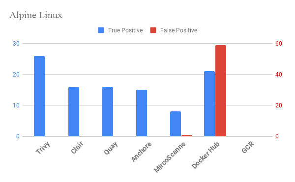

[](https://github.com/knqyf263/trivy/releases/latest)
[](https://circleci.com/gh/knqyf263/trivy)
[](https://goreportcard.com/report/github.com/knqyf263/trivy)
[](https://github.com/knqyf263/trivy/blob/master/LICENSE)

A Simple and Comprehensive Vulnerability Scanner for Containers, Compatible with CI


# Accuracy Comparison




# TOC
- [Abstract](#abstract)
- [Features](#features)
- [Installation](#installation)
  - [RHEL/CentOS](#rhelcentos)
  - [Debian/Ubuntu](#debianubuntu)
  - [Mac OS X / Homebrew](#mac-os-x--homebrew)
  - [Binary (Including Windows)](#binary-including-windows)
  - [From source](#from-source)
- [Quick Start](#quick-start)
- [Examples](#examples)
  - [Basic Usage](#basic-usage)
  - [Scan an image](#scan-an-image)
  - [Scan an image file](#scan-an-image-file)
  - [Save the results as JSON](#save-the-results-as-json)
  - [Filter the vulnerabilities by severities](#filter-the-vulnerabilities-by-severities)
  - [Skip an update of vulnerability DB](#skip-an-update-of-vulnerability-db)
  - [Ignore unfixed vulnerabilities](#ignore-unfixed-vulnerabilities)
  - [Specify exit code](#specify-exit-code)
  - [Ignore the specified vulnerabilities](#ignore-the-specified-vulnerabilities)
  - [Clean all caches](#clean-all-caches)
- [Continuous Integration (CI)](#continuous-integration-ci)
  - [Travis CI](#travis-ci)
  - [Circle CI](#circle-ci)
- [Usage](#usage)
- [Comparison with other scanners](#comparison-with-other-scanners)
  - [Overview](#overview)
  - [vs Clair, Quay](#vs-clair-quay)
  - [vs Anchore Engine](#vs-anchore-engine)
  - [vs Docker Hub, GCR](#vs-docker-hub-gcr)
- [Q&A](#qa)
  - [Homebrew](#homebrew)
  - [Others](#others)

# Abstract
`Trivy` is a simple and comprehensive vulnerability scanner for containers.
`Trivy` detects vulnerabilities of OS packages (Alpine, RHEL, CentOS, etc.) and application dependencies (Bundler, Composer, npm, etc.).
`Trivy` is easy to use. Just install the binary and you're ready to scan. All you need to do for scanning is to specify a container image name.

It is considered to be used in CI. Before pushing to a container registry, you can scan your local container image easily.
See [here](#continuous-integration-ci) for details.


# Features
- Detect comprehensive vulnerabilities
  - OS packages (Alpine, Red Hat Enterprise Linux, CentOS, Debian, Ubuntu)
  - **Application dependencies** (Bundler, Composer, Pipenv, npm, Cargo)
- Simple
  - Specify only an image name
- Easy installation
  - **No need for prerequirements** such as installation of DB, libraries, etc.
  - `apt-get install`, `yum install` and `brew install` is possible (See [Installation](#installation))
- High accuracy
  - **Especially Alpine** (See [Comparison with other scanners](#comparison-with-other-scanners))
  - Other OSes are also high
- Continuous Integration
  - **Compatible with CI** such as Travis CI, CircleCI, Jenkins, etc.
  - See [CI Example](#continuous-integration-ci)


# Installation

## RHEL/CentOS

Add repository setting to `/etc/yum.repos.d`.

```
$ sudo vim /etc/yum.repos.d/trivy.repo
[trivy]
name=Trivy repository
baseurl=https://knqyf263.github.io/trivy-repo/rpm/releases/$releasever/$basearch/
gpgcheck=0
enabled=1
$ sudo yum -y update
$ sudo yum -y install trivy
```

or

```
$ rpm -ivh https://github.com/knqyf263/trivy/releases/download/v0.0.11/trivy_0.0.11_Linux-64bit.rpm
```

## Debian/Ubuntu

Replace `[CODE_NAME]` with your code name

CODE_NAME: wheezy, jessie, stretch, buster, trusty, xenial, bionic

```
$ sudo apt-get install apt-transport-https gnupg
$ wget -qO - https://knqyf263.github.io/trivy-repo/deb/public.key | sudo apt-key add -
$ echo deb https://knqyf263.github.io/trivy-repo/deb [CODE_NAME] main | sudo tee -a /etc/apt/sources.list
$ sudo apt-get update
$ sudo apt-get install trivy
```

or

```
$ sudo apt-get install rpm
$ wget https://github.com/knqyf263/trivy/releases/download/v0.0.11/trivy_0.0.11_Linux-64bit.deb
$ sudo dpkg -i trivy_0.0.11_Linux-64bit.deb
```

## Mac OS X / Homebrew
You can use homebrew on OS X.
```
$ brew tap knqyf263/trivy
$ brew install knqyf263/trivy/trivy
```

## Binary (Including Windows)
Go to [the releases page](https://github.com/knqyf263/trivy/releases), find the version you want, and download the zip file. Unpack the zip file, and put the binary to somewhere you want (on UNIX-y systems, /usr/local/bin or the like). Make sure it has execution bits turned on.

You need to install `rpm` command for scanning RHEL/CentOS.

## From source

```sh
$ go get -u github.com/knqyf263/trivy
```

# Quick Start

Simply specify an image name (and a tag). **The `latest` tag should be avoided as problems occur with cache.**

```
$ trivy nginx:1.16.0-alpine
```

# Examples
### Scan an image file

```
$ docker save ruby:2.4.6-alpine3.9 -o ruby-2.4.6.tar
$ trivy --input ruby-2.4.6.tar
```

### Save the results as JSON

```
$ trivy -f json -o results.json composer:1.7.2
```

### Filter the vulnerabilities by severities

```
$ trivy --severity HIGH,CRITICAL python:3.7-alpine3.9
```

### Skip an update of vulnerability DB 
`Trivy` updates vulnerability database every time it is run. This is usually fast as it is a difference update. But if you want to skip even that, use the `--skip-update` option.

```
$ trivy --skip-update alpine:3.9
```

### Ignore unfixed vulnerabilities
By default, `Trivy` also detects unpatched/unfixed vulnerabilities. This means you can't fix these vulnerabilities even if you update all packages.
If you would like to ignore them, use the `--ignore-unfixed` option.


```
$ trivy --exit-code 1 httpd:2.4.39
```

### Specify exit code
By default, `Trivy` exits with code 0 even when vulnerabilities are detected.
Use the `--exit-code` option if you want to exit with a non-zero exit code.

```
$ trivy --exit-code 1 httpd:2.4.39
```

This option is useful for CI/CD. In the following example, the test will fail only when a critical vulnerability is found.

```
$ trivy --exit-code 0 --severity MEDIUM,HIGH httpd:2.4.39
$ trivy --exit-code 1 --severity CRITICAL httpd:2.4.39
```

### Ignore the specified vulnerabilities
Use `.trivyignore`.

```
$ cat .trivyignore
# Accept the risk
CVE-2018-14618

# No impact in our settings
CVE-2019-3855

$ trivy composer:1.7.2 
```

### Clean all caches
The `--clean` option remove all caches. After this, it takes a long time as the vulnerability database needs to be rebuilt locally.

```
$ trivy --clean
```


## Continuous Integration (CI)
Scan your image built in Travis CI/CircleCI. The test will fail if a vulnerability is found. When you don't want to fail the test, specify `--exit-code 0` .

**Note**: The first time take a while (faster by cache after the second time)
### Travis CI

```
$ cat .travis.yml
services:
  - docker

before_install:
  - docker build -t trivy-ci-test:latest .
  - wget https://github.com/knqyf263/trivy/releases/download/v0.0.11/trivy_0.0.11_Linux-64bit.tar.gz
  - tar zxvf trivy_0.0.11_Linux-64bit.tar.gz
script:
  - ./trivy --exit-code 0 --severity HIGH --quiet trivy-ci-test:latest
  - ./trivy --exit-code 1 --severity CRITICAL --quiet trivy-ci-test:latest
cache:
  directories:
    - $HOME/.cache/trivy
```

example: https://travis-ci.org/knqyf263/trivy-ci-test  
repository: https://github.com/knqyf263/trivy-ci-test

### Circle CI

```
$ cat .circleci/config.yml
jobs:
  build:
    docker:
      - image: docker:18.09-git
    steps:
      - checkout
      - setup_remote_docker
      - restore_cache:
          key: vulnerability-db
      - run:
          name: Build image
          command: docker build -t trivy-ci-test:latest .
      - run:
          name: Install trivy
          command: |
            wget https://github.com/knqyf263/trivy/releases/download/v0.0.11/trivy_0.0.11_Linux-64bit.tar.gz
            tar zxvf trivy_0.0.11_Linux-64bit.tar.gz
            mv trivy /usr/local/bin
      - run:
          name: Scan the local image with trivy
          command: trivy --exit-code 1 --quiet trivy-ci-test:latest
      - save_cache:
          key: vulnerability-db
          paths:
            - $HOME/.cache/trivy
workflows:
  version: 2
  release:
    jobs:
      - build
```

example: https://circleci.com/gh/knqyf263/trivy-ci-test  
repository: https://github.com/knqyf263/trivy-ci-test

# Usage

```
NAME:
  trivy - A simple and comprehensive vulnerability scanner for containers
USAGE:
  trivy [options] image_name
VERSION:
  0.0.11
OPTIONS:
  --format value, -f value    format (table, json) (default: "table")
  --input value, -i value     input file path instead of image name
  --severity value, -s value  severities of vulnerabilities to be displayed (comma separated) (default: "UNKNOWN,LOW,MEDIUM,HIGH,CRITICAL")
  --output value, -o value    output file name
  --exit-code value           Exit code when vulnerabilities were found (default: 0)
  --skip-update               skip db update
  --clean, -c                 clean all cache
  --quiet, -q                 suppress progress bar
  --ignore-unfixed            display only fixed vulnerabilities
  --refresh                   refresh DB (usually used after version update of trivy
  --debug, -d                 debug mode
  --help, -h                  show help
  --version, -v               print the version
```

# Comparison with other scanners
## Overview
The following table shows a result of scanning `composer:1.7.2` (selected randomly).
In this case, the union of vulnerabilities detected by all vulnerability scanners is used as a data set.
Of course, there may be vulnerabilities that all scanners could not detect.

See [spreadsheet](https://docs.google.com/spreadsheets/d/16uj9vGh2PHMcVwb_D4h0nYUSvzCAxcnUz9UgQaDCYs4/edit#gid=0) for details.

Date: 2019/05/12

| Scanner   | Clair | Quay | MircoScanner | Docker Hub | Anchore Engine | Trivy |
|-----------|-------|------|--------------|------------|---------------|-------|
| Accuracy  | 75%   | 75%  | 66%          | 22%        | 74%           | **85%**   |
| Precision | 100%  | 100% | 89%          | 26%        | 100%          | **100%**  |

Reference: [Clair](https://github.com/coreos/clair), [Quay](https://quay.io/), [MicroScanner(Free)](https://github.com/aquasecurity/microscanner), [Docker Hub](https://hub.docker.com/), [Anchore Engine](https://anchore.com/engine/)

`Trivy` has high accuracy and high precision, especially in the case of Alpine Linux.
In the case of other OS, the result is similar to other container scanners.

## vs Clair, Quay
[Clair](https://github.com/coreos/clair) and [Quay](https://quay.io/) uses [alpine-secdb](https://github.com/alpinelinux/alpine-secdb/).
However, the purpose of this database is to make it possible to know what packages has backported fixes.
As README says, it is not a complete database of all security issues in Alpine.

`Trivy` collects vulnerability information in Alpine Linux from [Alpine LInux Redmine](https://bugs.alpinelinux.org/projects/alpine/issues).
Then, those vulnerabilities will be saved on [vuln-list](https://github.com/knqyf263/vuln-list/tree/master/alpine)

`alpine-secdb` has 6959 vulnerabilities (as of 2019/05/12).
`vuln-list` has 11101 vulnerabilities related with Alpine Linux (as of 2019/05/12).
There is a difference in detection accuracy because the number of vulnerabilities is nearly doubled.

In addition, `Trivy` analyzes the middle layer as well and find out which version of the library was used for static linking.

`Clair` can not handle the following cases because it analyzes the image after applying the all layers.

```
RUN apk add --no-cache sqlite-dev \
    && wget https://xxx/yyy.tar.gz \
    && tar zxvf yyy.tar.gz && cd yyy \
    && make && make install \
    && apk del sqlite-dev
```

Finally, `Trivy` can also detect vulnerabilities in application dependent libraries such as Bundler, Composer, Pipenv, etc.

## vs Anchore Engine
Similar to Clair, there is a difference in detection accuracy on Alpine Linux. Also, Anchore Engine needs some steps to start scanning.
`Trivy` is much easier to use.

## vs Docker Hub, GCR
Docker Hub can scan only official images. GCR hardly detects vulnerability on Alpine Linux. Also, it is locked to a specific registry.

`Trivy` does not depend on the registry. In addition, it is easy to be integrated with CI/CD services.


# Q&A
## Homebrew
### Error: Your macOS keychain GitHub credentials do not have sufficient scope!

```
$ brew tap knqyf263/trivy
Error: Your macOS keychain GitHub credentials do not have sufficient scope!
Scopes they need: none
Scopes they have:
Create a personal access token:
  https://github.com/settings/tokens/new?scopes=gist,public_repo&description=Homebrew
echo 'export HOMEBREW_GITHUB_API_TOKEN=your_token_here' >> ~/.zshrc
```

Try:
```
$ printf "protocol=https\nhost=github.com\n" | git credential-osxkeychain erase
```

### Error: knqyf263/trivy/trivy 64 already installed

```
$ brew upgrade
...
Error: knqyf263/trivy/trivy 64 already installed
```

Try:

```
$ brew unlink trivy && brew uninstall trivy
($ rm -rf /usr/local/Cellar/trivy/64)
$ brew install knqyf263/trivy/trivy
```

## Others
### Detected version update of trivy. Please try again with --refresh option
Try again with `--refresh` option

```
$ trivy --refresh alpine:3.9
```

### Unknown error
Try again with `--clean` option

```
$ trivy --clean
```

# Contribute

1. fork a repository: github.com/knqyf263/trivy to github.com/you/repo
2. get original code: `go get github.com/knqyf263/trivy`
3. work on original code
4. add remote to your repo: git remote add myfork https://github.com/you/repo.git
5. push your changes: git push myfork
6. create a new Pull Request

- see [GitHub and Go: forking, pull requests, and go-getting](http://blog.campoy.cat/2014/03/github-and-go-forking-pull-requests-and.html)

----

# Credits
Special thanks to [Tomoya Amachi](https://github.com/tomoyamachi)

# License
MIT

# Author
Teppei Fukuda (knqyf263)
