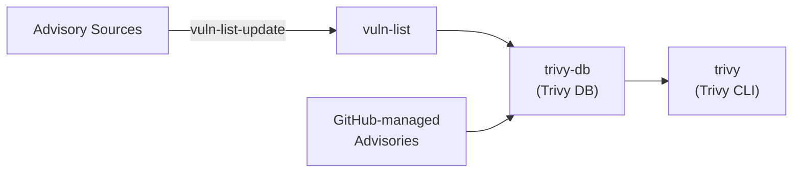

# Vulnerability Data Sources

This section explains how Trivy's vulnerability database works and how to contribute new advisory data sources.

## Overview

Trivy's vulnerability database is built through a multi-repository workflow involving three main repositories:

### Workflow Steps

1. **Advisory Collection** ([vuln-list-update])
    - Fetch raw advisories from upstream sources
    - Store them in [vuln-list] repository
    - Run periodically via cron to keep advisories up-to-date
    - This step can be skipped if advisories are already managed in a Git repository (e.g., GitHub Security Advisories)

2. **Database Build** ([trivy-db])
    - Parse advisories from [vuln-list] or directly from Git-managed sources
    - Transform them into Trivy's database format
    - Publish the built database periodically via cron

3. **Database Consumption** ([trivy])
    - Download the latest vulnerability database at scan time
    - Use it to detect vulnerabilities in scan targets

## Why Store Advisories in vuln-list?

For data sources that are not already Git-managed, storing advisories in the [vuln-list] repository provides several benefits:

- **Transparency**: Easy to track changes and differences between advisory versions
- **Web UI**: Browse advisories directly on GitHub with a user-friendly interface
- **Stability**: Mitigate issues when upstream advisory servers are unstable or unavailable
- **Shareability**: Provide stable URLs to reference specific advisories
- **Data Quality**: Validate advisory data before committing to vuln-list, preventing malformed data or unexpected format changes from breaking Trivy DB
- **Historical Data**: Preserve past advisories when upstream formats change

## Repository Overview

### [vuln-list-update]

This repository contains scripts that fetch advisories from various upstream sources. Each data source has its own package that handles:

- Fetching advisories from APIs or web sources
- Validating the advisory format and data
- Saving them to the [vuln-list] repository

### [vuln-list]

This repository serves as a data storage for raw advisories fetched by [vuln-list-update]. Key characteristics:

- Contains raw advisory data in JSON format
- Updated automatically by [vuln-list-update] scripts via cron
- **Not for manual contributions**: Direct pull requests to this repository are not accepted
- Used as the source for [trivy-db] to build the vulnerability database

### [trivy-db]

This repository contains parsers that transform raw advisories into Trivy's database format. Each data source has its own vulnerability source handler that:

- Reads advisory files from [vuln-list] or directly from Git-managed sources (e.g., GitHub Security Advisories)
- Maps advisory fields to Trivy's schema
- Stores vulnerability information in the database

### [trivy]

The main Trivy repository contains:

- OS and package analyzers to detect what's installed
- Vulnerability detection logic

## Next Steps

Ready to add a new vulnerability advisory source? See the [Add Vulnerability Advisory Source](add-vulnerability-source.md) guide for detailed steps.

[vuln-list]: https://github.com/aquasecurity/vuln-list
[vuln-list-update]: https://github.com/aquasecurity/vuln-list-update
[trivy-db]: https://github.com/aquasecurity/trivy-db
[trivy]: https://github.com/aquasecurity/trivy