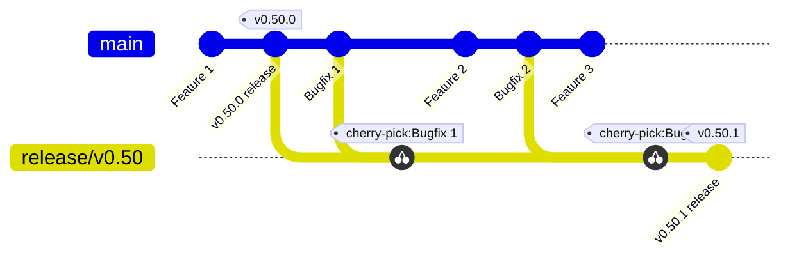

# Backporting Process

This document outlines the backporting process for Trivy, including when to create patch releases and how to perform the backporting.

## When to Create Patch Releases

In general, small changes should not be backported and should be included in the next minor release.
However, patch releases should be made in the following cases:

* Fixes for HIGH or CRITICAL vulnerabilities in Trivy itself or Trivy's dependencies
* Fixes for bugs that cause panic during Trivy execution or otherwise interfere with normal usage

In these cases, the fixes should be backported using the procedure [described below](#backporting-procedure).
At the maintainer's discretion, other bug fixes may be included in the patch release containing these hotfixes.

## Versioning

Trivy follows [Semantic Versioning](https://semver.org/), using version numbers in the format MAJOR.MINOR.PATCH.
When creating a patch release, the PATCH part of the version number is incremented.
For example, if a fix is being distributed for v0.50.0, the patch release would be v0.50.1.

## Backporting Procedure

1. A release branch (e.g., `release/v0.50`) is automatically created when a new minor version is released.
1. Create a pull request (PR) against the main branch with the necessary fixes. If the fixes are already merged into the main branch, skip this step.
1. Once the PR with the fixes is merged, comment `@aqua-bot backport <release-branch>` on the PR (e.g., `@aqua-bot backport release/v0.50`). This will trigger the automated backporting process using GitHub Actions.
1. The automated process will create a new PR with the backported changes. Ensure that all tests pass for this PR.
1. Once the tests pass, merge the automatically created PR into the release branch.
1. Merge [a release PR](release-flow.md) on the release branch and release the patch version.

!!! note
    Even if a conflict occurs, a PR is created by forceful commit, in which case the conflict should be resolved manually.
    If you want to re-run a backport of the same PR, close the existing PR, delete the branch and re-run it.

### Example
To better understand the backporting procedure, let's walk through an example using the releases of v0.50.

