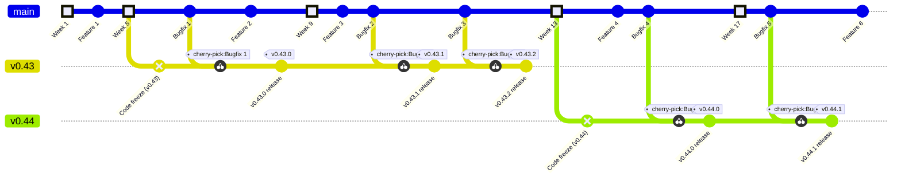

# Trivy Release Cycle

## TL;DR

- Minor versions (vX.Y.0) are released every 8 weeks.
- Normal development occurs during the first 4 weeks, followed by a 4-week code freeze phase.
- vX.Y.0 is released at the end of the code freeze, with subsequent patch versions (vX.Y.1, vX.Y.2, etc.) released during the next 4 weeks.

## Branching Strategy

- All code modifications and pull requests (PRs) are merged into the main branch.
- The main branch continuously accepts new feature additions.
- Changes required in other branches are incorporated using the cherry-pick method.

## Task Management

- [A milestone][milestones] is created for every minor release and is closed after the release.
- The roadmap for the project is managed at [Trivy's Roadmap][roadmap].

## Release Phases

The release cycle consists of an 8-week period divided into two main phases: Normal Development and Code Freeze.
Once the minor version is released, the Patch Version Release phase begins, running concurrently with the next Normal Development phase.

### 1. Normal Development (Weeks 1-4)

- New features and bug fixes are introduced.

### 2. Code Freeze (Weeks 5-8)

- A release branch named `release-X.Y` is created at the beginning of this phase.
- This phase is dedicated to testing the software for quality assurance, and accepts only critical bugs.
- While the release branch does not accept new features during this phase, the main branch continues to accept new feature additions.
- vX.Y.0 is released at the end of this phase.

### 3. Patch Version Release (Weeks 9-12)

- Only critical bug fixes are accepted for the release branch during this period.
- Patch versions like vX.Y.1, vX.Y.2, etc., are released, addressing any critical issues identified post the main release.
- Concurrently, the development cycle returns to the Normal Development phase for the next minor version.

## Definitions

### Code Freeze

A dedicated period for quality assurance testing.
The release branch does not accept new features during this phase, ensuring that the software is stable and reliable for the upcoming release.
However, the main branch continues to accept new feature additions.

### Release Milestone

A set point in the development process where specific features or fixes targeted for a release should be completed and ready for testing.

### Release Branch

A separate branch where the release is stabilized.
Created from the main branch at the beginning of the code freeze phase and serves as the source for the actual release and subsequent patch versions.

## Example
To better understand the release cycle of Trivy, let's walk through an example using the releases of v0.43 and v0.44.

### v0.43 Release

#### Normal Development (Weeks 1-4)

During the first four weeks, the focus is on the Normal Development phase. New features and bug fixes are continuously merged into the main branch.

#### Code Freeze (Weeks 5-8)

At the beginning of the fifth week, a release branch named `release-0.43` is created.
This branch enters the Code Freeze phase, meaning no new features will be added.
However, the main branch remains active, accepting new features and bug fixes as usual.

During this phase, only critical bugs are addressed in the `release-0.43` branch.
For instance, "Bugfix 1" and "Bugfix 2" are identified as critical and are backported to the `release-0.43` branch using the cherry-pick method.

In the initial week of the Code Freeze phase, decisions are made regarding which features to include in the milestone for **the next version (v0.44)**.

#### v0.43.0 Release (End of Week 8)

After four weeks of Code Freeze, v0.43.0 is released from the `release-0.43` branch.

#### Patch Version Release & Concurrent Normal Development (Weeks 9-12)

While the cycle returns to the Normal Development phase for the next version, critical bugs continue to be addressed in the `release-0.43` branch, similar to the Code Freeze phase.
In the above example, "Bugfix 3" and "Bugfix 4" are backported to the `release-0.43` branch.
As a result, patch versions like v0.43.1 or v0.43.2 may be released from this branch if necessary.

### v0.44 Release

The release cycle for v0.44 follows the same pattern:

#### Normal Development (Weeks 9-12)

The cycle begins with the Normal Development phase, where new features and bug fixes are merged into the main branch.

#### Code Freeze (Weeks 13-16)

After four weeks, a new release branch, `release-0.44`, is created, and the Code Freeze phase begins.

The milestone for v0.45 is created at the beginning of week 13.

#### v0.44.0 Release (End of Week 16)

At the end of the Code Freeze phase, v0.44.0 is released from the `release-0.44` branch.

#### Continuation

The cycle then repeats, with patch versions being released for v0.44 while the main branch enters the Normal Development phase for the subsequent version.

[milestones]: https://github.com/aquasecurity/trivy/milestones
[roadmap]: https://github.com/orgs/aquasecurity/projects/25/views/12