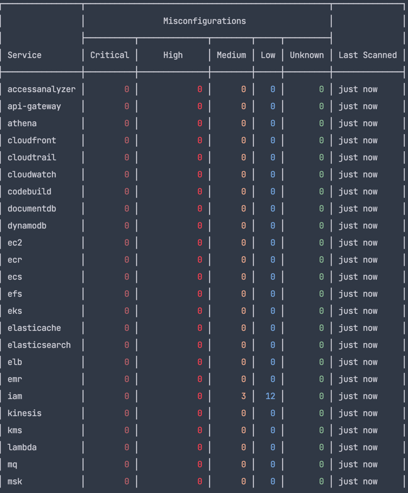

# AWS Compliance

## CIS Compliance Report

!!! warning "EXPERIMENTAL"
This feature might change without preserving backwards compatibility.

The Trivy AWS CLI allows you to scan your AWS account resources and generate the `AWS CIS Foundations Benchmark` report

[AWS CIS Foundations Benchmark v1.2](https://d0.awsstatic.com/whitepapers/compliance/AWS_CIS_Foundations_Benchmark.pdf) validates the following control checks:

+--------------------------------------------+--------------------------------+
|                    NAME                    |          DESCRIPTION           |
+--------------------------------------------+--------------------------------+
| limit-root-account-usage                   | The "root" account has         |
|                                            | unrestricted access to all     |
|                                            | resources in the AWS account.  |
|                                            | It is highly recommended that  |
|                                            | the use of this account be     |
|                                            | avoided.                       |
| no-password-reuse                          | IAM Password policy should     |
|                                            | prevent password reuse.        |
| set-max-password-age                       | IAM Password policy should     |
|                                            | have expiry less than or equal |
|                                            | to 90 days.                    |
| no-root-access-keys                        | The root user has complete     |
|                                            | access to all services and     |
|                                            | resources in an AWS account.   |
|                                            | AWS Access Keys provide        |
|                                            | programmatic access to a given |
|                                            | account.                       |
| enforce-root-mfa                           | The "root" account has         |
|                                            | unrestricted access to all     |
|                                            | resources in the AWS account.  |
|                                            | It is highly recommended that  |
|                                            | this account have MFA enabled. |
| no-user-attached-policies                  | IAM policies should not be     |
|                                            | granted directly to users.     |
| enforce-user-mfa                           | IAM Users should have MFA      |
|                                            | enforcement activated.         |
| disable-unused-credentials                 | Credentials which are          |
|                                            | no longer used should be       |
|                                            | disabled.                      |
| rotate-access-keys                         | Access keys should be rotated  |
|                                            | at least every 90 days         |
| require-uppercase-in-passwords             | IAM Password policy should     |
|                                            | have requirement for at least  |
|                                            | one uppercase character.       |
| require-lowercase-in-passwords             | IAM Password policy should     |
|                                            | have requirement for at least  |
|                                            | one lowercase character.       |
| require-symbols-in-passwords               | IAM Password policy should     |
|                                            | have requirement for at least  |
|                                            | one symbol in the password.    |
| require-numbers-in-passwords               | IAM Password policy should     |
|                                            | have requirement for at least  |
|                                            | one number in the password.    |
| set-minimum-password-length                | IAM Password policy should     |
|                                            | have minimum password length   |
|                                            | of 14 or more characters.      |
| no-public-log-access                       | The S3 Bucket backing          |
|                                            | Cloudtrail should be private   |
| ensure-cloudwatch-integration              | CloudTrail logs should be      |
|                                            | stored in S3 and also sent to  |
|                                            | CloudWatch Logs                |
| enable-all-regions                         | Cloudtrail should be enabled   |
|                                            | in all regions regardless of   |
|                                            | where your AWS resources are   |
|                                            | generally homed                |
| require-bucket-access-logging              | You should enable bucket       |
|                                            | access logging on the          |
|                                            | CloudTrail S3 bucket.          |
| require-unauthorised-api-call-alarm        | Ensure a log metric filter and |
|                                            | alarm exist for unauthorized   |
|                                            | API calls                      |
| require-sg-change-alarms                   | Ensure a log metric filter and |
|                                            | alarm exist for security group |
|                                            | changes                        |
| require-nacl-changes-alarm                 | Ensure a log metric filter     |
|                                            | and alarm exist for changes to |
|                                            | Network Access Control Lists   |
|                                            | (NACL)                         |
| require-network-gateway-changes-alarm      | Ensure a log metric filter     |
|                                            | and alarm exist for changes to |
|                                            | network gateways               |
| require-network-gateway-changes-alarm      | Ensure a log metric filter and |
|                                            | alarm exist for route table    |
|                                            | changes                        |
| require-vpc-changes-alarm                  | Ensure a log metric filter and |
|                                            | alarm exist for VPC changes    |
| require-non-mfa-login-alarm                | Ensure a log metric filter and |
|                                            | alarm exist for AWS Management |
|                                            | Console sign-in without MFA    |
| require-root-user-usage-alarm              | Ensure a log metric filter and |
|                                            | alarm exist for usage of root  |
|                                            | user                           |
| require-iam-policy-change-alarm            | Ensure a log metric filter     |
|                                            | and alarm exist for IAM policy |
|                                            | changes                        |
| require-cloud-trail-change-alarm           | Ensure a log metric filter     |
|                                            | and alarm exist for CloudTrail |
|                                            | configuration changes          |
| require-console-login-failures-alarm       | Ensure a log metric filter and |
|                                            | alarm exist for AWS Management |
|                                            | Console authentication         |
|                                            | failures                       |
| require-cmk-disabled-alarm                 | Ensure a log metric filter and |
|                                            | alarm exist for disabling or   |
|                                            | scheduled deletion of customer |
|                                            | managed keys                   |
| require-s3-bucket-policy-change-alarm      | Ensure a log metric filter     |
|                                            | and alarm exist for S3 bucket  |
|                                            | policy changes                 |
| require-config-configuration-changes-alarm | Ensure a log metric filter     |
|                                            | and alarm exist for AWS Config |
|                                            | configuration changes          |
| no-public-ingress-sgr                      | An ingress security group rule |
|                                            | allows traffic from /0.        |
+--------------------------------------------+--------------------------------+

## CLI Commands

Scan for misconfigurations in an AWS account based on AWS CIS 1.2 benchmark:

```
$ trivy aws  --compliance=awscis1.2 
```



In this case only the checks defined as per AWS CIS Benchmark v1.2 are run. To see which checks are being evaluated, you can run the following:
```shell
$ trivy aws --debug --compliance=awscis1.2

2022-11-22T16:08:30.205-0800    DEBUG   [defsec] 08:30.205930000 aws-api.scanner                  Found 6 results for AVD-AWS-0145
2022-11-22T16:08:30.205-0800    DEBUG   [defsec] 08:30.205939000 aws-api.scanner                  Found 1 results for AVD-AWS-0056
2022-11-22T16:08:30.205-0800    DEBUG   [defsec] 08:30.205953000 aws-api.scanner                  Found 6 results for AVD-AWS-0143
2022-11-22T16:08:30.205-0800    DEBUG   [defsec] 08:30.205960000 aws-api.scanner                  Found 1 results for AVD-AWS-0058
2022-11-22T16:08:30.205-0800    DEBUG   [defsec] 08:30.205963000 aws-api.scanner                  Found 1 results for AVD-AWS-0059
2022-11-22T16:08:30.205-0800    DEBUG   [defsec] 08:30.205971000 aws-api.scanner                  Found 1 results for AVD-AWS-0060
2022-11-22T16:08:30.205-0800    DEBUG   [defsec] 08:30.205977000 aws-api.scanner                  Found 1 results for AVD-AWS-0061
2022-11-22T16:08:30.206-0800    DEBUG   [defsec] 08:30.206063000 aws-api.scanner                  Found 8 results for AVD-AWS-0146
2022-11-22T16:08:30.206-0800    DEBUG   [defsec] 08:30.206077000 aws-api.scanner                  Found 1 results for AVD-AWS-0062
2022-11-22T16:08:30.206-0800    DEBUG   [defsec] 08:30.206084000 aws-api.scanner                  Found 1 results for AVD-AWS-0063

```

## Custom compliance report

The Trivy AWS CLI allows you to create a custom compliance specification and pass it to trivy for generating scan report.

The report is generated based on scanning result mapping between users define controls and trivy checks ID.
The supported checks are from two types and can be found at [Aqua vulnerability DB](https://avd.aquasec.com/):
- [misconfiguration](https://avd.aquasec.com/misconfig/)

### Compliance spec format

The compliance spec file format should be as follows:


```yaml
---
spec:
  id: "0001"
  title: awscis1.2
  description: AWS CIS Foundations
  version: "1.2"
  relatedResources:
  - https://www.cisecurity.org/benchmark/amazon_web_services
  controls:
  - id: "1.1"
    name: limit-root-account-usage
    description: |-
      The "root" account has unrestricted access to all resources in the AWS account. It is highly
      recommended that the use of this account be avoided.
    checks:
    - id: AVD-AWS-0140
    severity: LOW
```

## Custom report CLI Commands

To use a custom spec, the file path should be passed to the `--compliance` flag with `@` prefix as follows:

```
$ trivy aws --compliance=@/spec/my_compliance.yaml
```

