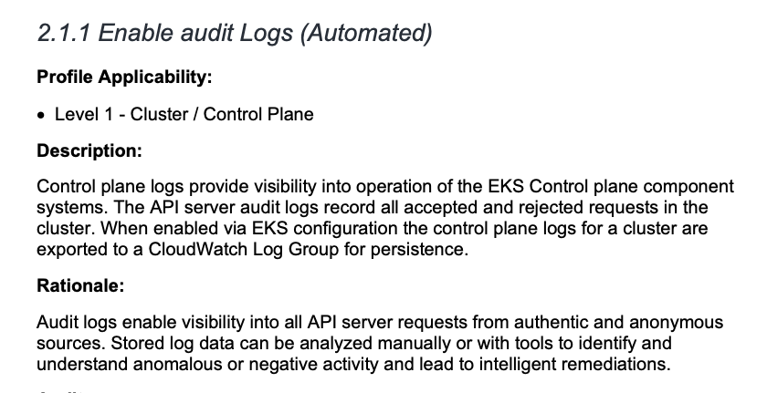

# Custom Compliance Spec

Trivy supports several different compliance specs. The details on compliance scanning with Trivy are provided in the [compliance documentation](../../docs/compliance/compliance.md).
All of the Compliance Specs currently available in Trivy can be found in the `trivy-checks/pkg/specs/compliance/` directory ([Link](https://github.com/aquasecurity/trivy-checks/tree/main/pkg/specs/compliance)).

New checks are based on the custom compliance report detailed in the [main documentation.](./compliance.md#custom-compliance)
If you would like to create your custom compliance report, please reference the information in the main documentation. This section details how community members can contribute new Compliance Specs to Trivy.

All compliance specs in Trivy are based on formal compliance reports such as CIS Benchmarks.

## Contributing new Compliance Specs

Compliance specs can be based on new compliance reports becoming available e.g. a new CIS Benchmark version, or identifying missing compliance specs that Trivy users would like to access.

### Create a new Compliance Spec

The existing compliance specs in Trivy are located under the `trivy-checks/pkg/specs/compliance/` directory ([Link](https://github.com/aquasecurity/trivy-checks/tree/main/pkg/specs/compliance)).

Create a new file under `trivy-checks/specs/compliance/` and name the file in the format of "provider-resource-spectype-version.yaml". For example, the file name for AWS CIS Benchmarks for EKS version 1.4 is: `aws-eks-cis-1.4.yaml`. Note that if the compliance spec is not specific to a provider, the `provider` field can be ignored.

### Minimum spec structure

The structure of the compliance spec is detailed in the [main documentation](./compliance.md#custom-compliance).

The first section in the spec is focused on the metadata of the spec. Replace all the fields of the metadata with the information relevant to the compliance spec that will be added. This information can be taken from the official report e.g. the CIS Benchmark report.

### Populating the `control` section

Compliance specs detail a set of checks that should pass so that the resource is compliant with the official benchmark specifications. There are two ways in which Trivy compliance checks can enforce the compliance specification:

1. The check is available in Trivy, as part of the `trivy-checks` and can be referenced in the Compliance Spec
2. The check is not available in Trivy and a manual check has to be added to the Compliance Spec

Additional information is provided below.

#### 1. Referencing a check that is already part of Trivy

Trivy has a comprehensive list of checks as part of its misconfiguration scanning. These can be found in the `trivy-checks/checks` directory ([Link](https://github.com/aquasecurity/trivy-checks/tree/main/checks)). If the check is present, the `AVD_ID` and other information from the check has to be used.

Note: Take a look at the more generic compliance specs that are already available in Trivy. If you are adding new compliance spec to Kubernetes e.g. AWS EKS CIS Benchmarks, chances are high that the check you would like to add to the new spec has already been defined in the general `k8s-ci-v.000.yaml` compliance spec. The same applies for creating specific Cloud Provider Compliance Specs and the [generic compliance specs](https://github.com/aquasecurity/trivy-checks/tree/main/pkg/specs/compliance) available.

For example, the following check is detailed in the AWS EKS CIS v1.4 Benchmark:
`3.1.2 Ensure that the kubelet kubeconfig file ownership is set to root:root (Manual)`

This check can be found in the general K8s CIS Compliance Benchmark: `k8s-cis-1.23.yaml` ([Link](https://github.com/aquasecurity/trivy-checks/blob/31e779916f3863dd74a28cee869ea24fdc4ca8c2/specs/compliance/k8s-cis-1.23.yaml#L480))

Thus, we can use the information already present:

```
  - id: 3.1.2
    name: Ensure that the kubelet service file ownership is set to root:root (Manual)
    description: Ensure that the kubelet service file ownership is set to root:root
    checks:
      - id: AVD-KCV-0070
    severity: HIGH
```

- The `ID`, `name`, and `description` is taken directly from the AWS EKS CIS Benchmarks
- The `check` and `severity` are taken from the existing complaince check in the `k8s-cis-1.23.yaml`


#### 2. Referencing a check manually that is not part of the Trivy default checks

If the check does not already exist in the [Aqua Vulnerability Database](https://avd.aquasec.com/) (AVD) and is not part of the trivy-checks, the fields in the compliance spec for the check have to be populated manually. This is done by referencing the information in the official compliance specification.

Below is the beginning of the information of the EKS CIS Benchmarks v1.4.0:



The corresponding check in the `control` section will look like this:

```
  - id: 2.1.1
    name: Enable audit Logs (Manual)
    description: |
      Control plane logs provide visibility into operation of the EKS Control plane components systems. 
      The API server audit logs record all accepted and rejected requests in the cluster. 
      When enabled via EKS configuration the control plane logs for a cluster are exported to a CloudWatch 
      Log Group for persistence.
    checks: null
    severity: MEDIUM
```

- Again, the `id`, `name` and `description` are taken directly from the EKS CIS Benchmarks v1.4.0
- The `checks` is in this case `null` as the check is not currently present in the AVD and does not have a check in the [trivy policies](https://github.com/aquasecurity/trivy-checks/tree/main/checks) repository
- Since the check does not exist in Trivy, the `severity` will be `MEDIUM`. However, in some cases, the compliance report e.g. the CIS Benchmark report will specify the severity

#### Contributing new checks to trivy-checks

All of the checks in trivy-policies can be referenced in the compliance specs.
To write new Rego checks for Trivy, please take a look at the contributing documentation for checks.

### Test the Compliance Spec

To test the compliance check, pass the new path into the Trivy scan through the `--compliance` flag. For instance, to pass the check to the Trivy Kubernetes scan use the following command structure:

```
trivy k8s cluster --compliance @</path/to/compliance.yaml> --report summary
```

Note: The `@` is required before the filepath.