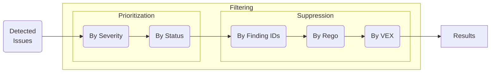

# Filtering
Trivy provides various methods for filtering the results.



Similar to the functionality of filtering results, you can also limit the sub-targets for each scanner.
For information on these settings, please refer to the scanner-specific documentation ([vulnerability](../scanner/vulnerability.md) , [misconfiguration](../scanner/misconfiguration/index.md), etc.).

## Prioritization
You can filter the results by 

- [Severity](#by-severity)
- [Status](#by-status)

### By Severity

|     Scanner      | Supported |
|:----------------:|:---------:|
|  Vulnerability   |     ✓     |
| Misconfiguration |     ✓     |
|      Secret      |     ✓     |
|     License      |     ✓     |

Use `--severity` option.

```bash
$ trivy image --severity HIGH,CRITICAL ruby:2.4.0
```

<details>
<summary>Result</summary>

```bash
2019-05-16T01:51:46.255+0900    INFO    Updating vulnerability database...
2019-05-16T01:51:49.213+0900    INFO    Detecting Debian vulnerabilities...

ruby:2.4.0 (debian 8.7)
=======================
Total: 1785 (UNKNOWN: 0, LOW: 0, MEDIUM: 0, HIGH: 1680, CRITICAL: 105)

+-----------------------------+------------------+----------+---------------------------+----------------------------------+-------------------------------------------------+
|           LIBRARY           | VULNERABILITY ID | SEVERITY |     INSTALLED VERSION     |          FIXED VERSION           |                      TITLE                      |
+-----------------------------+------------------+----------+---------------------------+----------------------------------+-------------------------------------------------+
| apt                         | CVE-2019-3462    | CRITICAL | 1.0.9.8.3                 | 1.0.9.8.5                        | Incorrect sanitation of the                     |
|                             |                  |          |                           |                                  | 302 redirect field in HTTP                      |
|                             |                  |          |                           |                                  | transport method of...                          |
+-----------------------------+------------------+----------+---------------------------+----------------------------------+-------------------------------------------------+
| bash                        | CVE-2019-9924    | HIGH     | 4.3-11                    | 4.3-11+deb8u2                    | bash: BASH_CMD is writable in                   |
|                             |                  |          |                           |                                  | restricted bash shells                          |
+                             +------------------+          +                           +----------------------------------+-------------------------------------------------+
|                             | CVE-2016-7543    |          |                           | 4.3-11+deb8u1                    | bash: Specially crafted                         |
|                             |                  |          |                           |                                  | SHELLOPTS+PS4 variables allows                  |
|                             |                  |          |                           |                                  | command substitution                            |
+-----------------------------+------------------+          +---------------------------+----------------------------------+-------------------------------------------------+
| binutils                    | CVE-2017-8421    |          | 2.25-5                    |                                  | binutils: Memory exhaustion in                  |
|                             |                  |          |                           |                                  | objdump via a crafted PE file                   |
+                             +------------------+          +                           +----------------------------------+-------------------------------------------------+
|                             | CVE-2017-14930   |          |                           |                                  | binutils: Memory leak in                        |
|                             |                  |          |                           |                                  | decode_line_info                                |
+                             +------------------+          +                           +----------------------------------+-------------------------------------------------+
|                             | CVE-2017-7614    |          |                           |                                  | binutils: NULL                                  |
|                             |                  |          |                           |                                  | pointer dereference in                          |
|                             |                  |          |                           |                                  | bfd_elf_final_link function                     |
+                             +------------------+          +                           +----------------------------------+-------------------------------------------------+
|                             | CVE-2014-9939    |          |                           |                                  | binutils: buffer overflow in                    |
|                             |                  |          |                           |                                  | ihex.c                                          |
+                             +------------------+          +                           +----------------------------------+-------------------------------------------------+
|                             | CVE-2017-13716   |          |                           |                                  | binutils: Memory leak with the                  |
|                             |                  |          |                           |                                  | C++ symbol demangler routine                    |
|                             |                  |          |                           |                                  | in libiberty                                    |
+                             +------------------+          +                           +----------------------------------+-------------------------------------------------+
|                             | CVE-2018-12699   |          |                           |                                  | binutils: heap-based buffer                     |
|                             |                  |          |                           |                                  | overflow in finish_stab in                      |
|                             |                  |          |                           |                                  | stabs.c                                         |
+-----------------------------+------------------+          +---------------------------+----------------------------------+-------------------------------------------------+
| bsdutils                    | CVE-2015-5224    |          | 2.25.2-6                  |                                  | util-linux: File name                           |
|                             |                  |          |                           |                                  | collision due to incorrect                      |
|                             |                  |          |                           |                                  | mkstemp use                                     |
+                             +------------------+          +                           +----------------------------------+-------------------------------------------------+
|                             | CVE-2016-2779    |          |                           |                                  | util-linux: runuser tty hijack                  |
|                             |                  |          |                           |                                  | via TIOCSTI ioctl                               |
+-----------------------------+------------------+----------+---------------------------+----------------------------------+-------------------------------------------------+
```

</details>

```bash
trivy config --severity HIGH,CRITICAL examples/misconf/mixed
```

<details>
<summary>Result</summary>

```shell
2022-05-16T13:50:42.718+0100	INFO	Detected config files: 3

Dockerfile (dockerfile)
=======================
Tests: 17 (SUCCESSES: 16, FAILURES: 1)
Failures: 1 (HIGH: 1, CRITICAL: 0)

HIGH: Last USER command in Dockerfile should not be 'root'
═══════════════════════════════════════════════════════════════════════════════════════════════════════════════════════════════════════
Running containers with 'root' user can lead to a container escape situation. It is a best practice to run containers as non-root users, which can be done by adding a 'USER' statement to the Dockerfile.

See https://avd.aquasec.com/misconfig/ds002
───────────────────────────────────────────────────────────────────────────────────────────────────────────────────────────────────────
 Dockerfile:3
───────────────────────────────────────────────────────────────────────────────────────────────────────────────────────────────────────
   3 [ USER root
───────────────────────────────────────────────────────────────────────────────────────────────────────────────────────────────────────


deployment.yaml (kubernetes)
============================
Tests: 8 (SUCCESSES: 8, FAILURES: 0)
Failures: 0 (HIGH: 0, CRITICAL: 0)


main.tf (terraform)
===================
Tests: 1 (SUCCESSES: 0, FAILURES: 1)
Failures: 1 (HIGH: 0, CRITICAL: 1)

CRITICAL: Classic resources should not be used.
═══════════════════════════════════════════════════════════════════════════════════════════════════════════════════════════════════════
AWS Classic resources run in a shared environment with infrastructure owned by other AWS customers. You should run
resources in a VPC instead.

See https://avd.aquasec.com/misconfig/avd-aws-0081
───────────────────────────────────────────────────────────────────────────────────────────────────────────────────────────────────────
 main.tf:2-4
───────────────────────────────────────────────────────────────────────────────────────────────────────────────────────────────────────
   2 ┌ resource "aws_db_security_group" "sg" {
   3 │
   4 └ }
───────────────────────────────────────────────────────────────────────────────────────────────────────────────────────────────────────
```
</details>

### By Status

|     Scanner      | Supported |
|:----------------:|:---------:|
|  Vulnerability   |     ✓     |
| Misconfiguration |           |
|      Secret      |           |
|     License      |           |

Trivy supports the following vulnerability statuses:

- `unknown`
- `not_affected`: this package is not affected by this vulnerability on this platform
- `affected`: this package is affected by this vulnerability on this platform, but there is no patch released yet
- `fixed`: this vulnerability is fixed on this platform
- `under_investigation`: it is currently unknown whether or not this vulnerability affects this package on this platform, and it is under investigation
- `will_not_fix`: this package is affected by this vulnerability on this platform, but there is currently no intention to fix it (this would primarily be for flaws that are of Low or Moderate impact that pose no significant risk to customers)
- `fix_deferred`: this package is affected by this vulnerability on this platform, and may be fixed in the future
- `end_of_life`: this package has been identified to contain the impacted component, but analysis to determine whether it is affected or not by this vulnerability was not performed

Note that vulnerabilities with the `unknown`, `not_affected` or `under_investigation` status are not detected.
These are only defined for comprehensiveness, and you will not have the opportunity to specify these statuses.

Some statuses are supported in limited distributions.

|     OS     | Fixed | Affected | Under Investigation | Will Not Fix | Fix Deferred | End of Life |
|:----------:|:-----:|:--------:|:-------------------:|:------------:|:------------:|:-----------:|
|   Debian   |   ✓   |    ✓     |                     |              |      ✓       |      ✓      |
|    RHEL    |   ✓   |    ✓     |          ✓          |      ✓       |      ✓       |      ✓      |
| Other OSes |   ✓   |    ✓     |                     |              |              |             |


To ignore vulnerabilities with specific statuses, use the `--ignore-status <list_of_statuses>` option.


```bash
$ trivy image --ignore-status affected,fixed ruby:2.4.0
```

<details>
<summary>Result</summary>

```
2019-05-16T12:50:14.786+0900    INFO    Detecting Debian vulnerabilities...

ruby:2.4.0 (debian 8.7)
=======================
Total: 527 (UNKNOWN: 0, LOW: 276, MEDIUM: 83, HIGH: 158, CRITICAL: 10)

┌─────────────────────────────┬──────────────────┬──────────┬──────────────┬────────────────────────────┬───────────────┬──────────────────────────────────────────────────────────────┐
│           Library           │  Vulnerability   │ Severity │    Status    │     Installed Version      │ Fixed Version │                            Title                             │
├─────────────────────────────┼──────────────────┼──────────┼──────────────┼────────────────────────────┼───────────────┼──────────────────────────────────────────────────────────────┤
│ binutils                    │ CVE-2014-9939    │ CRITICAL │ will_not_fix │ 2.25-5                     │               │ binutils: buffer overflow in ihex.c                          │
│                             │                  │          │              │                            │               │ https://avd.aquasec.com/nvd/cve-2014-9939                    │
│                             ├──────────────────┤          │              │                            ├───────────────┼──────────────────────────────────────────────────────────────┤
│                             │ CVE-2017-6969    │          │              │                            │               │ binutils: Heap-based buffer over-read in readelf when        │
│                             │                  │          │              │                            │               │ processing corrupt RL78 binaries                             │
│                             │                  │          │              │                            │               │ https://avd.aquasec.com/nvd/cve-2017-6969                    │
│                             ├──────────────────┤          │              │                            ├───────────────┼──────────────────────────────────────────────────────────────┤
...
```

</details>

!!! tip
    To skip all unfixed vulnerabilities, you can use the `--ignore-unfixed` flag .
    It is a shorthand of `--ignore-status affected,will_not_fix,fix_deferred,end_of_life`.
    It displays "fixed" vulnerabilities only.

```bash
$ trivy image --ignore-unfixed ruby:2.4.0
```

## Suppression
You can filter the results by

- [Finding IDs](#by-finding-ids)
- [Rego](#by-rego)
- [Vulnerability Exploitability Exchange (VEX)](#by-vulnerability-exploitability-exchange-vex)

To show the suppressed results, use the `--show-suppressed` flag.

!!! note
    It's exported as `ExperimentalModifiedFindings` in the JSON output.

```bash
$ trivy image --vex debian11.csaf.vex --ignorefile .trivyignore.yaml --show-suppressed debian:11
...

Suppressed Vulnerabilities (Total: 9)

┌───────────────┬───────────────┬──────────┬──────────────┬─────────────────────────────────────────────┬───────────────────┐
│    Library    │ Vulnerability │ Severity │    Status    │                  Statement                  │      Source       │
├───────────────┼───────────────┼──────────┼──────────────┼─────────────────────────────────────────────┼───────────────────┤
│ libdb5.3      │ CVE-2019-8457 │ CRITICAL │ not_affected │ vulnerable_code_not_in_execute_path         │ CSAF VEX          │
├───────────────┼───────────────┼──────────┼──────────────┼─────────────────────────────────────────────┼───────────────────┤
│ bsdutils      │ CVE-2022-0563 │ LOW      │ ignored      │ Accept the risk                             │ .trivyignore.yaml │
├───────────────┤               │          │              │                                             │                   │
│ libblkid1     │               │          │              │                                             │                   │
├───────────────┤               │          │              │                                             │                   │
│ libmount1     │               │          │              │                                             │                   │
├───────────────┤               │          │              │                                             │                   │
│ libsmartcols1 │               │          │              │                                             │                   │
├───────────────┤               │          │              │                                             │                   │
│ libuuid1      │               │          │              │                                             │                   │
├───────────────┤               │          │              │                                             │                   │
│ mount         │               │          │              │                                             │                   │
├───────────────┼───────────────┤          │              ├─────────────────────────────────────────────┤                   │
│ tar           │ CVE-2005-2541 │          │              │ The vulnerable configuration is not enabled │                   │
├───────────────┼───────────────┤          │              ├─────────────────────────────────────────────┤                   │
│ util-linux    │ CVE-2022-0563 │          │              │ Accept the risk                             │                   │
└───────────────┴───────────────┴──────────┴──────────────┴─────────────────────────────────────────────┴───────────────────┘
```

### By Finding IDs

Trivy supports the [.trivyignore](#trivyignore) and [.trivyignore.yaml](#trivyignoreyaml) ignore files.

#### .trivyignore

|     Scanner      | Supported |
|:----------------:|:---------:|
|  Vulnerability   |     ✓     |
| Misconfiguration |     ✓     |
|      Secret      |     ✓     |
|     License      |           |


```bash
$ cat .trivyignore
# Accept the risk
CVE-2018-14618

# Accept the risk until 2023-01-01
CVE-2019-14697 exp:2023-01-01

# No impact in our settings
CVE-2019-1543

# Ignore misconfigurations
AVD-DS-0002

# Ignore secrets
generic-unwanted-rule
aws-account-id
```

```bash
$ trivy image python:3.4-alpine3.9
```

<details>
<summary>Result</summary>

```bash
2019-05-16T12:53:10.076+0900    INFO    Updating vulnerability database...
2019-05-16T12:53:28.134+0900    INFO    Detecting Alpine vulnerabilities...

python:3.4-alpine3.9 (alpine 3.9.2)
===================================
Total: 0 (UNKNOWN: 0, LOW: 0, MEDIUM: 0, HIGH: 0, CRITICAL: 0)

```

</details>

#### .trivyignore.yaml

|     Scanner      | Supported |
|:----------------:|:---------:|
|  Vulnerability   |     ✓     |
| Misconfiguration |     ✓     |
|      Secret      |     ✓     |
|     License      |     ✓     |

!!! warning "EXPERIMENTAL"
    This feature might change without preserving backwards compatibility.

When the extension of the specified ignore file is either `.yml` or `.yaml`, Trivy will load the file as YAML.
For the `.trivyignore.yaml` file, you can set ignored IDs separately for `vulnerabilities`, `misconfigurations`, `secrets`, or `licenses`[^1].

Available fields:

| Field      | Required | Type                | Description                                                                                                                                                             |
|------------|:--------:|---------------------|-------------------------------------------------------------------------------------------------------------------------------------------------------------------------|
| id         |    ✓     | string              | The identifier of the vulnerability, misconfiguration, secret, or license[^1].                                                                                          |
| paths[^2]  |          | string array        | The list of file paths to ignore. If `paths` is not set, the ignore finding is applied to all files.                                                                    |
| purls      |          | string array        | The list of PURLs to ignore packages. If `purls` is not set, the ignore finding is applied to all packages. This field is currently available only for vulnerabilities. |
| expired_at |          | date (`yyyy-mm-dd`) | The expiration date of the ignore finding. If `expired_at` is not set, the ignore finding is always valid.                                                              |
| statement  |          | string              | The reason for ignoring the finding. (This field is not used for filtering.)                                                                                            |

```bash
$ cat .trivyignore.yaml
vulnerabilities:
  - id: CVE-2022-40897
    paths:
      - "usr/local/lib/python3.9/site-packages/setuptools-58.1.0.dist-info/METADATA"
    statement: Accept the risk
  - id: CVE-2023-2650
  - id: CVE-2023-3446
  - id: CVE-2023-3817
    purls:
      - "pkg:deb/debian/libssl1.1"
  - id: CVE-2023-29491
    expired_at: 2023-09-01

misconfigurations:
  - id: AVD-DS-0001
  - id: AVD-DS-0002
    paths:
      - "docs/Dockerfile"
    statement: The image needs root privileges

secrets:
  - id: aws-access-key-id
  - id: aws-secret-access-key
    paths:
      - "foo/bar/aws.secret"

licenses:
  - id: GPL-3.0 # License name is used as ID
    paths:
      - "usr/share/gcc/python/libstdcxx/v6/__init__.py"
```

Since this feature is experimental, you must explicitly specify the YAML file path using the `--ignorefile` flag.
Once this functionality is stable, the YAML file will be loaded automatically.

```bash
$ trivy image --ignorefile ./.trivyignore.yaml python:3.9.16-alpine3.16
```

<details>
<summary>Result</summary>

```bash
2023-08-31T11:10:27.155+0600	INFO	Vulnerability scanning is enabled
2023-08-31T11:10:27.155+0600	INFO	Secret scanning is enabled
2023-08-31T11:10:27.155+0600	INFO	If your scanning is slow, please try '--scanners vuln' to disable secret scanning
2023-08-31T11:10:27.155+0600	INFO	Please see also https://aquasecurity.github.io/trivy/dev/docs/scanner/secret/#recommendation for faster secret detection
2023-08-31T11:10:29.164+0600	INFO	Detected OS: alpine
2023-08-31T11:10:29.164+0600	INFO	Detecting Alpine vulnerabilities...
2023-08-31T11:10:29.169+0600	INFO	Number of language-specific files: 1
2023-08-31T11:10:29.170+0600	INFO	Detecting python-pkg vulnerabilities...

python:3.9.16-alpine3.16 (alpine 3.16.5)
========================================
Total: 0 (UNKNOWN: 0, LOW: 0, MEDIUM: 0, HIGH: 0, CRITICAL: 0)


```

</details>

### By Rego

|     Scanner      | Supported |
|:----------------:|:---------:|
|  Vulnerability   |     ✓     |
| Misconfiguration |     ✓     |
|      Secret      |     ✓     |
|     License      |     ✓     |

!!! warning "EXPERIMENTAL"
    This feature might change without preserving backwards compatibility.

[Rego](https://www.openpolicyagent.org/docs/latest/policy-language/) is a policy language that allows you to express decision logic in a concise syntax. 
Rego is part of the popular [Open Policy Agent (OPA)](https://www.openpolicyagent.org) CNCF project.
For advanced filtering, Trivy allows you to use Rego language to filter vulnerabilities.

Use the `--ignore-policy` flag which takes a path to a Rego file that defines the filtering policy.
The Rego package name must be `trivy` and it must include a "rule" named `ignore` which determines if each individual scan result should be excluded (ignore=true) or not (ignore=false).
The `input` for the evaluation is each [DetectedVulnerability](https://github.com/aquasecurity/trivy/blob/00f2059e5d7bc2ca2e3e8b1562bdfede1ed570e3/pkg/types/vulnerability.go#L9) and [DetectedMisconfiguration](https://github.com/aquasecurity/trivy/blob/00f2059e5d7bc2ca2e3e8b1562bdfede1ed570e3/pkg/types/misconfiguration.go#L6).

A practical way to observe the filtering policy input in your case, is to run a scan with the `--format json` option and look at the resulting structure:

```bash
trivy image -f json centos:7

...
  "Results": [
    {
      "Target": "centos:7 (centos 7.9.2009)",
      "Class": "os-pkgs",
      "Type": "centos",
      "Vulnerabilities": [
        {
          "VulnerabilityID": "CVE-2015-5186",
          "PkgID": "audit-libs@2.8.5-4.el7.x86_64",
          "PkgName": "audit-libs",
          "InstalledVersion": "2.8.5-4.el7",
          "Layer": {
            "Digest": "sha256:2d473b07cdd5f0912cd6f1a703352c82b512407db6b05b43f2553732b55df3bc",
            "DiffID": "sha256:174f5685490326fc0a1c0f5570b8663732189b327007e47ff13d2ca59673db02"
          },
          "SeveritySource": "redhat",
          "PrimaryURL": "https://avd.aquasec.com/nvd/cve-2015-5186",
          "Title": "log terminal emulator escape sequences handling",
          "Description": "Audit before 2.4.4 in Linux does not sanitize escape characters in filenames.",
          "Severity": "MEDIUM",
          "CweIDs": [
            "CWE-20"
          ],
...
```

Each individual Vulnerability, Misconfiguration, License and Secret (under `Results.Vulnerabilities`, `Results.Misconfigurations`, 
`Results.Licenses`, `Results.Secrets`) is evaluated for exclusion or inclusion by the `ignore` rule.

The following is a Rego ignore policy that filters out every vulnerability with a specific CWE ID (as seen in the JSON example above):

```rego
package trivy

default ignore = false

ignore {
	input.CweIDs[_] == "CWE-20"
}
```

```bash
trivy image --ignore-policy examples/ignore-policies/basic.rego centos:7
```

For more advanced use cases, there is a built-in Rego library with helper functions that you can import into your policy using: `import data.lib.trivy`.
More info about the helper functions are in the library [here](https://github.com/aquasecurity/trivy/tree/{{ git.tag }}/pkg/result/module.go).

You can create a whitelist of checks using Rego, see the detailed [example](https://github.com/aquasecurity/trivy/tree/{{ git.tag }}/examples/ignore-policies/whitelist.rego). Additional examples are available [here](https://github.com/aquasecurity/trivy/tree/{{ git.tag }}/examples/ignore-policies).

### By Vulnerability Exploitability Exchange (VEX)
|     Scanner      | Supported |
|:----------------:|:---------:|
|  Vulnerability   |     ✓     |
| Misconfiguration |           |
|      Secret      |           |
|     License      |           |

Please refer to the [VEX documentation](../supply-chain/vex/index.md) for the details.


[^1]: license name is used as id for `.trivyignore.yaml` files.
[^2]: This doesn't work for os package licenses (e.g. apk, dpkg, rpm). For projects which manage dependencies through a dependency file (e.g. go.mod, yarn.lock) `path` should point to that particular file.
