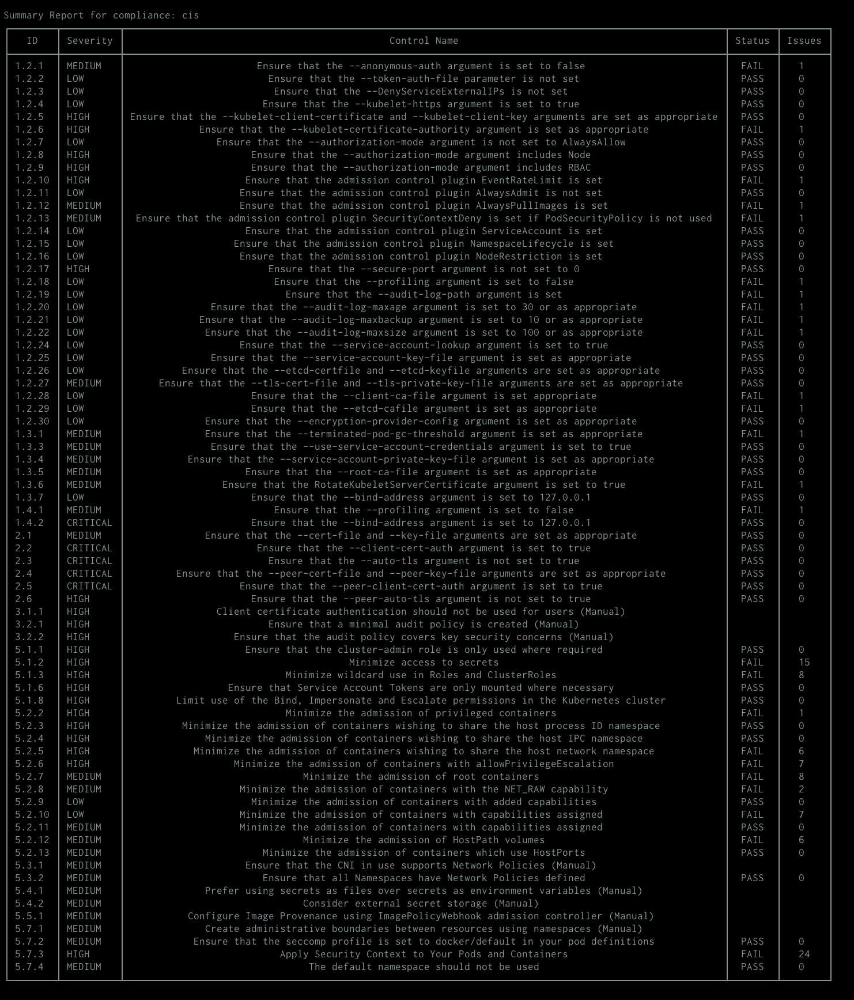

# Kubernetes Compliance

## CIS Kubernetes Benchmark Compliance Report

!!! warning "EXPERIMENTAL"
    This feature might change without preserving backwards compatibility.

The Trivy K8s CLI allows you to scan your Kubernetes cluster resources and generate the `CIS Kubernetes Benchmark` report

[CIS Kubernetes Benchmark](https://www.cisecurity.org/benchmark/kubernetes) report is produced by trivy and validate the following control checks :

| ID     | Name                                                                                                   | Description                                                                                                                                                                                                                                                    |
| ------ | ------------------------------------------------------------------------------------------------------ | -------------------------------------------------------------------------------------------------------------------------------------------------------------------------------------------------------------------------------------------------------------- |
| 1.2.1  | Ensure that the --anonymous-auth argument is set to false                                              | Disable anonymous requests to the API server                                                                                                                                                                                                                   |
| 1.2.2  | Ensure that the --token-auth-file parameter is not set                                                 | Do not use token based authentication.                                                                                                                                                                                                                         |
| 1.2.3  | Ensure that the --DenyServiceExternalIPs is not set                                                    | This admission controller rejects all net-new usage of the Service field externalIPs.                                                                                                                                                                          |
| 1.2.4  | Ensure that the --kubelet-https argument is set to true                                                | Use https for kubelet connections.                                                                                                                                                                                                                             |
| 1.2.5  | Ensure that the --kubelet-client-certificate and --kubelet-client-key arguments are set as appropriate | Enable certificate based kubelet authentication.                                                                                                                                                                                                               |
| 1.2.6  | Ensure that the --kubelet-certificate-authority argument is set as appropriate                         | Verify kubelets certificate before establishing connection.                                                                                                                                                                                                    |
| 1.2.7  | Ensure that the --authorization-mode argument is not set to AlwaysAllow                                | Do not always authorize all requests.                                                                                                                                                                                                                          |
| 1.2.8  | Ensure that the --authorization-mode argument includes Node                                            | Restrict kubelet nodes to reading only objects associated with them.                                                                                                                                                                                           |
| 1.2.9  | Ensure that the --authorization-mode argument includes RBAC                                            | Turn on Role Based Access Control.                                                                                                                                                                                                                             |
| 1.2.10 | Ensure that the admission control plugin EventRateLimit is set                                         | Limit the rate at which the API server accepts requests.                                                                                                                                                                                                       |
| 1.2.11 | Ensure that the admission control plugin AlwaysAdmit is not set                                        | Do not allow all requests                                                                                                                                                                                                                                      |
| 1.2.12 | Ensure that the admission control plugin AlwaysPullImages is set                                       | Always pull images                                                                                                                                                                                                                                             |
| 1.2.13 | Ensure that the admission control plugin SecurityContextDeny is set if PodSecurityPolicy is not used   | The SecurityContextDeny admission controller can be used to deny pods which make use of some SecurityContext fields which could allow for privilege escalation in the cluster. This should be used where PodSecurityPolicy is not in place within the cluster. |
| 1.2.14 | Ensure that the admission control plugin ServiceAccount is set                                         | Automate service accounts management.                                                                                                                                                                                                                          |
| 1.2.15 | Ensure that the admission control plugin NamespaceLifecycle is set                                     | Reject creating objects in a namespace that is undergoing termination.                                                                                                                                                                                         |
| 1.2.16 | Ensure that the admission control plugin NodeRestriction is set                                        | Limit the Node and Pod objects that a kubelet could modify.                                                                                                                                                                                                    |
| 1.2.17 | Ensure that the --secure-port argument is not set to 0                                                 | Do not disable the secure port                                                                                                                                                                                                                                 |
| 1.2.18 | Ensure that the --profiling argument is set to false                                                   | Disable profiling, if not needed.                                                                                                                                                                                                                              |
| 1.2.19 | Ensure that the --audit-log-path argument is set                                                       | Enable auditing on the Kubernetes API Server and set the desired audit log path.                                                                                                                                                                               |
| 1.2.20 | Ensure that the --audit-log-maxage argument is set to 30 or as appropriate                             | Retain the logs for at least 30 days or as appropriate.                                                                                                                                                                                                        |
| 1.2.21 | Ensure that the --audit-log-maxbackup argument is set to 10 or as appropriate                          | Retain 10 or an appropriate number of old log file.                                                                                                                                                                                                            |
| 1.2.22 | Ensure that the --audit-log-maxsize argument is set to 100 or as appropriate                           | Rotate log files on reaching 100 MB or as appropriate.                                                                                                                                                                                                         |
| 1.2.24 | Ensure that the --service-account-lookup argument is set to true                                       | Validate service account before validating token.                                                                                                                                                                                                              |
| 1.2.25 | Ensure that the --service-account-key-file argument is set as appropriate                              | Explicitly set a service account public key file for service accounts on the apiserver.                                                                                                                                                                        |
| 1.2.26 | Ensure that the --etcd-certfile and --etcd-keyfile arguments are set as appropriate                    | etcd should be configured to make use of TLS encryption for client connections.                                                                                                                                                                                |
| 1.2.27 | Ensure that the --tls-cert-file and --tls-private-key-file arguments are set as appropriate            |                                                                                                                                                                                                                                                                |
| 1.2.28 | Ensure that the --client-ca-file argument is set appropriate                                           | Setup TLS connection on the API server.                                                                                                                                                                                                                        |
| 1.2.29 | Ensure that the --etcd-cafile argument is set as appropriate                                           | etcd should be configured to make use of TLS encryption for client connections.                                                                                                                                                                                |
| 1.2.30 | Ensure that the --encryption-provider-config argument is set as appropriate                            | Encrypt etcd key-value store.                                                                                                                                                                                                                                  |
| 1.3.1  | Ensure that the --terminated-pod-gc-threshold argument is set as appropriate                           | Activate garbage collector on pod termination, as appropriate.                                                                                                                                                                                                 |
| 1.3.3  | Ensure that the --use-service-account-credentials argument is set to true                              | Use individual service account credentials for each controller.                                                                                                                                                                                                |
| 1.3.4  | Ensure that the --service-account-private-key-file argument is set as appropriate                      | Explicitly set a service account private key file for service accounts on the controller manager.                                                                                                                                                              |
| 1.3.5  | Ensure that the --root-ca-file argument is set as appropriate                                          | Allow pods to verify the API servers serving certificate before establishing connections.                                                                                                                                                                      |
| 1.3.6  | Ensure that the RotateKubeletServerCertificate argument is set to true                                 | Enable kubelet server certificate rotation on controller-manager.                                                                                                                                                                                              |
| 1.3.7  | Ensure that the --bind-address argument is set to 127.0.0.1                                            | Do not bind the scheduler service to non-loopback insecure addresses.                                                                                                                                                                                          |
| 1.4.1  | Ensure that the --profiling argument is set to false                                                   | Disable profiling, if not needed.                                                                                                                                                                                                                              |
| 1.4.2  | Ensure that the --bind-address argument is set to 127.0.0.1                                            | Do not bind the scheduler service to non-loopback insecure addresses.                                                                                                                                                                                          |
| 2.1    | Ensure that the --cert-file and --key-file arguments are set as appropriate                            |                                                                                                                                                                                                                                                                |
| 2.2    | Ensure that the --client-cert-auth argument is set to true                                             | Enable client authentication on etcd service.                                                                                                                                                                                                                  |
| 2.3    | Ensure that the --auto-tls argument is not set to true                                                 | Do not use self-signed certificates for TLS.                                                                                                                                                                                                                   |
| 2.4    | Ensure that the --peer-cert-file and --peer-key-file arguments are set as appropriate                  | etcd should be configured to make use of TLS encryption for peer connections.                                                                                                                                                                                  |
| 2.5    | Ensure that the --peer-client-cert-auth argument is set to true                                        | etcd should be configured for peer authentication.                                                                                                                                                                                                             |
| 2.6    | Ensure that the --peer-auto-tls argument is not set to true                                            | Do not use self-signed certificates for TLS.                                                                                                                                                                                                                   |
| 3.1.1  | Client certificate authentication should not be used for users (Manual)                                | Kubernetes provides the option to use client certificates for user authentication. However as there is no way to revoke these certificates when a user leaves an organization or loses their credential, they are not suitable for this purpose.               |
| 3.2.1  | Ensure that a minimal audit policy is created (Manual)                                                 | Kubernetes can audit the details of requests made to the API server. The --audit- policy-file flag must be set for this logging to be enabled.                                                                                                                 |
| 3.2.2  | Ensure that the audit policy covers key security concerns (Manual)                                     | Ensure that the audit policy created for the cluster covers key security concerns.                                                                                                                                                                             |
| 5.1.1  | Ensure that the cluster-admin role is only used where required                                         | The RBAC role cluster-admin provides wide-ranging powers over the environment and should be used only where and when needed.                                                                                                                                   |
| 5.1.2  | Minimize access to secrets                                                                             | The Kubernetes API stores secrets, which may be service account tokens for the Kubernetes API or credentials used by workloads in the cluster                                                                                                                  |
| 5.1.3  | Minimize wildcard use in Roles and ClusterRoles                                                        | Kubernetes Roles and ClusterRoles provide access to resources based on sets of objects and actions that can be taken on those objects. It is possible to set either of these to be the wildcard "*" which matches all items                                    |
| 5.1.6  | Ensure that Service Account Tokens are only mounted where necessary                                    | Service accounts tokens should not be mounted in pods except where the workload running in the pod explicitly needs to communicate with the API server                                                                                                         |
| 5.1.8  | Limit use of the Bind, Impersonate and Escalate permissions in the Kubernetes cluster                  | Cluster roles and roles with the impersonate, bind or escalate permissions should not be granted unless strictly required                                                                                                                                      |
| 5.2.2  | Minimize the admission of privileged containers                                                        | Do not generally permit containers to be run with the securityContext.privileged flag set to true.                                                                                                                                                             |
| 5.2.3  | Minimize the admission of containers wishing to share the host process ID namespace                    | Do not generally permit containers to be run with the hostPID flag set to true.                                                                                                                                                                                |
| 5.2.4  | Minimize the admission of containers wishing to share the host IPC namespace                           | Do not generally permit containers to be run with the hostIPC flag set to true.                                                                                                                                                                                |
| 5.2.5  | Minimize the admission of containers wishing to share the host network namespace                       | Do not generally permit containers to be run with the hostNetwork flag set to true.                                                                                                                                                                            |
| 5.2.6  | Minimize the admission of containers with allowPrivilegeEscalation                                     | Do not generally permit containers to be run with the allowPrivilegeEscalation flag set to true                                                                                                                                                                |
| 5.2.7  | Minimize the admission of root containers                                                              | Do not generally permit containers to be run as the root user.                                                                                                                                                                                                 |
| 5.2.8  | Minimize the admission of containers with the NET_RAW capability                                       | Do not generally permit containers with the potentially dangerous NET_RAW capability.                                                                                                                                                                          |
| 5.2.9  | Minimize the admission of containers with added capabilities                                           | Do not generally permit containers with capabilities assigned beyond the default set.                                                                                                                                                                          |
| 5.2.10 | Minimize the admission of containers with capabilities assigned                                        | Do not generally permit containers with capabilities                                                                                                                                                                                                           |
| 5.2.11 | Minimize the admission of containers with capabilities assigned                                        | Do not generally permit containers with capabilities                                                                                                                                                                                                           |
| 5.2.12 | Minimize the admission of HostPath volumes                                                             | Do not generally admit containers which make use of hostPath volumes.                                                                                                                                                                                          |
| 5.2.13 | Minimize the admission of containers which use HostPorts                                               | Do not generally permit containers which require the use of HostPorts.                                                                                                                                                                                         |
| 5.3.1  | Ensure that the CNI in use supports Network Policies (Manual)                                          | There are a variety of CNI plugins available for Kubernetes. If the CNI in use does not support Network Policies it may not be possible to effectively restrict traffic in the cluster.                                                                        |
| 5.3.2  | Ensure that all Namespaces have Network Policies defined                                               | Use network policies to isolate traffic in your cluster network.                                                                                                                                                                                               |
| 5.4.1  | Prefer using secrets as files over secrets as environment variables (Manual)                           | Kubernetes supports mounting secrets as data volumes or as environment variables. Minimize the use of environment variable secrets.                                                                                                                            |
| 5.4.2  | Consider external secret storage (Manual)                                                              | Consider the use of an external secrets storage and management system, instead of using Kubernetes Secrets directly, if you have more complex secret management needs.                                                                                         |
| 5.5.1  | Configure Image Provenance using ImagePolicyWebhook admission controller (Manual)                      | Configure Image Provenance for your deployment.                                                                                                                                                                                                                |
| 5.7.1  | Create administrative boundaries between resources using namespaces (Manual)                           | Use namespaces to isolate your Kubernetes objects.                                                                                                                                                                                                             |
| 5.7.2  | Ensure that the seccomp profile is set to docker/default in your pod definitions                       | Enable docker/default seccomp profile in your pod definitions.                                                                                                                                                                                                 |
| 5.7.3  | Apply Security Context to Your Pods and Containers                                                     | Apply Security Context to Your Pods and Containers                                                                                                                                                                                                             |
| 5.7.4  | The default namespace should not be used                                                               | Kubernetes provides a default namespace, where objects are placed if no namespace is specified for them                                                                                                                                                        |

## CLI Commands

Scan a full cluster and generate a complliance CIS-Benchmark summary report:

```
$ trivy k8s cluster --compliance=cis --report summary
```



***Note*** : The `Issues` column represent the total number of failed checks for this control.


An additional report is supported to get all of the detail the output contains, use `--report all`
```
$ trivy k8s cluster --compliance=cis --report all
```
Report also supported in json format examples :

```
$ trivy k8s cluster --compliance=cis --report summary --format json
```

```
$ trivy k8s cluster --compliance=cis --report all --format json
```

## Custom compliance report

The Trivy K8s CLI allows you to create a custom compliance specification and pass it to trivy for generating scan report .

The report is generated based on scanning result mapping between users define controls and trivy checks ID.
The supported checks are from two types and can be found at [Aqua vulnerability DB](https://avd.aquasec.com/):
- [misconfiguration](https://avd.aquasec.com/misconfig/)
- [vulnerabilities](https://avd.aquasec.com/nvd) 


### Compliance spec format

The compliance spec file format should look as follow :


```yaml
---
spec:
  id: "0001" # report unique identifier
  title: spec name # report title 
  description: spec description # description of the report
  relatedResources :
    - https://www.spec.reference # reference is related to public or internal spec
  version: "1.0" # spec version
  controls:
    - name: Non-root containers # short control naming
      description: 'Check that container is not running as root' # long control description
      id: '1.0' # control identifier 
      checks:   # list of trivy checks which associated to control
        - id: AVD-KSV-0012 # check ID (midconfiguration ot vulnerability) must start with `AVD-` or `CVE-` 
      severity: 'MEDIUM' # control severity
    - name: Immutable container file systems
      description: 'Check that container root file system is immutable'
      id: '1.1'
      checks:
        - id: AVD-KSV-0014
      severity: 'LOW'
```

## Custom report CLI Commands

To generate the custom report, an custom spec file path should be passed to the `--compliance` flag with `@` prefix as follow:


```
$ trivy k8s cluster --compliance=@/spec/my_complaince.yaml --report summary
```

