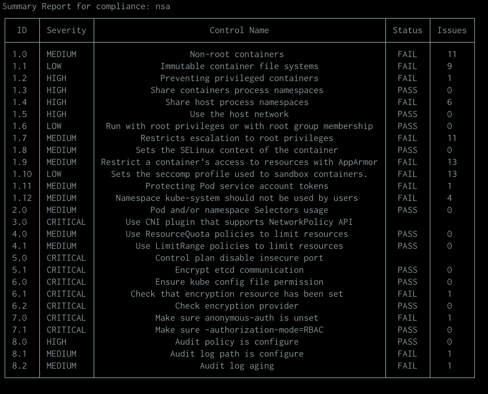

# Kubernetes Compliance

## NSA Compliance Report

!!! warning "EXPERIMENTAL"
    This feature might change without preserving backwards compatibility.

The Trivy K8s CLI allows you to scan your Kubernetes cluster resources and generate the `NSA, CISA Kubernetes Hardening Guidance` report

[NSA, CISA Kubernetes Hardening Guidance v1.2](https://media.defense.gov/2022/Aug/29/2003066362/-1/-1/0/CTR_KUBERNETES_HARDENING_GUIDANCE_1.2_20220829.PDF) cybersecurity technical report is produced by trivy and validate the following control checks :

| NAME                                                     | DESCRIPTION                                                                                             |          |
|----------------------------------------------------------|---------------------------------------------------------------------------------------------------------|---------------|
| Non-root containers                                      | Check that container is not running as root                                                       |
| Immutable container file systems                         | Check that container root file system is immutable                                                  |
| Preventing privileged containers                         | Controls whether Pods can run privileged containers                                                 |
| Share containers process namespaces                      | Controls whether containers can share process namespaces                                                 |
| Share host process namespaces                            | Controls whether share host process namespaces                                                 |
| Use the host network                                     | Controls whether containers can use the host network                                                    |
| Run with root privileges or with root group membership   | Controls whether container applications can run with <br/>root privileges or with root group membership                   |
| Restricts escalation to root privileges                  | Control check restrictions escalation to root privileges                                                 |
| Sets the SELinux context of the container                | Control checks if pod sets the SELinux context of the container                                                  |
| Restrict a container's access to resources with AppArmor | Control checks the restriction of containers access to resources with AppArmor                                    | 
| Sets the seccomp profile used to sandbox containers      | Control checks the sets the seccomp profile used to sandbox containers                                                 |
| Protecting Pod service account tokens                    | Control check whether disable secret token been mount ,automountServiceAccountToken: false                        | 
| Namespace kube-system should not be used by users        | Control check whether Namespace kube-system is not be used by users                                                      |
| Pod and/or namespace Selectors usage                     | Control check validate the pod and/or namespace Selectors usage                                                      |
| Use CNI plugin that supports NetworkPolicy API           | Control check whether check cni plugin installed                                                  |
| Use ResourceQuota policies to limit resources            | Control check the use of ResourceQuota policy to limit aggregate resource usage within namespace                  | 
| Use LimitRange policies to limit resources               | Control check the use of LimitRange policy limit resource usage for namespaces or nodes                              |
| Control plan disable insecure port                       | Control check whether control plan disable insecure port                                                       |
| Encrypt etcd communication                               | Control check whether etcd communication is encrypted                                                  |
| Ensure kube config file permission                       | Control check whether kube config file permissions                                                |
| Check that encryption resource has been set              | Control checks whether encryption resource has been set                                                        |
| Check encryption provider                                | Control checks whether encryption provider has been set                                                        |
| Make sure anonymous-auth is unset                        | Control checks whether anonymous-auth is unset                                                      |
| Make sure -authorization-mode=RBAC                       | Control check whether RBAC permission is in use                                                        |
| Audit policy is configure                                | Control check whether audit policy is configure                                                  |
| Audit log path is configure                              | Control check whether audit log path is configure                                                  |
| Audit log aging                                          | Control check whether audit log aging is configure                                                  |

## CLI Commands

Scan a full cluster and generate a complliance NSA summary report:

```
$ trivy k8s cluster --compliance=nsa --report summary
```



***Note*** : The `compliance` column represent the calculation of all tests pass vs. fail for all resources per control check in percentage format.

Example: if I have two resources in cluster and one resource scan result show pass while the other one show fail for `1.0 Non-root Containers` then it compliance will show 50%

An additional report is supported to get all of the detail the output contains, use `--report all`
```
$ trivy k8s cluster --compliance=nsa --report all
```
Report also supported in json format examples :

```
$ trivy k8s cluster --compliance=nsa --report summary --format json
```

```
$ trivy k8s cluster --compliance=nsa --report all --format json
```
