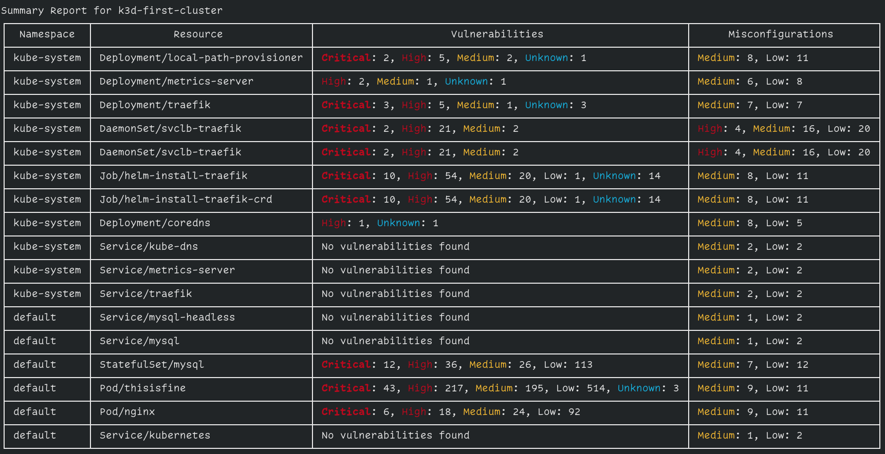

# Kubernetes

!!! warning "EXPERIMENTAL"

This feature might change without preserving backwards compatibility.

The Trivy K8s CLI allows you to scan your Kubernetes cluster for Vulnerabilities, Secrets and Misconfigurations. You can either run the CLI locally or integrate it into your CI/CD pipeline. The difference to the Trivy CLI is that the Trivy K8s CLI allows you to scan running workloads directly within your cluster.

If you are looking for continuous cluster audit scanning, have a look at the [Trivy K8s operator.](../operator/getting-started.md)

Trivy uses your local kubectl configuration to access the API server to list artifacts.

## CLI Commands

Scan a full cluster and generate a simple summary report:

```
$ trivy k8s --report=summary
```



The summary report is the default. To get all of the detail the output contains, use `--report all`.

Filter by severity:

```
$ trivy k8s --severity=CRITICAL --report=all
```

Filter by security check (Vulnerabilties, Secrets or Misconfigurations):

```
$ trivy k8s --security-checks=secret --report=summary
# or
$ trivy k8s --security-checks=config --report=summary
```

Scan a specific namespace:

```
$ trivy k8s -n kube-system --report=summary
```

Scan a specific resource and get all the output:

```
$ trivy k8s deployment/appname
```

If you want to pass in flags before scanning specific workloads, you will have to do it before the resource name.
For example, scanning a deployment in the app namespace of your Kubernetes cluster for critical vulnerabilities would be done through the following command:

```
$ trivy k8s -n app --severity=CRITICAL deployment/appname
```
This is specific to all Trivy CLI commands.

The supported formats are `table`, which is the default, and `json`.
To get a JSON output on a full cluster scan:

```
$ trivy k8s --format json -o results.json
```

<details>
<summary>Result</summary>

```json
{
  "ClusterName": "minikube",
  "Vulnerabilities": [
    {
      "Namespace": "default",
      "Kind": "Deployment",
      "Name": "app",
      "Results": [
        {
          "Target": "ubuntu:latest (ubuntu 22.04)",
          "Class": "os-pkgs",
          "Type": "ubuntu",
          "Vulnerabilities": [
            {
              "VulnerabilityID": "CVE-2016-2781",
              "PkgName": "coreutils",
              "InstalledVersion": "8.32-4.1ubuntu1",
              "Layer": {
                "Digest": "sha256:125a6e411906fe6b0aaa50fc9d600bf6ff9bb11a8651727ce1ed482dc271c24c",
                "DiffID": "sha256:e59fc94956120a6c7629f085027578e6357b48061d45714107e79f04a81a6f0c"
              },
              "SeveritySource": "ubuntu",
              "PrimaryURL": "https://avd.aquasec.com/nvd/cve-2016-2781",
              "DataSource": {
                "ID": "ubuntu",
                "Name": "Ubuntu CVE Tracker",
                "URL": "https://git.launchpad.net/ubuntu-cve-tracker"
              },
              "Title": "coreutils: Non-privileged session can escape to the parent session in chroot",
              "Description": "chroot in GNU coreutils, when used with --userspec, allows local users to escape to the parent session via a crafted TIOCSTI ioctl call, which pushes characters to the terminal's input buffer.",
              "Severity": "LOW",
              "CweIDs": [
                "CWE-20"
              ],
              "VendorSeverity": {
                "cbl-mariner": 2,
                "nvd": 2,
                "redhat": 2,
                "ubuntu": 1
              },
              "CVSS": {
                "nvd": {
                  "V2Vector": "AV:L/AC:L/Au:N/C:N/I:P/A:N",
                  "V3Vector": "CVSS:3.0/AV:L/AC:L/PR:L/UI:N/S:C/C:N/I:H/A:N",
                  "V2Score": 2.1,
                  "V3Score": 6.5
                },
                "redhat": {
                  "V2Vector": "AV:L/AC:H/Au:N/C:C/I:C/A:C",
                  "V3Vector": "CVSS:3.0/AV:L/AC:L/PR:N/UI:R/S:C/C:H/I:H/A:H",
                  "V2Score": 6.2,
                  "V3Score": 8.6
                }
              },
              "References": [
                "http://seclists.org/oss-sec/2016/q1/452",
                "http://www.openwall.com/lists/oss-security/2016/02/28/2",
                "http://www.openwall.com/lists/oss-security/2016/02/28/3",
                "https://access.redhat.com/security/cve/CVE-2016-2781",
                "https://cve.mitre.org/cgi-bin/cvename.cgi?name=CVE-2016-2781",
                "https://lists.apache.org/thread.html/rf9fa47ab66495c78bb4120b0754dd9531ca2ff0430f6685ac9b07772@%3Cdev.mina.apache.org%3E",
                "https://lore.kernel.org/patchwork/patch/793178/",
                "https://nvd.nist.gov/vuln/detail/CVE-2016-2781"
              ],
              "PublishedDate": "2017-02-07T15:59:00Z",
              "LastModifiedDate": "2021-02-25T17:15:00Z"
            }
          ]
        }
      ]
    }
  ],
  "Misconfigurations": [
    {
      "Namespace": "default",
      "Kind": "Deployment",
      "Name": "app",
      "Results": [
        {
          "Target": "Deployment/app",
          "Class": "config",
          "Type": "kubernetes",
          "MisconfSummary": {
            "Successes": 20,
            "Failures": 19,
            "Exceptions": 0
          },
          "Misconfigurations": [
            {
              "Type": "Kubernetes Security Check",
              "ID": "KSV001",
              "Title": "Process can elevate its own privileges",
              "Description": "A program inside the container can elevate its own privileges and run as root, which might give the program control over the container and node.",
              "Message": "Container 'app' of Deployment 'app' should set 'securityContext.allowPrivilegeEscalation' to false",
              "Namespace": "builtin.kubernetes.KSV001",
              "Query": "data.builtin.kubernetes.KSV001.deny",
              "Resolution": "Set 'set containers[].securityContext.allowPrivilegeEscalation' to 'false'.",
              "Severity": "MEDIUM",
              "PrimaryURL": "https://avd.aquasec.com/misconfig/ksv001",
              "References": [
                "https://kubernetes.io/docs/concepts/security/pod-security-standards/#restricted",
                "https://avd.aquasec.com/misconfig/ksv001"
              ],
              "Status": "FAIL",
              "Layer": {},
              "IacMetadata": {
                "Provider": "Kubernetes",
                "Service": "general",
                "StartLine": 121,
                "EndLine": 133
              }
            },
            {
              "Type": "Kubernetes Security Check",
              "ID": "KSV003",
              "Title": "Default capabilities not dropped",
              "Description": "The container should drop all default capabilities and add only those that are needed for its execution.",
              "Message": "Container 'app' of Deployment 'app' should add 'ALL' to 'securityContext.capabilities.drop'",
              "Namespace": "builtin.kubernetes.KSV003",
              "Query": "data.builtin.kubernetes.KSV003.deny",
              "Resolution": "Add 'ALL' to containers[].securityContext.capabilities.drop.",
              "Severity": "LOW",
              "PrimaryURL": "https://avd.aquasec.com/misconfig/ksv003",
              "References": [
                "https://kubesec.io/basics/containers-securitycontext-capabilities-drop-index-all/",
                "https://avd.aquasec.com/misconfig/ksv003"
              ],
              "Status": "FAIL",
              "Layer": {},
              "IacMetadata": {
                "Provider": "Kubernetes",
                "Service": "general",
                "StartLine": 121,
                "EndLine": 133
              }
            }
          ]
        }
      ]
    },
    {
      "Namespace": "default",
      "Kind": "ConfigMap",
      "Name": "kube-root-ca.crt"
    }
  ]
}

```

</details>

