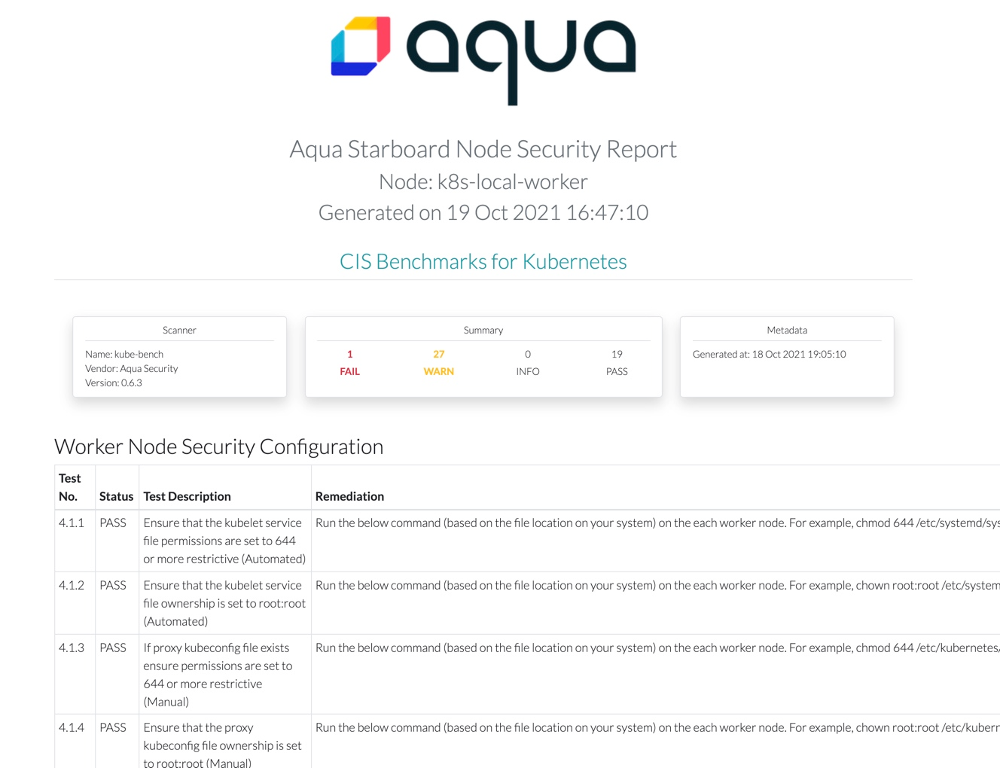

# Infrastructure Scanners

Currently, these are the tools for infrastructure checking in Kubernetes:

* CIS benchmark for Kubernetes nodes provided by [kube-bench].
* Penetration test results for a Kubernetes cluster provided by [kube-hunter].

## Kube-bench

The CIS benchmark for Kubernetes provides prescriptive guidance for system and application administrators, security
specialists, auditors, help desk, and platform deployment personnel who are responsible for establishing secure
configuration for solutions that incorporate Kubernetes.

Starboard Operator automatically discovers cluster nodes and checks their configuration against CIS benchmarks.
With Starboard CLI you can use the `scan ciskubebenchreports` command:

```
starboard scan ciskubebenchreports
```

In both cases, results are stored as [CISKubeBenchReport] resources controller by the corresponding cluster node.

If everything goes fine, list benchmark results with the `kubectl get` command:

```console
$ kubectl get ciskubebenchreports -o wide
NAME                 SCANNER      AGE   FAIL   WARN   INFO   PASS
kind-control-plane   kube-bench   13s   11     43     0      69
kind-worker          kube-bench   14s   1      29     0      19
kind-worker2         kube-bench   14s   1      29     0      19
```

With Starboard CLI it is also possible to generate a CIS Benchmark HTML report and open it in your web browser:

```
starboard report nodes/kind-control-plane > kind-control-plane-report.html
```
```
open kind-control-plane-report.html
```




## Kube-hunter

Kube-hunter hunts for security weaknesses in Kubernetes clusters. It was developed to increase awareness and visibility
for security issues in Kubernetes environments.

!!! tip
    Kube-hunter is only integrated with Starboard CLI.

To run kube-hunter in your cluster as a Pod use the following command:

```
starboard scan kubehunterreports
```

If everything goes well, you can retrieve the penetration test report with the `kubectl get` command:

```console
$ kubectl get kubehunterreports -o wide
NAME      SCANNER       AGE   HIGH   MEDIUM   LOW
cluster   kube-hunter   27h   0      0        1
```

## What's Next?

* See how Starboard Operator can automate [Infrastructure Scanning] with kube-bench.
* Watch the video where we demonstrated [Automating Kubernetes Compliance Checks with Starboard Operator].

[kube-bench]: https://github.com/aquasecurity/kube-bench/
[kube-hunter]: https://github.com/aquasecurity/kube-hunter/
[Infrastructure Scanning]: ./../../operator/getting-started.md#infrastructure-scanning
[CISKubeBenchReport]: ./../../crds/ciskubebench-report.md
[Automating Kubernetes Compliance Checks with Starboard Operator]: https://www.youtube.com/watch?v=hOQyEPL-ULI