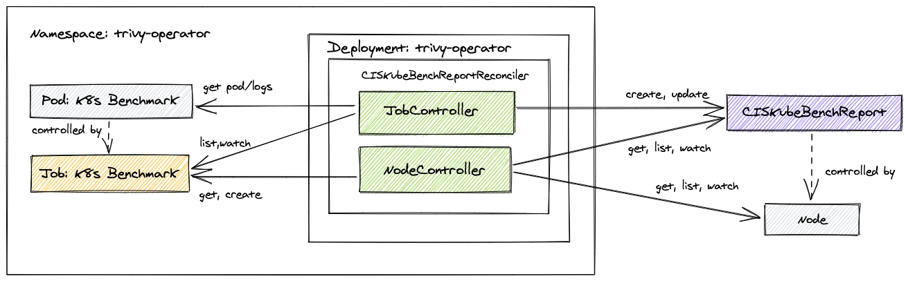

# Trivy-Operator 

## Overview

This operator automatically updates security report resources in response to workload and other changes on a Kubernetes
cluster - for example, initiating a vulnerability scan and configuration audit when a new Pod is started.

<figure>
  
  <figcaption>Workload reconcilers discover K8s controllers, manage scan jobs, and create VulnerabilityReport and ConfigAuditReport objects.</figcaption>
</figure>

Similarly, the operator performs infrastructure checks by watching Kubernetes cluster nodes and executing CIS Kubernetes Benchmark
for each of them.

<figure>
  
  <figcaption>Infrastructure reconciler discovers K8s nodes, manages scan jobs, and creates CISKubeBenchReport objects.</figcaption>
</figure>

In other words, the desired state for the controllers managed by this operator is that for each workload or node there
are security reports stored in the cluster as custom resources. Each custom resource is owned by a built-in resource
to inherit its life cycle. Beyond that, we take advantage of Kubernetes [garbage collector][k8s-garbage-collection]
to automatically delete stale reports and trigger rescan. For example, deleting a ReplicaSet will delete controlee
VulnerabilityReports, whereas deleting a VulnerabilityReport owned by a ReplicaSet will rescan that ReplicaSet and
eventually recreate the VulnerabilityReport.

Rescan is also triggered whenever a config of a configuration audit plugin has changed. For example, when a new OPA
policy script is added to the Confest plugin config. This is implemented by adding the label named `plugin-config-hash`
to ConfigAuditReport instances. The plugins' config reconciler watches the ConfigMap that holds plugin settings
and computes a hash from the ConfigMap's data. The hash is then compared with values of the `plugin-config-hash` labels.
If hashes are not equal then affected ConfigAuditReport objects are deleted, which in turn triggers rescan - this time
with new plugin's configuration.

<figure>
  
  <figurecaption>Plugin configuration reconciler deletes ConfigAuditReports whenever the configuration changes.</figurecaption>
</figure>

!!! warning
    Currently, the operator supports [vulnerabilityreports], [configauditreports], and [ciskubebenchreports] security
    resources. We plan to support [kubehunterreports]. We also plan to implement rescan on configurable schedule, for
    example every 24 hours.

## What's Next?

- Install the operator and follow the [Getting Started](./getting-started.md) guide.

[vulnerabilityreports]: ./../crds/vulnerability-report.md
[configauditreports]: ./../crds/configaudit-report.md
[ciskubebenchreports]: ./../crds/ciskubebench-report.md
[kubehunterreports]: ./../crds/kubehunter-report.md
[clustercompliancereports]: ./../crds/clustercompliance-report.md
[clustercompliancedetailreports]: ./../crds/clustercompliancedetail-report.md

[k8s-garbage-collection]: https://kubernetes.io/docs/concepts/workloads/controllers/garbage-collection/
