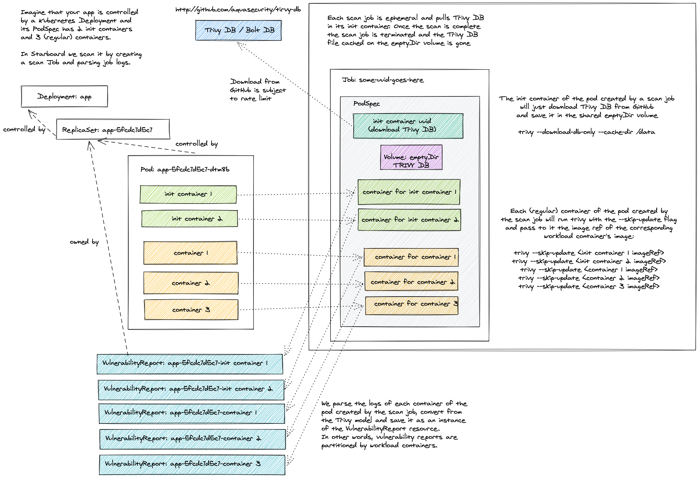
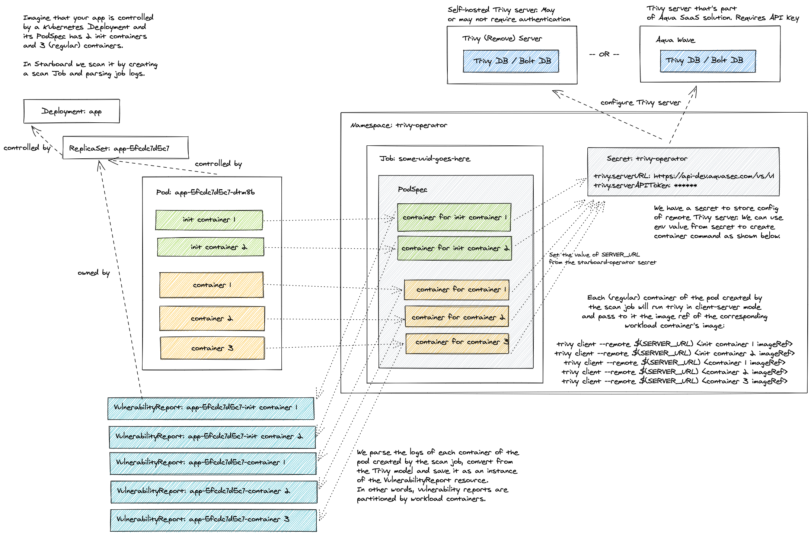

# Vulnerability Scanning Configuration

## Standalone

The default configuration settings enable Trivy `vulnerabilityReports.scanner` in [`Standalone`][trivy-standalone]
`trivy.mode`. Even though it doesn't require any additional setup, it's the least efficient method. Each Pod created
by a scan Job has the init container that downloads the Trivy vulnerabilities database from the GitHub releases page
and stores it in the local file system of the [emptyDir volume]. This volume is then shared with containers that perform
the actual scanning. Finally, the Pod is deleted along with the emptyDir volume.



The number of containers defined by a scan Job equals the number of containers defined by the scanned Kubernetes
workload, so the cache in this mode is useful only if the workload defines multiple containers.

Beyond that, frequent downloads from GitHub might lead to a [rate limiting] problem. The limits are imposed by GitHub on
all anonymous requests originating from a given IP. To mitigate such problems you can add the `trivy.githubToken` key to
the `trivy-operator` secret.

```bash

kubectl patch secret trivy-operator-trivy-config -n trivy-operator \
  --type merge \
  -p "$(cat <<EOF
{
  "data": {
    "trivy.githubToken": "$(echo -n <GITHUB_TOKEN> | base64)"
  }
}
EOF
)"
```

## ClientServer

You can connect Trivy to an external Trivy server by changing the default `trivy.mode` from
[`Standalone`][trivy-standalone] to [`ClientServer`][trivy-clientserver] and specifying `trivy.serverURL`.

```bash
kubectl patch cm trivy-operator-trivy-config -n trivy-operator \
  --type merge \
  -p "$(cat <<EOF
{
  "data": {
    "trivy.mode":      "ClientServer",
    "trivy.serverURL": "<TRIVY_SERVER_URL>"
  }
}
EOF
)"
```

The Trivy server could be your own deployment, or it could be an external service. See [Trivy server][trivy-clientserver] documentation for more information.

If the server requires access token and/or custom HTTP authentication headers, you may add `trivy.serverToken` and `trivy.serverCustomHeaders` properties to the Trivy Operator secret.

```bash
kubectl patch secret trivy-operator-trivy-config -n trivy-operator \
  --type merge \
  -p "$(cat <<EOF
{
  "data": {
    "trivy.serverToken":         "$(echo -n <SERVER_TOKEN> | base64)",
    "trivy.serverCustomHeaders": "$(echo -n x-api-token:<X_API_TOKEN> | base64)"
  }
}
EOF
)"
```



## Settings

| CONFIGMAP KEY| DEFAULT| DESCRIPTION|
|---|---|---|
| `trivy.imageRef`| `docker.io/aquasec/trivy:0.25.2`| Trivy image reference|
| `trivy.dbRepository`| `ghcr.io/aquasecurity/trivy-db`| External OCI Registry to download the vulnerability database|
| `trivy.mode`| `Standalone`| Trivy client mode. Either `Standalone` or `ClientServer`. Depending on the active mode other settings might be applicable or required.                              |
| `trivy.severity`| `UNKNOWN,LOW,MEDIUM,HIGH,CRITICAL` | A comma separated list of severity levels reported by Trivy|
| `trivy.ignoreUnfixed`| N/A| Whether to show only fixed vulnerabilities in vulnerabilities reported by Trivy. Set to `"true"` to enable it.|
| `trivy.skipFiles`| N/A| A comma separated list of file paths for Trivy to skip traversal.|
| `trivy.skipDirs`| N/A| A comma separated list of directories for Trivy to skip traversal.|
| `trivy.ignoreFile`| N/A| It specifies the `.trivyignore` file which contains a list of vulnerability IDs to be ignored from vulnerabilities reported by Trivy.|
| `trivy.timeout`| `5m0s`| The duration to wait for scan completion|
| `trivy.serverURL`| N/A| The endpoint URL of the Trivy server. Required in `ClientServer` mode.|
| `trivy.serverTokenHeader`| `Trivy-Token`| The name of the HTTP header to send the authentication token to Trivy server. Only application in `ClientServer` mode when `trivy.serverToken` is specified.|
| `trivy.serverInsecure`| N/A| The Flag to enable insecure connection to the Trivy server.|
| `trivy.insecureRegistry.<id>`| N/A| The registry to which insecure connections are allowed. There can be multiple registries with different registry `<id>`.|
| `trivy.nonSslRegistry.<id>`| N/A| A registry without SSL. There can be multiple registries with different registry `<id>`.|
| `trivy.registry.mirror.<registry>` | N/A| Mirror for the registry `<registry>`, e.g. `trivy.registry.mirror.index.docker.io: mirror.io` would use `mirror.io` to get images originated from `index.docker.io` |
| `trivy.httpProxy`| N/A| The HTTP proxy used by Trivy to download the vulnerabilities database from GitHub.|
| `trivy.httpsProxy`| N/A| The HTTPS proxy used by Trivy to download the vulnerabilities database from GitHub.|
| `trivy.noProxy`| N/A| A comma separated list of IPs and domain names that are not subject to proxy settings.|
| `trivy.resources.requests.cpu`| `100m`| The minimum amount of CPU required to run Trivy scanner pod.|
| `trivy.resources.requests.memory`| `100M`| The minimum amount of memory required to run Trivy scanner pod.|
| `trivy.resources.limits.cpu`| `500m`| The maximum amount of CPU allowed to run Trivy scanner pod.|
| `trivy.resources.limits.memory`| `500M`| The maximum amount of memory allowed to run Trivy scanner pod.|

| SECRET KEY| DESCRIPTION|
|---|---|
| `trivy.githubToken`| The GitHub access token used by Trivy to download the vulnerabilities database from GitHub. Only applicable in `Standalone` mode. |
| `trivy.serverToken`| The token to authenticate Trivy client with Trivy server. Only applicable in `ClientServer` mode.|
| `trivy.serverCustomHeaders`| A comma separated list of custom HTTP headers sent by Trivy client to Trivy server. Only applicable in `ClientServer` mode.|

[trivy-standalone]: https://aquasecurity.github.io/trivy/latest/modes/standalone/
[emptyDir volume]: https://kubernetes.io/docs/concepts/storage/volumes/#emptydir
[rate limiting]: https://docs.github.com/en/free-pro-team@latest/rest/overview/resources-in-the-rest-api#rate-limiting
[trivy-clientserver]: https://aquasecurity.github.io/trivy/latest/advanced/modes/client-server/
