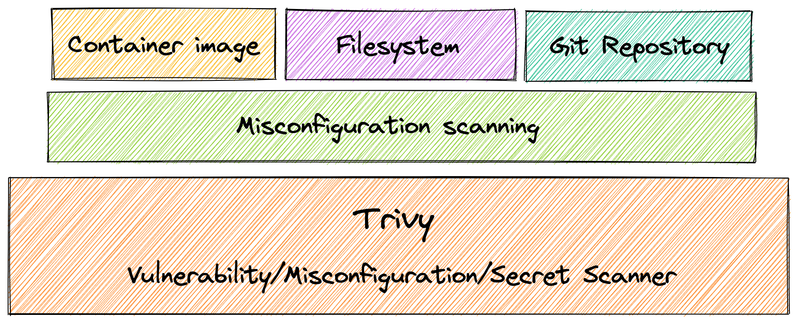

# Misconfiguration Scanning
Trivy provides built-in policies to detect configuration issues in popular Infrastructure as Code files, such as: Docker, Kubernetes, Terraform, CloudFormation, and more. 
In addition to built-in policies, you can write your own custom policies, as you can see [here][custom].



## Quick start

Simply specify a directory containing IaC files such as Terraform, CloudFormation, Azure ARM templates, Helm Charts and Dockerfile.

``` bash
$ trivy config [YOUR_IaC_DIRECTORY]
```


!!! example
    ```
    $ ls build/
    Dockerfile
    $ trivy config ./build
    2022-05-16T13:29:29.952+0100	INFO	Detected config files: 1
    
    Dockerfile (dockerfile)
    =======================
    Tests: 23 (SUCCESSES: 22, FAILURES: 1, EXCEPTIONS: 0)
    Failures: 1 (UNKNOWN: 0, LOW: 0, MEDIUM: 1, HIGH: 0, CRITICAL: 0)
    
    MEDIUM: Specify a tag in the 'FROM' statement for image 'alpine'
    ══════════════════════════════════════════════════════════════════════════════════════════════════════════════════════
    When using a 'FROM' statement you should use a specific tag to avoid uncontrolled behavior when the image is updated.
    
    See https://avd.aquasec.com/misconfig/ds001
    ──────────────────────────────────────────────────────────────────────────────────────────────────────────────────────
    Dockerfile:1
    ──────────────────────────────────────────────────────────────────────────────────────────────────────────────────────
    1 [ FROM alpine:latest
    ──────────────────────────────────────────────────────────────────────────────────────────────────────────────────────
    ```

You can also enable misconfiguration detection in container image, filesystem and git repository scanning via `--scanners config`.

```bash
$ trivy image --scanners config IMAGE_NAME
```

```bash
$ trivy fs --scanners config /path/to/dir
```

!!! note
    Misconfiguration detection is not enabled by default in `image`, `fs` and `repo` subcommands.

Unlike the `config` subcommand, `image`, `fs` and `repo` subcommands can also scan for vulnerabilities and secrets at the same time. 
You can specify `--scanners vuln,config,secret` to enable vulnerability and secret detection as well as misconfiguration detection.


!!! example
    ``` bash
    $ ls myapp/
    Dockerfile Pipfile.lock
    $ trivy fs --scanners vuln,config,secret --severity HIGH,CRITICAL myapp/
    2022-05-16T13:42:21.440+0100	INFO	Number of language-specific files: 1
    2022-05-16T13:42:21.440+0100	INFO	Detecting pipenv vulnerabilities...
    2022-05-16T13:42:21.440+0100	INFO	Detected config files: 1
    
    Pipfile.lock (pipenv)
    =====================
    Total: 1 (HIGH: 1, CRITICAL: 0)
    
    ┌──────────┬────────────────┬──────────┬───────────────────┬───────────────┬───────────────────────────────────────────────────────────┐
    │ Library  │ Vulnerability  │ Severity │ Installed Version │ Fixed Version │                           Title                           │
    ├──────────┼────────────────┼──────────┼───────────────────┼───────────────┼───────────────────────────────────────────────────────────┤
    │ httplib2 │ CVE-2021-21240 │ HIGH     │ 0.12.1            │ 0.19.0        │ python-httplib2: Regular expression denial of service via │
    │          │                │          │                   │               │ malicious header                                          │
    │          │                │          │                   │               │ https://avd.aquasec.com/nvd/cve-2021-21240                │
    └──────────┴────────────────┴──────────┴───────────────────┴───────────────┴───────────────────────────────────────────────────────────┘
    
    Dockerfile (dockerfile)
    =======================
    Tests: 17 (SUCCESSES: 16, FAILURES: 1, EXCEPTIONS: 0)
    Failures: 1 (HIGH: 1, CRITICAL: 0)
    
    HIGH: Last USER command in Dockerfile should not be 'root'
    ════════════════════════════════════════════════════════════════════════════════════════════════════════════════════════════════════════════════════════════════
    Running containers with 'root' user can lead to a container escape situation. It is a best practice to run containers as non-root users, which can be done by adding a 'USER' statement to the Dockerfile.
    
    See https://avd.aquasec.com/misconfig/ds002
    ────────────────────────────────────────────────────────────────────────────────────────────────────────────────────────────────────────────────────────────────
    Dockerfile:3
    ────────────────────────────────────────────────────────────────────────────────────────────────────────────────────────────────────────────────────────────────
    3 [ USER root
    ────────────────────────────────────────────────────────────────────────────────────────────────────────────────────────────────────────────────────────────────
    ```

In the above example, Trivy detected vulnerabilities of Python dependencies and misconfigurations in Dockerfile.

## Type detection
The specified directory can contain mixed types of IaC files.
Trivy automatically detects config types and applies relevant policies.

For example, the following example holds IaC files for Terraform, CloudFormation, Kubernetes, Helm Charts, and Dockerfile in the same directory.

``` bash
$ ls iac/
Dockerfile  deployment.yaml  main.tf mysql-8.8.26.tar
$ trivy conf --severity HIGH,CRITICAL ./iac
```

<details>
<summary>Result</summary>

```
2022-06-06T11:01:21.142+0100	INFO	Detected config files: 8

Dockerfile (dockerfile)

Tests: 21 (SUCCESSES: 20, FAILURES: 1, EXCEPTIONS: 0)
Failures: 1 (MEDIUM: 0, HIGH: 1, CRITICAL: 0)

HIGH: Specify at least 1 USER command in Dockerfile with non-root user as argument
═══════════════════════════════════════════════════════════════════════════════════════════════════════════════════════════════════════════════════════════════════════════════════════════════
Running containers with 'root' user can lead to a container escape situation. It is a best practice to run containers as non-root users, which can be done by adding a 'USER' statement to the Dockerfile.

See https://avd.aquasec.com/misconfig/ds002
───────────────────────────────────────────────────────────────────────────────────────────────────────────────────────────────────────────────────────────────────────────────────────────────


deployment.yaml (kubernetes)

Tests: 20 (SUCCESSES: 15, FAILURES: 5, EXCEPTIONS: 0)
Failures: 5 (MEDIUM: 4, HIGH: 1, CRITICAL: 0)

MEDIUM: Container 'hello-kubernetes' of Deployment 'hello-kubernetes' should set 'securityContext.allowPrivilegeEscalation' to false
═══════════════════════════════════════════════════════════════════════════════════════════════════════════════════════════════════════════════════════════════════════════════════════════════
A program inside the container can elevate its own privileges and run as root, which might give the program control over the container and node.

See https://avd.aquasec.com/misconfig/ksv001
───────────────────────────────────────────────────────────────────────────────────────────────────────────────────────────────────────────────────────────────────────────────────────────────
 deployment.yaml:16-19
───────────────────────────────────────────────────────────────────────────────────────────────────────────────────────────────────────────────────────────────────────────────────────────────
  16 ┌       - name: hello-kubernetes
  17 │         image: hello-kubernetes:1.5
  18 │         ports:
  19 └         - containerPort: 8080
───────────────────────────────────────────────────────────────────────────────────────────────────────────────────────────────────────────────────────────────────────────────────────────────


HIGH: Deployment 'hello-kubernetes' should not specify '/var/run/docker.socker' in 'spec.template.volumes.hostPath.path'
═══════════════════════════════════════════════════════════════════════════════════════════════════════════════════════════════════════════════════════════════════════════════════════════════
Mounting docker.sock from the host can give the container full root access to the host.

See https://avd.aquasec.com/misconfig/ksv006
───────────────────────────────────────────────────────────────────────────────────────────────────────────────────────────────────────────────────────────────────────────────────────────────
 deployment.yaml:6-29
───────────────────────────────────────────────────────────────────────────────────────────────────────────────────────────────────────────────────────────────────────────────────────────────
   6 ┌   replicas: 3
   7 │   selector:
   8 │     matchLabels:
   9 │       app: hello-kubernetes
  10 │   template:
  11 │     metadata:
  12 │       labels:
  13 │         app: hello-kubernetes
  14 └     spec:
  ..   
───────────────────────────────────────────────────────────────────────────────────────────────────────────────────────────────────────────────────────────────────────────────────────────────


MEDIUM: Container 'hello-kubernetes' of Deployment 'hello-kubernetes' should set 'securityContext.runAsNonRoot' to true
═══════════════════════════════════════════════════════════════════════════════════════════════════════════════════════════════════════════════════════════════════════════════════════════════
'runAsNonRoot' forces the running image to run as a non-root user to ensure least privileges.

See https://avd.aquasec.com/misconfig/ksv012
───────────────────────────────────────────────────────────────────────────────────────────────────────────────────────────────────────────────────────────────────────────────────────────────
 deployment.yaml:16-19
───────────────────────────────────────────────────────────────────────────────────────────────────────────────────────────────────────────────────────────────────────────────────────────────
  16 ┌       - name: hello-kubernetes
  17 │         image: hello-kubernetes:1.5
  18 │         ports:
  19 └         - containerPort: 8080
───────────────────────────────────────────────────────────────────────────────────────────────────────────────────────────────────────────────────────────────────────────────────────────────


MEDIUM: Deployment 'hello-kubernetes' should not set 'spec.template.volumes.hostPath'
═══════════════════════════════════════════════════════════════════════════════════════════════════════════════════════════════════════════════════════════════════════════════════════════════
HostPath volumes must be forbidden.

See https://avd.aquasec.com/misconfig/ksv023
───────────────────────────────────────────────────────────────────────────────────────────────────────────────────────────────────────────────────────────────────────────────────────────────
 deployment.yaml:6-29
───────────────────────────────────────────────────────────────────────────────────────────────────────────────────────────────────────────────────────────────────────────────────────────────
   6 ┌   replicas: 3
   7 │   selector:
   8 │     matchLabels:
   9 │       app: hello-kubernetes
  10 │   template:
  11 │     metadata:
  12 │       labels:
  13 │         app: hello-kubernetes
  14 └     spec:
  ..   
───────────────────────────────────────────────────────────────────────────────────────────────────────────────────────────────────────────────────────────────────────────────────────────────


MEDIUM: Deployment 'hello-kubernetes' should set 'securityContext.sysctl' to the allowed values
═══════════════════════════════════════════════════════════════════════════════════════════════════════════════════════════════════════════════════════════════════════════════════════════════
Sysctls can disable security mechanisms or affect all containers on a host, and should be disallowed except for an allowed 'safe' subset. A sysctl is considered safe if it is namespaced in the container or the Pod, and it is isolated from other Pods or processes on the same Node.

See https://avd.aquasec.com/misconfig/ksv026
───────────────────────────────────────────────────────────────────────────────────────────────────────────────────────────────────────────────────────────────────────────────────────────────
 deployment.yaml:6-29
───────────────────────────────────────────────────────────────────────────────────────────────────────────────────────────────────────────────────────────────────────────────────────────────
   6 ┌   replicas: 3
   7 │   selector:
   8 │     matchLabels:
   9 │       app: hello-kubernetes
  10 │   template:
  11 │     metadata:
  12 │       labels:
  13 │         app: hello-kubernetes
  14 └     spec:
  ..   
───────────────────────────────────────────────────────────────────────────────────────────────────────────────────────────────────────────────────────────────────────────────────────────────


mysql-8.8.26.tar:templates/primary/statefulset.yaml (helm)

Tests: 20 (SUCCESSES: 18, FAILURES: 2, EXCEPTIONS: 0)
Failures: 2 (MEDIUM: 2, HIGH: 0, CRITICAL: 0)

MEDIUM: Container 'mysql' of StatefulSet 'mysql' should set 'securityContext.allowPrivilegeEscalation' to false
═══════════════════════════════════════════════════════════════════════════════════════════════════════════════════════════════════════════════════════════════════════════════════════════════
A program inside the container can elevate its own privileges and run as root, which might give the program control over the container and node.

See https://avd.aquasec.com/misconfig/ksv001
───────────────────────────────────────────────────────────────────────────────────────────────────────────────────────────────────────────────────────────────────────────────────────────────
 mysql-8.8.26.tar:templates/primary/statefulset.yaml:56-130
───────────────────────────────────────────────────────────────────────────────────────────────────────────────────────────────────────────────────────────────────────────────────────────────
  56 ┌         - name: mysql
  57 │           image: docker.io/bitnami/mysql:8.0.28-debian-10-r23
  58 │           imagePullPolicy: "IfNotPresent"
  59 │           securityContext:
  60 │             runAsUser: 1001
  61 │           env:
  62 │             - name: BITNAMI_DEBUG
  63 │               value: "false"
  64 └             - name: MYSQL_ROOT_PASSWORD
  ..   
───────────────────────────────────────────────────────────────────────────────────────────────────────────────────────────────────────────────────────────────────────────────────────────────


MEDIUM: Container 'mysql' of StatefulSet 'mysql' should set 'securityContext.runAsNonRoot' to true
═══════════════════════════════════════════════════════════════════════════════════════════════════════════════════════════════════════════════════════════════════════════════════════════════
'runAsNonRoot' forces the running image to run as a non-root user to ensure least privileges.

See https://avd.aquasec.com/misconfig/ksv012
───────────────────────────────────────────────────────────────────────────────────────────────────────────────────────────────────────────────────────────────────────────────────────────────
 mysql-8.8.26.tar:templates/primary/statefulset.yaml:56-130
───────────────────────────────────────────────────────────────────────────────────────────────────────────────────────────────────────────────────────────────────────────────────────────────
  56 ┌         - name: mysql
  57 │           image: docker.io/bitnami/mysql:8.0.28-debian-10-r23
  58 │           imagePullPolicy: "IfNotPresent"
  59 │           securityContext:
  60 │             runAsUser: 1001
  61 │           env:
  62 │             - name: BITNAMI_DEBUG
  63 │               value: "false"
  64 └             - name: MYSQL_ROOT_PASSWORD
  ..   
───────────────────────────────────────────────────────────────────────────────────────────────────────────────────────────────────────────────────────────────────────────────────────────────

```

</details>

You can see the config type next to each file name.

!!! example
``` bash
Dockerfile (dockerfile)
=======================
Tests: 23 (SUCCESSES: 22, FAILURES: 1, EXCEPTIONS: 0)
Failures: 1 (HIGH: 1, CRITICAL: 0)

...

deployment.yaml (kubernetes)
============================
Tests: 28 (SUCCESSES: 15, FAILURES: 13, EXCEPTIONS: 0)
Failures: 13 (MEDIUM: 4, HIGH: 1, CRITICAL: 0)

...

main.tf (terraform)
===================
Tests: 23 (SUCCESSES: 14, FAILURES: 9, EXCEPTIONS: 0)
Failures: 9 (HIGH: 6, CRITICAL: 1)

...

bucket.yaml (cloudformation)
============================
Tests: 9 (SUCCESSES: 3, FAILURES: 6, EXCEPTIONS: 0)
Failures: 6 (UNKNOWN: 0, LOW: 0, MEDIUM: 2, HIGH: 4, CRITICAL: 0)

...

mysql-8.8.26.tar:templates/primary/statefulset.yaml (helm)
==========================================================
Tests: 20 (SUCCESSES: 18, FAILURES: 2, EXCEPTIONS: 0)
Failures: 2 (MEDIUM: 2, HIGH: 0, CRITICAL: 0)
```

## Examples
See [here](https://github.com/aquasecurity/trivy/tree/{{ git.tag }}/examples/misconf/mixed)

[custom]: ./custom/index.md