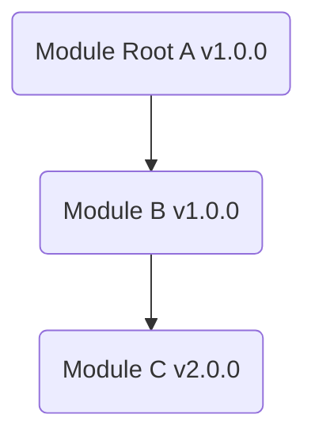
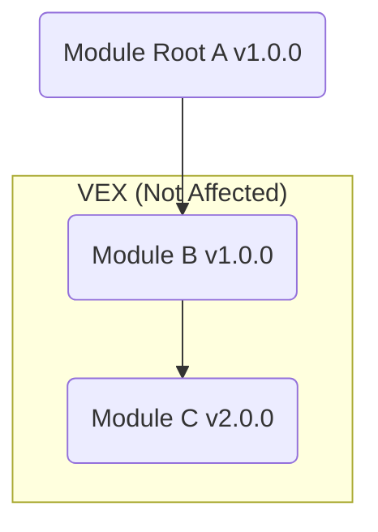
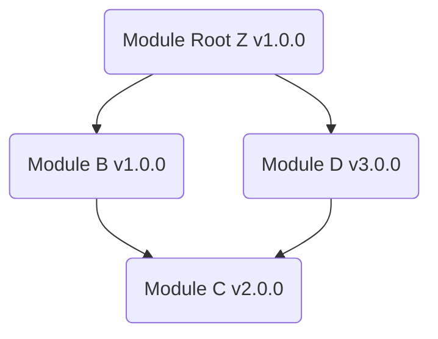
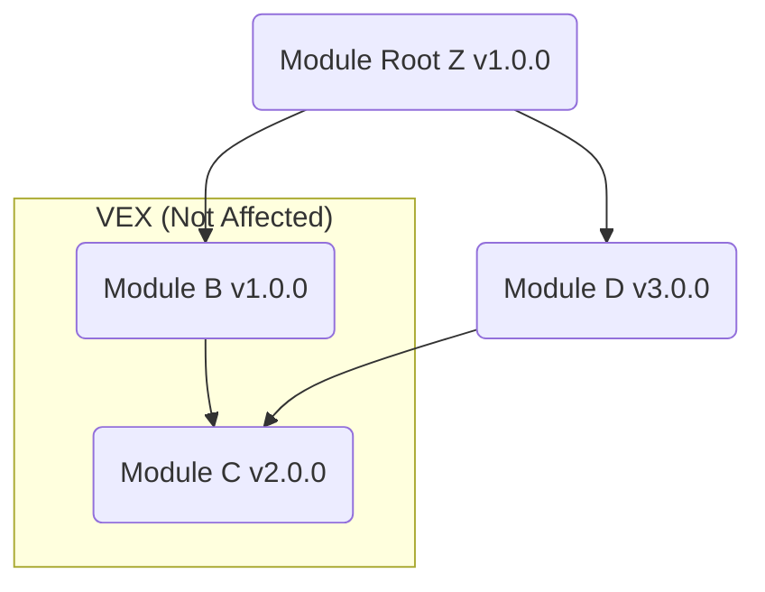

# Local VEX Files

!!! warning "EXPERIMENTAL"
    This feature might change without preserving backwards compatibility.

In addition to [VEX repositories](./repo.md), Trivy also supports the use of local VEX files for vulnerability filtering.
This method is useful when you have specific VEX documents that you want to apply to your scans.
Currently, Trivy supports the following formats:

- [CycloneDX](https://cyclonedx.org/capabilities/vex/)
- [OpenVEX](https://github.com/openvex/spec)
- [CSAF](https://oasis-open.github.io/csaf-documentation/specification.html)

## CycloneDX
|     Target      | Supported |
|:---------------:|:---------:|
| Container Image |           |
|   Filesystem    |           |
| Code Repository |           |
|    VM Image     |           |
|   Kubernetes    |           |
|      SBOM       |     ✅     |

There are [two VEX formats](https://cyclonedx.org/capabilities/vex/) for CycloneDX:

- Independent BOM and VEX BOM
- BOM With Embedded VEX

Trivy only supports the Independent BOM and VEX BOM format, so you need to provide a separate VEX file alongside the SBOM.
The input SBOM format must be in CycloneDX format.

The following steps are required:

1. Generate a CycloneDX SBOM
2. Create a VEX based on the SBOM generated in step 1
3. Provide the VEX when scanning the CycloneDX SBOM

### Generate the SBOM
You can generate a CycloneDX SBOM with Trivy as follows:

```bash
$ trivy image --format cyclonedx --output debian11.sbom.cdx debian:11
```

### Create the VEX
Next, create a VEX based on the generated SBOM.
Multiple vulnerability statuses can be defined under `vulnerabilities`.
Take a look at the example below.

```bash
$ cat <<EOF > trivy.vex.cdx
{
  "bomFormat": "CycloneDX",
  "specVersion": "1.5",
  "version": 1,
  "vulnerabilities": [
    {
      "id": "CVE-2020-8911",
      "analysis": {
        "state": "not_affected",
        "justification": "code_not_reachable",
        "response": ["will_not_fix", "update"],
        "detail": "The vulnerable function is not called"
      },
      "affects": [
        {
          "ref": "urn:cdx:3e671687-395b-41f5-a30f-a58921a69b79/1#pkg:golang/github.com/aws/aws-sdk-go@v1.44.234"
        }
      ]
    }
  ]
}
EOF
```

This is a VEX document in the CycloneDX format.
The vulnerability ID, such as a CVE-ID or GHSA-ID, should be placed in `vulnerabilities.id`.
When the `analysis.state` is set to `not_affected`, Trivy will not detect the vulnerability.

BOM-Links must be placed in `affects.ref`.
The BOM-Link has the following syntax and consists of three elements:

```
urn:cdx:serialNumber/version#bom-ref
```

- serialNumber
- version
- bom-ref
 
These values must be obtained from the CycloneDX SBOM.
Please note that while the serialNumber starts with `urn:uuid:`, the BOM-Link starts with `urn:cdx:`.

The `bom-ref` must contain the BOM-Ref of the package affected by the vulnerability.
In the example above, since the Go package `github.com/aws/aws-sdk-go` is affected by CVE-2020-8911, it was necessary to specify the SBOM's BOM-Ref, `pkg:golang/github.com/aws/aws-sdk-go@1.44.234`.

For more details on CycloneDX VEX and BOM-Link, please refer to the following links:

- [CycloneDX VEX](https://cyclonedx.org/capabilities/vex/)
- [BOM-Link](https://cyclonedx.org/capabilities/bomlink/)
- [Examples](https://github.com/CycloneDX/bom-examples/tree/master)

### Scan SBOM with VEX
Provide the VEX when scanning the CycloneDX SBOM.

```bash
$ trivy sbom trivy.sbom.cdx --vex trivy.vex.cdx
...
2023-04-13T12:55:44.838+0300    INFO    Filtered out the detected vulnerability {"VEX format": "CycloneDX", "vulnerability-id": "CVE-2020-8911", "status": "not_affected", "justification": "code_not_reachable"}

go.mod (gomod)
==============
Total: 1 (UNKNOWN: 0, LOW: 1, MEDIUM: 0, HIGH: 0, CRITICAL: 0)

┌───────────────────────────┬───────────────┬──────────┬───────────────────┬───────────────┬────────────────────────────────────────────────────────────┐
│          Library          │ Vulnerability │ Severity │ Installed Version │ Fixed Version │                           Title                            │
├───────────────────────────┼───────────────┼──────────┼───────────────────┼───────────────┼────────────────────────────────────────────────────────────┤
│ github.com/aws/aws-sdk-go │ CVE-2020-8912 │ LOW      │ v1.44.234         │               │ aws-sdk-go: In-band key negotiation issue in AWS S3 Crypto │
│                           │               │          │                   │               │ SDK for golang...                                          │
│                           │               │          │                   │               │ https://avd.aquasec.com/nvd/cve-2020-8912                  │
└───────────────────────────┴───────────────┴──────────┴───────────────────┴───────────────┴────────────────────────────────────────────────────────────┘
```

CVE-2020-8911 is no longer shown as it is filtered out according to the given CycloneDX VEX document.

## OpenVEX
|     Target      | Supported |
|:---------------:|:---------:|
| Container Image |     ✅     |
|   Filesystem    |     ✅     |
| Code Repository |     ✅     |
|    VM Image     |     ✅     |
|   Kubernetes    |     ✅     |
|      SBOM       |     ✅     |

Trivy also supports [OpenVEX][openvex] that is designed to be minimal, compliant, interoperable, and embeddable.
OpenVEX can be used in all Trivy targets, unlike CycloneDX VEX.

The following steps are required:

1. Create a VEX document
2. Provide the VEX when scanning your target

### Create the VEX document
Please see also [the example](https://github.com/openvex/examples).
Trivy requires [the Package URL (PURL)][purl] as the product identifier.

```bash
$ cat <<EOF > debian11.openvex.json
{
  "@context": "https://openvex.dev/ns/v0.2.0",
  "@id": "https://openvex.dev/docs/public/vex-2e67563e128250cbcb3e98930df948dd053e43271d70dc50cfa22d57e03fe96f",
  "author": "Aqua Security",
  "timestamp": "2023-08-29T19:07:16.853479631-06:00",
  "version": 1,
  "statements": [
    {
      "vulnerability": {"name": "CVE-2019-8457"},
      "products": [
        {"@id": "pkg:deb/debian/libdb5.3@5.3.28+dfsg1-0.8"}
      ],
      "status": "not_affected",
      "justification": "vulnerable_code_not_in_execute_path"
    }
  ]
}
EOF
```

In the above example, PURLs, `pkg:deb/debian/libdb5.3@5.3.28+dfsg1-0.8` are used for the product identifier.
You can find PURLs in the JSON report generated by Trivy.
This VEX statement is applied if the PURL specified in the VEX matches the PURL found during the scan.
See [here](#purl-matching) for more details of PURL matching.

Trivy also supports [OpenVEX subcomponents][openvex-subcomponent], which allow for more precise specification of the scope of a VEX statement, reducing the risk of incorrect filtering.
Let's say you want to suppress vulnerabilities within a container image.
If you only specify the PURL of the container image as the product, the resulting VEX would look like this:

<details>
<summary>OpenVEX products only</summary>

```json
"statements": [
  {
    "vulnerability": {"name": "CVE-2024-32002"},
    "products": [
      {"@id": "pkg:oci/trivy?repository_url=ghcr.io%2Faquasecurity%2Ftrivy"}
    ],
    "status": "not_affected",
    "justification": "vulnerable_code_not_in_execute_path"
  }
]
```

</details>

However, this approach would suppress all instances of CVE-2024-32002 within the container image.
If the intention is to declare that the `git` package distributed by Alpine Linux within this image is not affected, subcomponents can be utilized as follows:

<details>
<summary>OpenVEX subcomponents</summary>

```json
"statements": [
  {
    "vulnerability": {"name": "CVE-2024-32002"},
    "products": [
      {
        "@id": "pkg:oci/trivy?repository_url=ghcr.io%2Faquasecurity%2Ftrivy",
        "subcomponents": [
          {"@id": "pkg:apk/alpine/git"}
        ]
      }
    ],
    "status": "not_affected",
    "justification": "vulnerable_code_not_in_execute_path"
  }
]
```

</details>

By declaring the subcomponent in this manner, Trivy will filter the results, considering only the `git` package within the `ghcr.io/aquasecurity/trivy` container image as not affected.
Omitting the version in the PURL applies the statement to all versions of the package.
More details about PURL matching can be found [here](#purl-matching).

Furthermore, the product specified in a VEX statement does not necessarily need to be the target of the scan.
It is possible to specify a component that is included in the scan target as the product.
For example, you can designate a specific Go project as the product and its dependent modules as subcomponents.

In the following example, the VEX statement declares that the `github.com/docker/docker` module, which is a dependency of the `github.com/aquasecurity/trivy` Go project, is not affected by CVE-2024-29018.

<details>
<summary>OpenVEX intermediate components</summary>

```json
"statements": [
  {
    "vulnerability": {"name": "CVE-2024-29018"},
    "products": [
      {
        "@id": "pkg:golang/github.com/aquasecurity/trivy",
        "subcomponents": [
          { "@id": "pkg:golang/github.com/docker/docker" }
        ]
      }
    ],
    "status": "not_affected",
    "justification": "vulnerable_code_not_in_execute_path"
  }
]
```

</details>

This VEX document can be used when scanning a container image as well as other targets.
The VEX statement will be applied when Trivy finds the Go binary within the container image.

```bash
$ trivy image ghcr.io/aquasecurity/trivy:0.50.0 --vex trivy.openvex.json
```

VEX documents can indeed be reused across different container images, eliminating the need to issue separate VEX documents for each image.
This is particularly useful when there is a common component or library that is used across multiple projects or container images.

You can see [the appendix](#applying-vex-to-dependency-trees) for more details on how VEX is applied in Trivy.

### Scan with VEX
Provide the VEX when scanning your target.

```bash
$ trivy image debian:11.6 --vex debian11.openvex.json
...
2023-04-26T17:56:05.358+0300    INFO    Filtered out the detected vulnerability {"VEX format": "OpenVEX", "vulnerability-id": "CVE-2019-8457", "status": "not_affected", "justification": "vulnerable_code_not_in_execute_path"}

debian:11.6 (debian 11.6)

Total: 176 (UNKNOWN: 1, LOW: 82, MEDIUM: 46, HIGH: 41, CRITICAL: 5)
```

CVE-2019-8457 is no longer shown as it is filtered out according to the given OpenVEX document.


## CSAF
|     Target      | Supported |
|:---------------:|:---------:|
| Container Image |     ✅     |
|   Filesystem    |     ✅     |
| Code Repository |     ✅     |
|    VM Image     |     ✅     |
|   Kubernetes    |     ✅     |
|      SBOM       |     ✅     |

Trivy also supports [CSAF][csaf] format for VEX.
Since CSAF aims to be SBOM format agnostic, both CycloneDX and SPDX formats are available for use as input SBOMs in Trivy.

The following steps are required:

1. Create a CSAF document
2. Provide the CSAF when scanning your target


### Create the CSAF document
Create a CSAF document in JSON format as follows:

<details>
<summary>CSAF VEX</summary>

```bash
$ cat <<EOF > debian11.vex.csaf
{
  "document": {
    "category": "csaf_vex",
    "csaf_version": "2.0",
    "notes": [
      {
        "category": "summary",
        "text": "Example Company VEX document. Unofficial content for demonstration purposes only.",
        "title": "Author comment"
      }
    ],
    "publisher": {
      "category": "vendor",
      "name": "Example Company ProductCERT",
      "namespace": "https://psirt.example.com"
    },
    "title": "AquaSecurity example VEX document",
    "tracking": {
      "current_release_date": "2024-01-01T11:00:00.000Z",
      "generator": {
        "date": "2024-01-01T11:00:00.000Z",
        "engine": {
          "name": "Secvisogram",
          "version": "1.11.0"
        }
      },
      "id": "2024-EVD-UC-01-A-001",
      "initial_release_date": "2024-01-01T11:00:00.000Z",
      "revision_history": [
        {
          "date": "2024-01-01T11:00:00.000Z",
          "number": "1",
          "summary": "Initial version."
        }
      ],
      "status": "final",
      "version": "1"
    }
  },
  "product_tree": {
    "branches": [
      {
        "branches": [
          {
            "branches": [
              {
                "category": "product_version",
                "name": "5.3",
                "product": {
                  "name": "Database Libraries 5.3",
                  "product_id": "LIBDB-5328",
                  "product_identification_helper": {
                    "purl": "pkg:deb/debian/libdb5.3@5.3.28%2Bdfsg1-0.8?arch=amd64\u0026distro=debian-11.8"
                  }
                }
              }
            ],
            "category": "product_name",
            "name": "Database Libraries"
          }
        ],
        "category": "vendor",
        "name": "Debian"
      }
    ]
  },
  "vulnerabilities": [
    {
      "cve": "CVE-2019-8457",
      "notes": [
        {
          "category": "description",
          "text": "SQLite3 from 3.6.0 to and including 3.27.2 is vulnerable to heap out-of-bound read in the rtreenode() function when handling invalid rtree tables.",
          "title": "CVE description"
        }
      ],
      "product_status": {
        "known_not_affected": [
          "LIBDB-5328"
        ]
      },
      "threats": [
        {
          "category": "impact",
          "details": "Vulnerable code not in execute path.",
          "product_ids": [
            "LIBDB-5328"
          ]
        }
      ]
    }
  ]
}
EOF
```

</details>

Trivy also supports [CSAF relationships][csaf-relationship], reducing the risk of incorrect filtering.
It works in the same way as OpenVEX subcomponents.
At present, the specified relationship category is not taken into account and all the following categories are treated internally as "depends_on".

- default_component_of
- installed_on
- installed_with

You can see [the appendix](#applying-vex-to-dependency-trees) for more details on how VEX is applied in Trivy.

### Scan with CSAF VEX
Provide the CSAF document when scanning your target.

```bash
$ trivy image debian:11.8 --vex debian11.vex.csaf
...
2024-01-02T10:28:26.704+0100	INFO	Filtered out the detected vulnerability	{"VEX format": "CSAF", "vulnerability-id": "CVE-2019-8457", "status": "not_affected"}

debian:11.8 (debian 11.8)

Total: 153 (UNKNOWN: 1, LOW: 82, MEDIUM: 33, HIGH: 32, CRITICAL: 5)
```

CVE-2019-8457 is no longer shown as it is filtered out according to the given CSAF document.

## Appendix
### PURL matching
In the context of VEX, Package URLs (PURLs) are utilized to identify specific software packages and their versions.
The PURL matching specification outlines how PURLs are interpreted for vulnerability exception processing, ensuring precise identification and broad coverage of software packages.

!!! note
    The following PURL matching rules are not formally defined within the current official PURL specification.
    Instead, they represent [a community consensus][purl-matching] on how to interpret PURLs.

Below are the key aspects of the PURL matching rules:

#### Matching Without Version
A PURL without a specified version (e.g., `pkg:maven/com.google.guava/guava`) matches all versions of that package.
This rule simplifies the application of vulnerability exceptions to all versions of a package.

**Example**: `pkg:maven/com.google.guava/guava` matches:

- All versions of `guava`, such as `com.google.guava:guava:24.1.1`, `com.google.guava:guava:30.0`.
 
#### Matching Without Qualifiers
A PURL without any qualifiers (e.g., `pkg:maven/com.google.guava/guava@24.1.1`) matches any variation of that package, irrespective of qualifiers.
This approach ensures broad matching capabilities, covering all architectural or platform-specific variations of a package version.

**Example**: `pkg:maven/com.google.guava/guava@24.1.1` matches:

- `pkg:maven/com.google.guava/guava@24.1.1?classifier=x86`
- `pkg:maven/com.google.guava/guava@24.1.1?type=pom`

#### Matching With Specific Qualifiers
A PURL that includes specific qualifiers (e.g., `pkg:maven/com.google.guava/guava@24.1.1?classifier=x86`) matches only those package versions that include the same qualifiers.

**Example**: `pkg:maven/com.google.guava/guava@24.1.1?classifier=x86` matches:

- `pkg:maven/com.google.guava/guava@24.1.1?classifier=x86&type=dll`
    - Extra qualifiers (e.g., `type=dll`) are ignored.

does not match:

- `pkg:maven/com.google.guava/guava@24.1.1`
    - `classifier=x86` is missing.
- `pkg:maven/com.google.guava/guava@24.1.1?classifier=sources`
    - `classifier` must have the same value.

### Applying VEX to Dependency Trees

Trivy internally generates a dependency tree and applies VEX statements to this graph.
Let's consider a project with the following dependency tree, where `Module C v2.0.0` is assumed to have a vulnerability CVE-XXXX-YYYY:



Now, suppose a VEX statement is issued for `Module B` as follows:

```json
"statements": [
  {
    "vulnerability": {"name": "CVE-XXXX-YYYY"},
    "products": [
      {
        "@id": "pkg:golang/module-b@v1.0.0",
        "subcomponents": [
          { "@id": "pkg:golang/module-c@v2.0.0" }
        ]
      }
    ],
    "status": "not_affected",
    "justification": "vulnerable_code_not_in_execute_path"  
  }
]
```

It declares that `Module B` is not affected by CVE-XXXX-YYYY on `Module C`.

!!! note
    The VEX in this example defines the relationship between `Module B` and `Module C`.
    However, as Trivy traverses all parents from vulnerable packages, it is also possible to define a VEX for the relationship between a vulnerable package and any parent, such as `Module A` and `Module C`, etc.

Mapping this VEX onto the dependency tree would look like this:



In this case, it's clear that `Module Root A` is also not affected by CVE-XXXX-YYYY, so this vulnerability is suppressed.

Now, let's consider another project:



Assuming the same VEX as before, applying it to this dependency tree would look like:



`Module Root Z` depends on `Module C` via multiple paths.
While the VEX tells us that `Module B` is not affected by the vulnerability, `Module D` might be.
In the absence of a VEX, the default assumption is that it is affected.
Taking all of this into account, Trivy determines that `Module Root Z` is affected by this vulnerability.


[csaf]: https://oasis-open.github.io/csaf-documentation/specification.html
[openvex]: https://github.com/openvex/spec
[purl]: https://github.com/package-url/purl-spec
[purl-matching]: https://github.com/openvex/spec/issues/27

[openvex-subcomponent]: https://github.com/openvex/spec/blob/main/OPENVEX-SPEC.md#subcomponent
[csaf-relationship]: https://docs.oasis-open.org/csaf/csaf/v2.0/os/csaf-v2.0-os.html#3224-product-tree-property---relationships