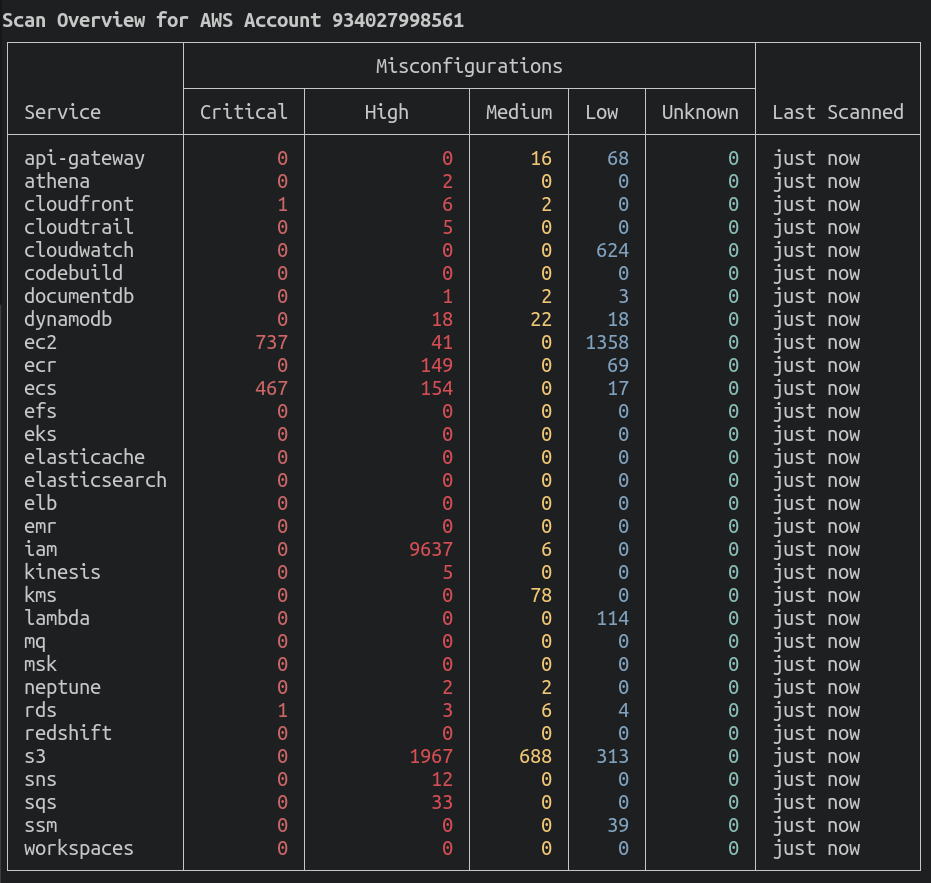

# Amazon Web Services

!!! warning "EXPERIMENTAL"
    This feature might change without preserving backwards compatibility.

The Trivy AWS CLI allows you to scan your AWS account for misconfigurations. 
You can either run the CLI locally or integrate it into your CI/CD pipeline. 

Whilst you can already scan the infrastructure-as-code that defines your AWS resources with `trivy config`, you can now scan your live AWS account(s) directly too.

The included checks cover all of the aspects of the [AWS CIS 1.2](https://docs.aws.amazon.com/securityhub/latest/userguide/securityhub-standards-cis.html) automated benchmarks.

Trivy uses the same [authentication methods](https://docs.aws.amazon.com/cli/latest/userguide/cli-chap-configure.html) as the AWS CLI to configure and authenticate your access to the AWS platform.

You will need permissions configured to read all AWS resources - we recommend using a group/role with the `ReadOnlyAccess` policy attached.

Once you've scanned your account, you can run additional commands to filter the results without having to run the entire scan again - infrastructure information is cached locally per AWS account/region.

Trivy currently supports the following scanning for AWS accounts.

- Misconfigurations

## CLI Commands

Scan a full AWS account (all supported services):

```shell
trivy aws --region us-east-1
```

You can allow Trivy to determine the AWS region etc. by using the standard AWS configuration files and environment variables. The `--region` flag overrides these.



The summary view is the default when scanning multiple services.

Scan a specific service:

```shell
trivy aws --service s3
```

Scan multiple services:

```shell
# --service s3,ec2 works too
trivy aws --service s3 --service ec2
```

Show results for a specific AWS resource:

```shell
trivy aws --service s3 --arn arn:aws:s3:::example-bucket
```

All ARNs with detected issues will be displayed when showing results for their associated service.

## Compliance
This section describes AWS specific compliance reports.
For an overview of Trivy's Compliance feature, including working with custom compliance, check out the [Compliance documentation](../compliance/compliance.md).

### Built in reports

the following reports are available out of the box:

| Compliance                         | Name for command | More info                                                                                            |
|------------------------------------|------------------|------------------------------------------------------------------------------------------------------|
| AWS CIS Foundations Benchmark v1.2 | `aws-cis-1.2`    | [link](https://d0.awsstatic.com/whitepapers/compliance/AWS_CIS_Foundations_Benchmark.pdf)            |
| AWS CIS Foundations Benchmark v1.4 | `aws-cis-1.4`    | [link](https://docs.aws.amazon.com/securityhub/latest/userguide/securityhub-cis-controls-1.4.0.html) |

### Examples

Scan a cloud account and generate a compliance summary report:

```
$ trivy aws --compliance=<compliance_id> --report=summary
```

***Note*** : The `Issues` column represent the total number of failed checks for this control.


Get all of the detailed output for checks:

```
$ trivy aws --compliance=<compliance_id> --report all
```

Report result in JSON format:

```
$ trivy aws --compliance=<compliance_id> --report all --format json
```

## Cached Results

By default, Trivy will cache a representation of each AWS service for 24 hours.
This means you can filter and view results for a service without having to wait for the entire scan to run again.
If you want to force the cache to be refreshed with the latest data, you can use `--update-cache`.
Or if you'd like to use cached data for a different timeframe, you can specify `--max-cache-age` (e.g. `--max-cache-age 2h`.).
Regardless of whether the cache is used or not, rules will be evaluated again with each run of `trivy aws`.

## Custom Policies

You can write custom policies for Trivy to evaluate against your AWS account.
These policies are written in [Rego](https://www.openpolicyagent.org/docs/latest/policy-language/), the same language used by [Open Policy Agent](https://www.openpolicyagent.org/).
See the [Custom Policies](../misconfiguration/custom/index.md) page for more information.

