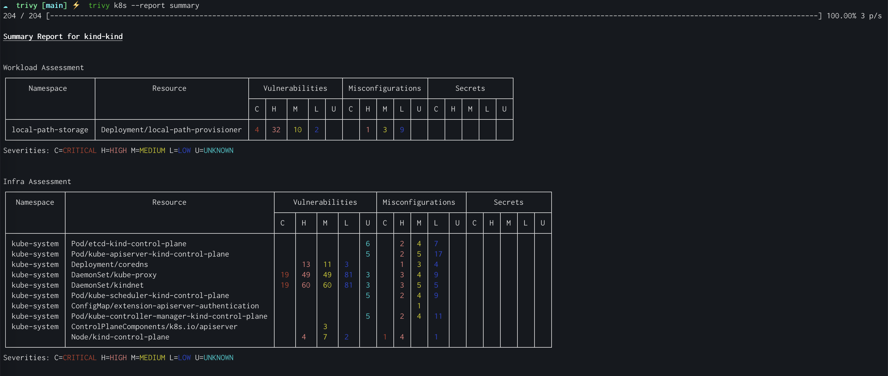

# Kubernetes

!!! warning "EXPERIMENTAL"
    This feature might change without preserving backwards compatibility.

Trivy can connect to your Kubernetes cluster and scan it for security issues using the `trivy k8s` command. This page covers the technical capabilities of Trivy Kubernetes scanning.
Trivy can also be installed *inside* your cluster as a Kubernetes Operator, and continuously scan it. For more about this, please see the [Trivy Operator](https://aquasecurity.github.io/trivy-operator/) project.

When scanning a Kubernetes cluster, Trivy differentiates between the following:

1. Cluster infrastructure (e.g api-server, kubelet, addons)
1. Cluster configuration (e.g Roles, ClusterRoles).
1. Application workloads (e.g nginx, postgresql).

When scanning any of the above, the container image is scanned separately to the Kubernetes resource definition (the YAML manifest) that defines the resource.

Container image is scanned for:

- Vulnerabilities
- Misconfigurations
- Exposed secrets

Kubernetes resource definition is scanned for:

- Vulnerabilities (Open Source Libraries, Control Plane and Node Components)
- Misconfigurations
- Exposed secrets

## Kubernetes target configurations

```sh
trivy k8s [flags] [CONTEXT] -  if the target name [CONTEXT] is not specified, the default will be used.
```

for example:

```sh
trivy k8s --report summary
```

!!! note "JSON result for multi-container pods"
    For multi-container pods, it may be challenging to associate results with specific images in the json summary report. Kubernetes treats a pod as a single object, so individual images within the pod aren’t distinguished. 
    For detailed information, please use the `--report all` option.

By default Trivy will look for a [`kubeconfig` configuration file in the default location](https://kubernetes.io/docs/concepts/configuration/organize-cluster-access-kubeconfig/), and use the default cluster that is specified.  
You can also specify a `kubeconfig` using the `--kubeconfig` flag:

```sh
trivy k8s --kubeconfig ~/.kube/config2
```

By default, all cluster resource images will be downloaded and scanned.

### Skip-images

You can control whether Trivy will scan and download the cluster resource images. To disable this feature, add the --skip-images flag.

- `--skip-images` flag will prevent the downloading and scanning of images (including vulnerabilities and secrets) in the cluster resources.

Example:

```sh
trivy k8s --report summary --skip-images
```

### Include/Exclude Kinds

You can control which kinds of resources will be discovered using the `--include-kinds` or `--exclude-kinds` comma-separated flags:

***Note:*** Both flags (`--include-kinds` or `--exclude-kinds`) cannot be set in conjunction.

- `--include-kinds` will include the listed kinds in cluster scanning.
- `--exclude-kinds` will exclude the listed kinds from cluster scanning.

By default, all kinds will be included in cluster scanning.

Example:

```sh
trivy k8s --report summary --exclude-kinds node,pod
```

### Include/Exclude Namespaces

You can control which namespaces will be discovered using the `--include-namespaces` or `--exclude-namespaces` comma-separated flags:

***Note:*** Both flags (`--include-namespaces` or `--exclude-namespaces`) cannot be set in conjunction.

- `--include-namespaces` will include the listed namespaces in cluster scanning.
- `--exclude-namespaces` will exclude the listed namespaces from cluster scanning.

By default, all namespaces will be included in cluster scanning.

Example:

```sh
trivy k8s --report summary --exclude-namespace dev-system,staging-system
```

## Control Plane and Node Components Vulnerability Scanning

Trivy is capable of discovering Kubernetes control plane (apiserver, controller-manager and etc) and node components(kubelet, kube-proxy and etc), matching them against the [official Kubernetes vulnerability database feed](https://github.com/aquasecurity/vuln-list-k8s), and reporting any vulnerabilities it finds.

To read more about KBOM, see the [documentation for Kubernetes scanning](./sbom.md#kbom).

```sh
trivy k8s --scanners vuln  --report all

NodeComponents/kind-control-plane (kubernetes)

Total: 3 (UNKNOWN: 0, LOW: 1, MEDIUM: 0, HIGH: 2, CRITICAL: 0)

┌────────────────┬────────────────┬──────────┬────────┬───────────────────┬──────────────────────────────────┬───────────────────────────────────────────────────┐
│    Library     │ Vulnerability  │ Severity │ Status │ Installed Version │          Fixed Version           │                       Title                       │
├────────────────┼────────────────┼──────────┼────────┼───────────────────┼──────────────────────────────────┼───────────────────────────────────────────────────┤
│ k8s.io/kubelet │ CVE-2023-2431  │ LOW      │ fixed  │ 1.21.1            │ 1.24.14, 1.25.10, 1.26.5, 1.27.2 │ Bypass of seccomp profile enforcement             │
│                │                │          │        │                   │                                  │ https://avd.aquasec.com/nvd/cve-2023-2431         │
│                ├────────────────┼──────────┤        │                   ├──────────────────────────────────┼───────────────────────────────────────────────────┤
│                │ CVE-2021-25741 │ HIGH     │        │                   │ 1.19.16, 1.20.11, 1.21.5, 1.22.1 │ Symlink exchange can allow host filesystem access │
│                │                │          │        │                   │                                  │ https://avd.aquasec.com/nvd/cve-2021-25741        │
│                ├────────────────┤          │        │                   ├──────────────────────────────────┼───────────────────────────────────────────────────┤
│                │ CVE-2021-25749 │          │        │                   │ 1.22.14, 1.23.11, 1.24.5         │ runAsNonRoot logic bypass for Windows containers  │
│                │                │          │        │                   │                                  │ https://avd.aquasec.com/nvd/cve-2021-25749        │
└────────────────┴────────────────┴──────────┴────────┴───────────────────┴──────────────────────────────────┴───────────────────────────────────────────────────┘
```

## Node-Collector

Node-collector is a scan job that collects node configuration parameters and permission information. This information will be evaluated against Kubernetes hardening (e.g. CIS benchmark) and best practices values. The scan results will be output in infrastructure assessment and CIS benchmark compliance reports.

### Disable Node Collector

You can control whether the node scan-job (`node-collector`) will run in the cluster. To disable it, add the `--disable-node-collector` flag  

- `--disable-node-collector` This flag will exclude findings related to Node (infra assessment) misconfigurations

By default, the node scan-job (`node-collector`) will run in the cluster.

Example:

```sh
trivy k8s --report summary --disable-node-collector
```

### Taints and Tolerations

The node-collector scan-job will run on every node. In case the node has been tainted, it is possible to add toleration to the scan job for it to be scheduled on the tainted node. for more details [see k8s docs](https://kubernetes.io/docs/concepts/scheduling-eviction/taint-and-toleration/)

- `--tolerations  key1=value1:NoExecute,key2=value2:NoSchedule` this flag wil enable node-collector to be schedule on tainted Node

Example:

```sh
trivy k8s --report summary --tolerations  key1=value1:NoExecute,key2=value2:NoSchedule
```

### Exclude Nodes by Label

You can exclude specific nodes from the scan using the `--exclude-nodes` flag, which takes a label in the format `label-name:label-value` and excludes all matching nodes:

```sh
trivy k8s --report summary --exclude-nodes kubernetes.io/arch:arm6
```

## Reporting and filtering

Since scanning an entire cluster for any security issue can be overwhelming, By default Trivy summarizes the results in a simple "summary" view.
By scoping the scan on a specific resource, you can see the detailed report.
You can always choose the report granularity using the `--report summary`/`--report all` flag.

Scan a full cluster and generate a simple summary report:

```sh
trivy k8s --report=summary
```



Filter by severity:

```
trivy k8s --severity=CRITICAL --report=all
```

Filter by scanners (Vulnerabilities, Secrets or Misconfigurations):

```
trivy k8s --scanners=secret --report=summary
# or
trivy k8s --scanners=misconfig --report=summary
```

The supported output formats are `table`, which is the default, and `json`.

```
trivy k8s --format json -o results.json cluster
```

<details>
<summary>Result</summary>

```json
{
  "ClusterName": "minikube",
  "Vulnerabilities": [
    {
      "Namespace": "default",
      "Kind": "Deployment",
      "Name": "app",
      "Results": [
        {
          "Target": "ubuntu:latest (ubuntu 22.04)",
          "Class": "os-pkgs",
          "Type": "ubuntu",
          "Vulnerabilities": [
            {
              "VulnerabilityID": "CVE-2016-2781",
              "PkgName": "coreutils",
              "InstalledVersion": "8.32-4.1ubuntu1",
              "Layer": {
                "Digest": "sha256:125a6e411906fe6b0aaa50fc9d600bf6ff9bb11a8651727ce1ed482dc271c24c",
                "DiffID": "sha256:e59fc94956120a6c7629f085027578e6357b48061d45714107e79f04a81a6f0c"
              },
              "SeveritySource": "ubuntu",
              "PrimaryURL": "https://avd.aquasec.com/nvd/cve-2016-2781",
              "DataSource": {
                "ID": "ubuntu",
                "Name": "Ubuntu CVE Tracker",
                "URL": "https://git.launchpad.net/ubuntu-cve-tracker"
              },
              "Title": "coreutils: Non-privileged session can escape to the parent session in chroot",
              "Description": "chroot in GNU coreutils, when used with --userspec, allows local users to escape to the parent session via a crafted TIOCSTI ioctl call, which pushes characters to the terminal's input buffer.",
              "Severity": "LOW",
              "CweIDs": [
                "CWE-20"
              ],
              "VendorSeverity": {
                "cbl-mariner": 2,
                "nvd": 2,
                "redhat": 2,
                "ubuntu": 1
              },
              "CVSS": {
                "nvd": {
                  "V2Vector": "AV:L/AC:L/Au:N/C:N/I:P/A:N",
                  "V3Vector": "CVSS:3.0/AV:L/AC:L/PR:L/UI:N/S:C/C:N/I:H/A:N",
                  "V2Score": 2.1,
                  "V3Score": 6.5
                },
                "redhat": {
                  "V2Vector": "AV:L/AC:H/Au:N/C:C/I:C/A:C",
                  "V3Vector": "CVSS:3.0/AV:L/AC:L/PR:N/UI:R/S:C/C:H/I:H/A:H",
                  "V2Score": 6.2,
                  "V3Score": 8.6
                }
              },
              "References": [
                "http://seclists.org/oss-sec/2016/q1/452",
                "http://www.openwall.com/lists/oss-security/2016/02/28/2",
                "http://www.openwall.com/lists/oss-security/2016/02/28/3",
                "https://access.redhat.com/security/cve/CVE-2016-2781",
                "https://cve.mitre.org/cgi-bin/cvename.cgi?name=CVE-2016-2781",
                "https://lists.apache.org/thread.html/rf9fa47ab66495c78bb4120b0754dd9531ca2ff0430f6685ac9b07772@%3Cdev.mina.apache.org%3E",
                "https://lore.kernel.org/patchwork/patch/793178/",
                "https://nvd.nist.gov/vuln/detail/CVE-2016-2781"
              ],
              "PublishedDate": "2017-02-07T15:59:00Z",
              "LastModifiedDate": "2021-02-25T17:15:00Z"
            }
          ]
        }
      ]
    }
  ],
  "Misconfigurations": [
    {
      "Namespace": "default",
      "Kind": "Deployment",
      "Name": "app",
      "Results": [
        {
          "Target": "Deployment/app",
          "Class": "config",
          "Type": "kubernetes",
          "MisconfSummary": {
            "Successes": 20,
            "Failures": 19
          },
          "Misconfigurations": [
            {
              "Type": "Kubernetes Security Check",
              "ID": "KSV001",
              "Title": "Process can elevate its own privileges",
              "Description": "A program inside the container can elevate its own privileges and run as root, which might give the program control over the container and node.",
              "Message": "Container 'app' of Deployment 'app' should set 'securityContext.allowPrivilegeEscalation' to false",
              "Namespace": "builtin.kubernetes.KSV001",
              "Query": "data.builtin.kubernetes.KSV001.deny",
              "Resolution": "Set 'set containers[].securityContext.allowPrivilegeEscalation' to 'false'.",
              "Severity": "MEDIUM",
              "PrimaryURL": "https://avd.aquasec.com/misconfig/ksv001",
              "References": [
                "https://kubernetes.io/docs/concepts/security/pod-security-standards/#restricted",
                "https://avd.aquasec.com/misconfig/ksv001"
              ],
              "Status": "FAIL",
              "Layer": {},
              "IacMetadata": {
                "Provider": "Kubernetes",
                "Service": "general",
                "StartLine": 121,
                "EndLine": 133
              }
            },
            {
              "Type": "Kubernetes Security Check",
              "ID": "KSV003",
              "Title": "Default capabilities not dropped",
              "Description": "The container should drop all default capabilities and add only those that are needed for its execution.",
              "Message": "Container 'app' of Deployment 'app' should add 'ALL' to 'securityContext.capabilities.drop'",
              "Namespace": "builtin.kubernetes.KSV003",
              "Query": "data.builtin.kubernetes.KSV003.deny",
              "Resolution": "Add 'ALL' to containers[].securityContext.capabilities.drop.",
              "Severity": "LOW",
              "PrimaryURL": "https://avd.aquasec.com/misconfig/ksv003",
              "References": [
                "https://kubesec.io/basics/containers-securitycontext-capabilities-drop-index-all/",
                "https://avd.aquasec.com/misconfig/ksv003"
              ],
              "Status": "FAIL",
              "Layer": {},
              "IacMetadata": {
                "Provider": "Kubernetes",
                "Service": "general",
                "StartLine": 121,
                "EndLine": 133
              }
            }
          ]
        }
      ]
    },
    {
      "Namespace": "default",
      "Kind": "ConfigMap",
      "Name": "kube-root-ca.crt"
    }
  ]
}

```

</details>

## Compliance

This section describes Kubernetes specific compliance reports.
For an overview of Trivy's Compliance feature, including working with custom compliance, check out the [Compliance documentation](../compliance/compliance.md).

The following reports are available out of the box:

| Compliance                                   | Name for command         | More info                                                                                                           |
|----------------------------------------------|--------------------------|---------------------------------------------------------------------------------------------------------------------|
| NSA, CISA Kubernetes Hardening Guidance v1.0 | `k8s-nsa-1.0`            | [Link](https://media.defense.gov/2022/Aug/29/2003066362/-1/-1/0/CTR_KUBERNETES_HARDENING_GUIDANCE_1.2_20220829.PDF) |
| CIS Benchmark for Kubernetes v1.23           | `k8s-cis-1.23`           | [Link](https://www.cisecurity.org/benchmark/kubernetes)                                                             |
| CIS Benchmark for RKE2 v1.24                 | `rke2-cis-1.24`          | [Link](https://www.cisecurity.org/benchmark/kubernetes)                                                             |
| CIS Benchmark for EKS v1.4                   | `eks-cis-1.4`            | [Link](https://www.cisecurity.org/benchmark/kubernetes)                                                             |
| Pod Security Standards, Baseline             | `k8s-pss-baseline-0.1`   | [Link](https://kubernetes.io/docs/concepts/security/pod-security-standards/#baseline)                               |
| Pod  Security Standards, Restricted          | `k8s-pss-restricted-0.1` | [Link](https://kubernetes.io/docs/concepts/security/pod-security-standards/#restricted)                             |

Examples:

Scan the cluster for Kubernetes Pod Security Standards Baseline compliance:

```

trivy k8s --compliance=k8s-pss-baseline --report summary

```

Get the detailed report for checks:

```

trivy k8s --compliance=k8s-cis-1.23 --report all

```

Get summary report in JSON format:

```

trivy k8s --compliance=k8s-cis-1.23 --report summary --format json

```

Get detailed report in JSON format:

```

trivy k8s --compliance=k8s-cis-1.23 --report all --format json

```

## KBOM

KBOM, Kubernetes Bill of Materials, is a manifest of all the important components that make up your Kubernetes cluster – Control plane components, Node Components, and Addons, including their versions and images. Which “api-server” version are you currently running? Which flavor of "kubelet" is running on each node? What kind of etcd or storage are you currently using? And most importantly – are there any vulnerabilities known to affect these components? These are all questions that KBOM can help you answer.  
For more background on KBOM, see [here](https://blog.aquasec.com/introducing-kbom-kubernetes-bill-of-materials).

Trivy can generate KBOM in CycloneDX format:

```sh

trivy k8s --format cyclonedx --output mykbom.cdx.json

```

Trivy can also scan that generated KBOM (or any SBOM) for vulnerabilities:

```sh

trivy sbom mykbom.cdx.json

```

<details>
<summary>Result</summary>

```sh

2023-09-28T22:52:25.707+0300    INFO    Vulnerability scanning is enabled
 2023-09-28T22:52:25.707+0300    INFO    Detected SBOM format: cyclonedx-json
 2023-09-28T22:52:25.717+0300    WARN    No OS package is detected. Make sure you haven't deleted any files that contain information about the installed packages.
 2023-09-28T22:52:25.717+0300    WARN    e.g. files under "/lib/apk/db/", "/var/lib/dpkg/" and "/var/lib/rpm"
 2023-09-28T22:52:25.717+0300    INFO    Detected OS: debian gnu/linux
 2023-09-28T22:52:25.717+0300    WARN    unsupported os : debian gnu/linux
 2023-09-28T22:52:25.717+0300    INFO    Number of language-specific files: 3
 2023-09-28T22:52:25.717+0300    INFO    Detecting kubernetes vulnerabilities...
 2023-09-28T22:52:25.718+0300    INFO    Detecting gobinary vulnerabilities...
 Kubernetes (kubernetes)
 Total: 2 (UNKNOWN: 0, LOW: 1, MEDIUM: 0, HIGH: 1, CRITICAL: 0)
 ┌────────────────┬────────────────┬──────────┬────────┬───────────────────┬─────────────────────────────────┬──────────────────────────────────────────────────┐
 │    Library     │ Vulnerability  │ Severity │ Status │ Installed Version │          Fixed Version          │                      Title                       │
 ├────────────────┼────────────────┼──────────┼────────┼───────────────────┼─────────────────────────────────┼──────────────────────────────────────────────────┤
 │ k8s.io/kubelet │ CVE-2021-25749 │ HIGH     │ fixed  │ 1.24.0            │ 1.22.14, 1.23.11, 1.24.5        │ runAsNonRoot logic bypass for Windows containers │
 │                │                │          │        │                   │                                 │ https://avd.aquasec.com/nvd/cve-2021-25749       │
 │                ├────────────────┼──────────┤        │                   ├─────────────────────────────────┼──────────────────────────────────────────────────┤
 │                │ CVE-2023-2431  │ LOW      │        │                   │ 1.24.14, 1.25.9, 1.26.4, 1.27.1 │ Bypass of seccomp profile enforcement            │
 │                │                │          │        │                   │                                 │ https://avd.aquasec.com/nvd/cve-2023-2431        │
 └────────────────┴────────────────┴──────────┴────────┴───────────────────┴─────────────────────────────────┴──────────────────────────────────────────────────┘
```

</details>

Find more in the [documentation for SBOM scanning](./sbom.md).

Currently KBOM vulnerability matching works for plain Kubernetes distributions and does not work well for vendor variants, including some cloud managed distributions.
