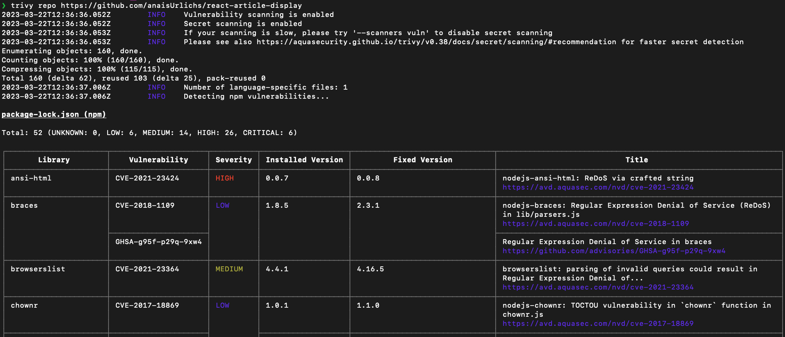
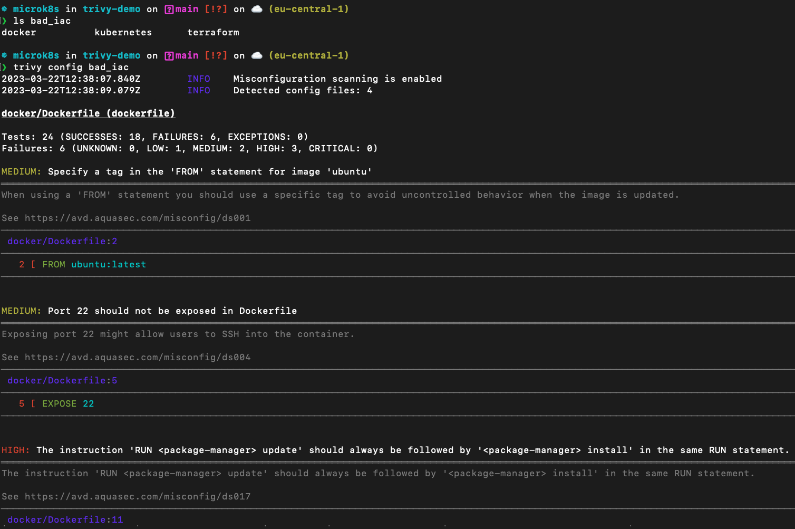
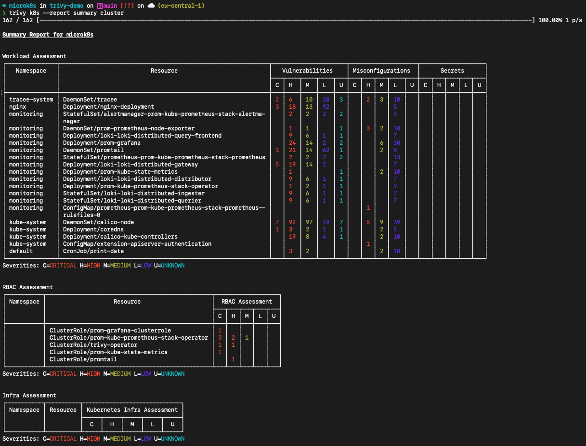
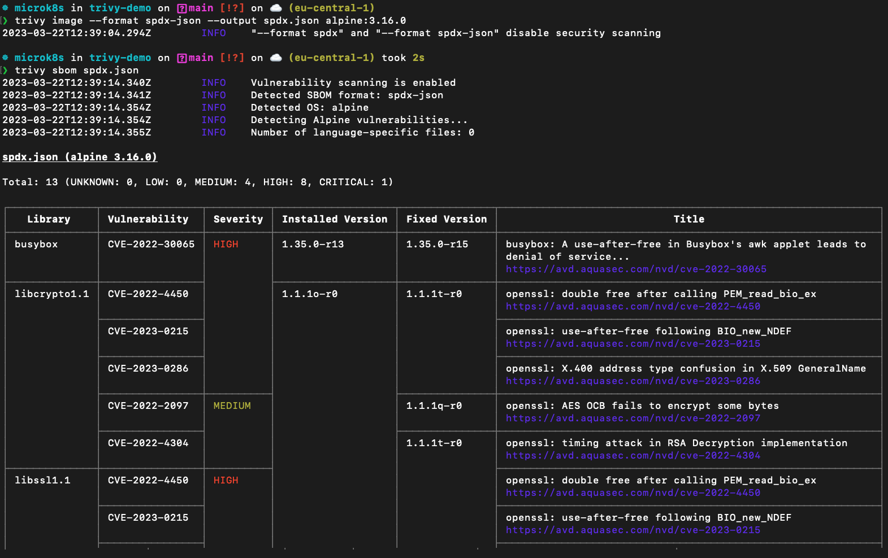

# Getting Started Guide

## Trivy CLI

### General usage

```bash
trivy <target> [--scanners <scanner1,scanner2>] <subject>
```

### Prerequisites

Before you can follow the examples provided below, please ensure that you have 

* Trivy Installed in your Terminal - [Installation Options](../getting-started/installation.md)

### Container Image Scanning

```bash
trivy image python:3.4-alpine
```

<details>
<summary>Result</summary>

<figure style="text-align: center">
  <video width="1000" autoplay muted controls loop>
    <source src="https://user-images.githubusercontent.com/1161307/171013513-95f18734-233d-45d3-aaf5-d6aec687db0e.mov" type="video/mp4" />
  </video>
  <figcaption>Demo: Vulnerability Detection</figcaption>
</figure>

</details>

### Git Repository Scanning

```bash
trivy repo <repository link>
```

{ width="1000" }


### Filesystem Scanning

```bash
trivy fs --scanners vuln,secret,config myproject/
```

<details>
<summary>Result</summary>

<figure style="text-align: center">
  <video width="1000" autoplay muted controls loop>
    <source src="https://user-images.githubusercontent.com/1161307/171013917-b1f37810-f434-465c-b01a-22de036bd9b3.mov" type="video/mp4" />
  </video>
  <figcaption>Demo: Misconfiguration Detection</figcaption>
</figure>

</details>

### Misconfiguration Scanning

```bash
trivy config myproject/
```
{ width="1000" }

### Virtual Machine Image

To scan virtual machine (VM) images, you can use the vm subcommand.

[More information.](../docs/target/vm.md)

### Kubernetes

```bash
trivy k8s --report summary cluster
```

{ width="1000" }


### SBOM

```bash
trivy image --format spdx-json --output spdx.json alpine:3.16.0
```


### AWS

The Trivy AWS CLI allows you to scan your AWS account for misconfigurations. You can either run the CLI locally or integrate it into your CI/CD pipeline. 

[More information.](../docs/target/aws.md)

## Additional Features

Trivy is an all-in-one Security Scanner and as such, it has lots of different features.
To get to know all of Trivy's features, [head over to the main documentation.](https://aquasecurity.github.io/trivy/latest/docs/)

## In other Environments

Trivy can be used in multiple different ways. This quick-start guide only highlighted how to get started with the Trivy CLI.

[The ecosystem section](../ecosystem/index.md) highlights multiple ways to use and integrate with Trivy, including in

- CI/CD platforms
- Kubernetes cluster,
- IDE
- and many more.

Let us know how you are using [Trivy at your company.](https://github.com/aquasecurity/trivy/discussions/categories/show-and-tell)