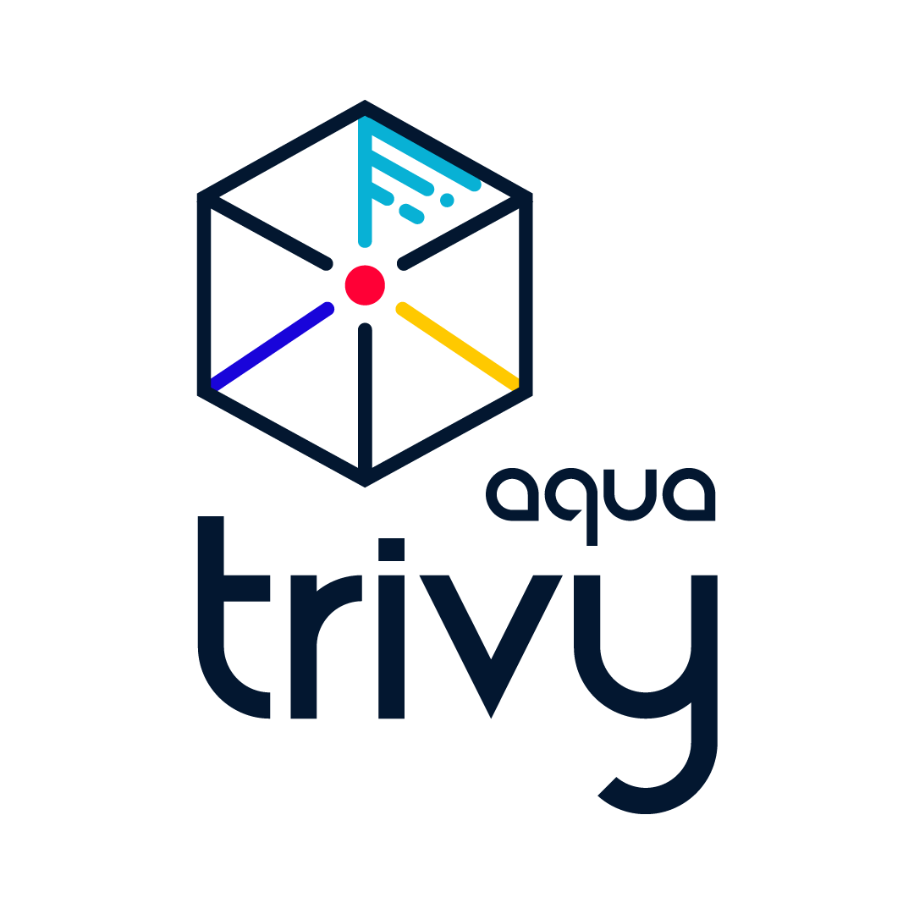

---
hide:
- toc
---
{ align=right }

# Trivy Documentation

👋 Welcome to Trivy Documentation! To help you get around, please notice the different sections at the top global menu:

- You are currently in the [Getting Started] section where you can find general information and help with first steps.
- In the [Tutorials] section you can find step-by-step guides that help you accomplish specific tasks.
- In the [Docs] section you can find the complete reference documentation for all of the different features and settings that Trivy has to offer.
- In the [Ecosystem] section you can find how Trivy works together with other tools and applications that you might already use.
- In the [Contributing] section you can find technical developer documentation and contribution guidelines.

# About Trivy

Trivy ([pronunciation][pronunciation]) is a comprehensive and versatile security scanner. Trivy has *scanners* that look for security issues, and *targets* where it can find those issues.

Targets (what Trivy can scan):

- Container Image
- Filesystem
- Git Repository (remote)
- Virtual Machine Image
- Kubernetes
- AWS

Scanners (what Trivy can find there):

- OS packages and software dependencies in use (SBOM)
- Known vulnerabilities (CVEs)
- IaC issues and misconfigurations
- Sensitive information and secrets
- Software licenses

To learn more, go to the [Trivy homepage][homepage] for feature highlights, or to the [Documentation site][Docs] for detailed information.

## Quick Start

### Get Trivy

Trivy is available in most common distribution channels. The complete list of installation options is available in the [Installation] page. Here are a few popular examples:

- `brew install trivy`
- `docker run aquasec/trivy`
- Download binary from <https://github.com/aquasecurity/trivy/releases/latest/>
- See [Installation] for more

Trivy is integrated with many popular platforms and applications. The complete list of integrations is available in the [Ecosystem] page. Here are a few popular options examples:

- [GitHub Actions](https://github.com/aquasecurity/trivy-action)
- [Kubernetes operator](https://github.com/aquasecurity/trivy-operator)
- [VS Code plugin](https://github.com/aquasecurity/trivy-vscode-extension)
- See [Ecosystem] for more

### General usage

```bash
trivy <target> [--security-checks <scanner1,scanner2>] <subject>
```

Examples:

```bash
trivy image python:3.4-alpine
```

<details>
<summary>Result</summary>

<figure style="text-align: center">
  <video width="1000" autoplay muted controls loop>
    <source src="https://user-images.githubusercontent.com/1161307/171013513-95f18734-233d-45d3-aaf5-d6aec687db0e.mov" type="video/mp4" />
  </video>
  <figcaption>Demo: Vulnerability Detection</figcaption>
</figure>

</details>

```bash
trivy fs --security-checks vuln,secret,config myproject/
```

<details>
<summary>Result</summary>

<figure style="text-align: center">
  <video width="1000" autoplay muted controls loop>
    <source src="https://user-images.githubusercontent.com/1161307/171013917-b1f37810-f434-465c-b01a-22de036bd9b3.mov" type="video/mp4" />
  </video>
  <figcaption>Demo: Misconfiguration Detection</figcaption>
</figure>

</details>

```bash
trivy k8s --report summary cluster
```

<details>
<summary>Result</summary>

<figure style="text-align: center">
  
  <figcaption>Demo: Secret Detection</figcaption>
</figure>

</details>

## FAQ

### How to pronounce the name "Trivy"?

`tri` is pronounced like **tri**gger, `vy` is pronounced like en**vy**.

---

Trivy is an [Aqua Security][aquasec] open source project.  
Learn about our open source work and portfolio [here][oss].  
Contact us about any matter by opening a GitHub Discussion [here][discussions]

[Ecosystem]: ./ecosystem/index.md
[Installation]: getting-started/installation.md
[pronunciation]: #how-to-pronounce-the-name-trivy

[aquasec]: https://aquasec.com
[oss]: https://www.aquasec.com/products/open-source-projects/
[discussions]: https://github.com/aquasecurity/trivy/discussions

[homepage]: https://trivy.dev
[Tutorials]: ./tutorials/overview
[Docs]: ./docs
[Getting Started]: ./
[Contributing]: ./community/contribute/issue
