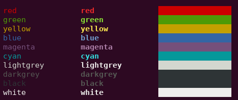

# tml - Terminal Markup Language

[](https://travis-ci.org/liamg/tml)
[](https://godoc.org/github.com/liamg/tml)

A Go module (and standalone binary) to make the output of coloured/formatted text in the terminal easier and more readable.

You can use it in your Go programs, and bash etc. too.



## Usage in Go

The output of coloured/formatted text is easy using the following syntax:

```go
package main

import "github.com/liamg/tml"

func main() {
    tml.Printf("<red>this text is <bold>red</bold></red> and the following is <green>%s</green>\n", "not red")
}
```

## Usage in Bash

First, install tml:

```
go get -u github.com/liamg/tml/tml
```

Then you can simply pipe text containing tags to tml:

```bash
#!/bin/bash

echo "<red>this text is <bold>red</bold></red> and the following is <green>not red</green>" | tml
```

## Format

Each tag is enclosed in angle brackets, much like HTML.

You can nest tags as deeply as you like.

It's not required to close tags you've opened, though it can make for easier reading.

### Available Tags

#### Foreground Colours

- `<red>`
- `<green>`
- `<yellow>`
- `<blue>`
- `<magenta>`
- `<cyan>`
- `<lightgrey>`
- `<darkgrey>`
- `<black>`
- `<white>`
- `<lightred>`
- `<lightgreen>`
- `<lightyellow>`
- `<lightblue>`
- `<lightmagenta>`
- `<lightcyan>`

#### Background Colours

- `<bg-red>`
- `<bg-green>`
- `<bg-yellow>`
- `<bg-blue>`
- `<bg-magenta>`
- `<bg-cyan>`
- `<bg-lightgrey>`
- `<bg-darkgrey>`
- `<bg-black>`
- `<bg-white>`
- `<bg-lightred>`
- `<bg-lightgreen>`
- `<bg-lightyellow>`
- `<bg-lightblue>`
- `<bg-lightmagenta>`
- `<bg-lightcyan>`

#### Attributes

- `<bold>`
- `<dim>`
- `<italic>`
- `<underline>`
- `<blink>`
- `<reverse>`
- `<hidden>`
